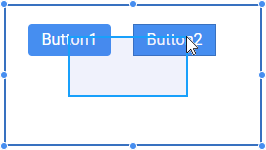
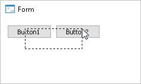

# Выделение компонентов формы

Выделение компонентов формы
-

# Выделение компонентов формы

## Выделение одного компонента

Для выделения одного компонента на форме:

	- щёлкните по необходимым компоненту;

	- выберите необходимый компонент в раскрывающемся списке,
	 расположенном в верхней части [инспектора
	 объектов](../03_Windows_of_Development_Environment/Object_Inspector.htm).

После выделения компонента в [инспекторе
 объектов](../03_Windows_of_Development_Environment/Object_Inspector.htm) будут отображаться его свойства и события.

## Выделение нескольких компонентов

Для выделения нескольких компонентов выполните одно из следующих действий:

	- удерживая клавишу CTRL, щёлкните по необходимым компонентам.

	- удерживая кнопку мыши, нарисуйте прямоугольную область. Все
	 компоненты, хотя бы частично попадающие в данную область, будут выделены.
	 Если в область выделения попадает компонент-контейнер, то он будет
	 выделен без дочерних компонентов. Для выделения компонентов внутри
	 компонента-контейнер необходимо при рисовании прямоугольника удерживать
	 клавишу SHIFT.

Примечание.
 Выделение компонентов внутри компонентов-контейнеров с удержанием клавши
 SHIFT доступно только в настольном приложении.

	 Веб-приложение

	 Настольное
	 приложение

		

		

При выделении нескольких компонентов в [инспекторе
 объектов](../03_Windows_of_Development_Environment/Object_Inspector.htm) отображаются только их общие свойства и события. При изменении
 таких свойств и событий все изменения будут применены для всех выделенных
 компонентов.

См. также:

[Компоненты
 веб-форм](../../Web_components/web_components.htm) | [Компоненты
 среды разработки](../Development_environment_components.htm)

		Справочная
		 система на версию 10.9
		 от 18/08/2025,
		 © ООО «ФОРСАЙТ»,
