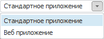
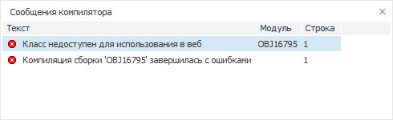

# Способ компиляции сборок

Способ компиляции сборок
-

# Способ компиляции сборок

Существует ряд ограничений, если в настольном приложении разрабатывается
 веб-приложение. Использование определенных классов, свойств и методов
 будет приводить к исключительным ситуациям. Ниже представлен список ресурсов,
 запрещенных для использования в веб-приложениях:

	- работа с буфером обмена (использование свойств и методов,
	 осуществляющих копирование/вырезание/вставку в буфер обмена);

	- работа с формами (класс Form) и ресурсами сборки ExtCtrls;

	- использование окон (окна, реализованные
	 в сборке Ui);

	- работа со свойствами, определяющими состояние и положение
	 курсора мыши.

Для проверки корректности кода в среде разработки в настольном приложении
 реализован специальный раскрывающийся список. В данном списке содержатся
 конфигурации приложения, в соответствии с которыми будет осуществляться
 компиляция:

При выборе режима «Веб приложение»,
 если в тексте макроса содержится код, попадающий под указанные ограничения,
 то будет генерироваться сообщение об ошибке «Класс/Метод недоступен для
 использования в веб».

По умолчанию устанавливается стандартный способ компиляции без ограничений.

См. также:

[Запуск и
 отладка](Run_Debug.htm)

		Справочная
		 система на версию 10.9
		 от 18/08/2025,
		 © ООО «ФОРСАЙТ»,
