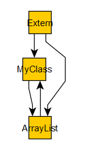

# Выявление утечек памяти

Выявление утечек памяти
-

# Выявление утечек памяти

Во время разработки прикладного кода могут возникнуть утечки памяти,
 которые связаны с потенциальными ошибками или неэффективностью написания
 прикладного кода. Большинство случаев возникновения утечек связаны с использованием
 глобальных переменных, использованием типа данных Variant для хранения
 COM-объектов, хранением экземпляров объектов пользовательских классов
 в массивах или коллекциях.

Для выявления областей кода, которые приводят к утечкам, в среде разработки
 «Форсайт. Аналитическая платформа»
 реализован ряд дополнительных инструментов.

Примечание.
 Описываемые ниже флаги реестра и код должны использоваться только при
 создании и отладке приложения. Не должны применяться при промышленном
 использовании.

## Вывод утечек в виде графа

Инструмент позволяет сохранять граф оставшихся в памяти среды выполнения
 объектов. Имеется несколько вариантов сохранения графа, рассмотрим каждый
 из них.

	Очистка среды выполнения Fore Флаги в реестре API Fore

		В среде разработки возможно два варианта очистки среды выполнения
		 Fore:

			- автоматическая очистка перед каждой компиляцией объектов.
			 Для использования данного варианта очистки среды выполнения
			 Fore установите флажок «Очищать
			 среду выполнения Fore при компиляции» на вкладке «Выполнение» в окне «[Параметры среды разработки](Developer.chm::/About_Developing/Development_Environment_Options.htm)»;

			- принудительная очистка, выполняемая вручную. Для использования
			 данного варианта очистки среды выполнения Fore выполните команду
			 главного меню «Сервис >
			 Очистить среду выполнения Fore».

		Если после очистки в памяти останутся неосвобождённые объекты,
		 то будет выдан диалог сохранения графа объектов в файл.

		Функциональность среды разработки может быть расширена за счет
		 использования специальных параметров в реестре, описание которых
		 представлено в подразделе «[Расширенное
		 логирование и получение дополнительной отладочной информации](KnowledgeBase.chm::/01_Fore/KB000030/KnowledgeBase_KB000030_1.htm)».

		Для отслеживания утечек при выходе из репозитория создайте в
		 ветке реестра [HKEY_CURRENT_USER\Software\Foresight\Foresight Analytics Platform\10.0\Fore] Параметр CheckLeaks типа REG_DWORD со значением «1».
		 Если в памяти остаются неосвобождённые объекты, то будет выдан
		 диалог сохранения списка объектов в файл. Данный вариант доступен
		 для использования в настольной версии «Форсайт. Аналитическая платформа».

		Для отслеживания утечек при работе с BI-сервером дополнительно
		 к параметру CheckLeaks создайте
		 в той же ветке реестра параметр LeaksGraphFile
		 и задайте в нём путь и наименование файла, в который будет сохраняться
		 граф объектов.

		С помощью метода [IForeRuntime](KeFore.chm::/Interface/IForeRuntime/IForeRuntime.htm).[ForeObjectsGraph](KeFore.chm::/Interface/IForeRuntime/IForeRuntime.ForeObjectsGraph.htm).[SaveToFile](KeFore.chm::/Interface/IForeObjectsGraph/IForeObjectsGraph.SaveToFile.htm)
		 можно сохранить список объектов, находящихся в памяти, в файл.
		 Выведенные таким образом объекты не считаются утечками, а выводится
		 список объектов находящихся в памяти на текущий момент выполнения
		 кода приложения. Пример:

			Sub UserProc;

			Var

			    Mb: IMetabase;

			    Runtime: IForeRuntime;

			    // ...

			Begin

			    Mb := MetabaseClass.Active;

			    // ...

			    // Выполняемый код приложения

			    // ...

			    Runtime := (Mb As IForeServices).GetRuntime;

			    Runtime.ForeObjectsGraph.SaveToFile("D:\CurrentObjects.tgf");

			    // ...

			    // Продолжение кода приложения

			    // ...

			End Sub UserProc;

Список объектов сохраняется в формате TGF (trivial graph format). Для
 работы с файлом может использоваться любой редактор, поддерживающий просмотр
 и редактирование файлов в данном формате.

Пример графа:

Связь между MyClass и ArrayList обозначает, что в объекте
 типа MyClass есть непустое поле
 типа ArrayList. Так же, если объект
 класса может быть коллекцией в цикле For
 Each, то от коллекции до всех её элементов также отобразится связь.
 На примере это проявляется в том, что есть связь от объекта ArrayList
 до MyClass. Вершина Extern
 обозначает внешнюю ссылку. Если есть связь от Extern
 до объекта, то это означает, что есть внешняя ссылка на данный объект.

## Логирование изменений счётчика внешних ссылок

Инструмент позволяет сохранять идентификатор модуля/формы и номер строки,
 в которой произошло изменение счётчика внешних ссылок объектов. Запуск
 кода на выполнение должен осуществляться без отладки. Имеется несколько
 вариантов отслеживания изменения счётчика внешних ссылок, рассмотрим каждый
 из них.

	Панель инструментов Сервис Флаги в реестре API Fore

		В среде разработки на панели инструментов Сервис
		 перед выполнением кода приложения нажмите кнопку «Начать
		 запись изменений счётчика внешних ссылок». Будет запущено
		 логирование. Запустите код на выполнение без отладки. В необходимый
		 момент выполнения или после выполнения кода нажмите кнопку «Остановить запись измененй счётчика
		 внешних ссылок», при этом будет выдан диалог сохранения
		 лога в текстовый файл.

		Создайте в ветке реестра [HKEY_CURRENT_USER\Software\Foresight\Foresight Analytics Platform\10.0\Fore]
		 Параметр ExternRefLogging
		 типа REG_DWORD со значением «1». При инициализации среды выполнения
		 будет запускаться логирование изменений счётчика внешних ссылок.
		 Также в параметре ExtRefChangesFile укажите путь и наименование
		 файла, в который будет сохраняться лог. Если при закрытии репозитория
		 логирование оставалось включённым, то происходит автоматическое
		 сохранение лога в заданный файл.

		С помощью свойства [IForeRuntime](KeFore.chm::/Interface/IForeRuntime/IForeRuntime.htm).[ExternReferenceLogger](KeFore.chm::/Interface/IForeRuntime/IForeRuntime.ExternReferenceLogger.htm).[Enable](KeFore.chm::/Interface/IExternReferenceLogger/IExternReferenceLogger.Enable.htm) можно
		 включить логирование изменений счётчика внешних ссылок. Сохранение
		 лога в файл осуществляется с помощью метода [IForeRuntime](KeFore.chm::/Interface/IForeRuntime/IForeRuntime.htm).[ExternReferenceLogger](KeFore.chm::/Interface/IForeRuntime/IForeRuntime.ExternReferenceLogger.htm).[SaveToFile](KeFore.chm::/Interface/IExternReferenceLogger/IExternReferenceLogger.SaveToFile.htm).
		 Сохранять можно после выключения логирования. Пример:

			Sub UserProc;

			Var

			    Mb: IMetabase;

			    ExtLogger: IExternReferenceLogger;

			    //...

			Begin

			    Mb := MetabaseClass.Active;

			    ExtLogger := (Mb As IForeServices).GetRuntime.ExternReferenceLogger;

			    ExtLogger.Collapse := True;

			    ExtLogger.Enable := True;

			    ExtLogger.ObjectIndexing := True;

			    //...

			    // Выполняемый код приложения

			    //...

			    ExtLogger.Enable := False;

			    ExtLogger.SaveToFile("D:\ExtLog.txt");

			    //...

			    // Продолжение кода приложения

			    //...

			End Sub UserProc;

Получаемый лог будет выглядеть примерно следующим образом:

MyClass Extern : 1

OBJ646 : 10 inc

OBJ646 : 10 inc

System : 4 dec

OBJ646 : 12 inc

OBJ646 : 12 inc

OBJ646 : 12 inc com

OBJ646 : 12 dec

OBJ646 : 14 inc

OBJ646 : 15 dec

In Garbage Collector
 : dec

ArrayList Extern : 1

OBJ646 : 11 inc

OBJ646 : 11 inc

System : 4 dec

OBJ646 : 13 inc

OBJ646 : 13 inc com

OBJ646 : 15 dec

Синтаксис лога в расширенной нотации РБНФ выглядит следующим образом:

Log = { LogRecord }

LogRecord = ClassName EXTERN ":" ExtRefCount
 { CodePosition ChangeType [ com ] }

ChangeType = "inc" | "dec"

CodePosition = (ModuleName ":" LineNumber
 | "In Garbage Collector" )

ClassName, ModuleName
 - идентификаторы, описывающие класс объекта и модуль, где происходит изменение
 внешней ссылки.

ExtRefCount, LineNumber
 - целые числа, описывающие счётчик внешних ссылок объекта и строчку кода,
 где изменилась внешняя ссылка.

ChangeType - тип изменения внешней
 ссылки: inc - увеличение; dec - уменьшение.

com - обозначение, используемое
 для отметки счётчика ссылок при работе с объектом пользовательского класса.

## Последствия наличия утечек памяти и внешних ссылок

При выполнении какой-либо сборки без отладки интерпретатор языка загружает
 сборку в память и удерживает там пока:

	- на сборку имеются ссылки из других сборок;

	- имеются неуничтоженные объекты классов, определённых в этой
	 сборке;

	- есть неуничтоженные объекты, предназначенные для работы с конструкциями
	 сборки ([IForeAssembly](KeFore.chm::/Interface/IForeAssembly/IForeAssembly.htm),
	 [IForeClass](KeFore.chm::/Interface/IForeClass/IForeClass.htm),
	 [IForeSub](KeFore.chm::/Interface/IForeSub/IForeSub.htm)
	 и другие).

При этом другие объекты, ссылающиеся на загруженную сборку, будут использовать
 именно ту её версию, которая загружена в текущий момент в память. Изменение
 кода такой сборки и её перекомпиляция не обновит сборку в памяти до завершения
 работы всего экземпляра продукта «Форсайт. Аналитическая платформа».

Во избежание подобной ситуации необходимо во время разработки использовать
 режим отладки, а также в соответствии с формируемой логикой приложения
 добавлять код для уничтожения объектов ([Dispose](KnowledgeBase.chm::/01_Fore/KnowledgeBase_KB000004.htm)),
 обнуления ссылок на объекты, освобождения статических ([Shared](Fore.chm::/02_GeneralInfo/Fore_ClassesAndObjects.htm))
 полей классов и переменных, используемых на уровне модулей. Также рекомендуется
 использовать команду главного меню среды разработки «Сервис
 > Очистить среду выполнения Fore», выполнение которой приводит
 к запуску полной сборки мусора, а также очищает содержимое статических
 полей и переменных в модулях. Если при завершении приложения в памяти
 остались какие-либо неуничтоженные объекты, то будет отображено окно «[Объекты
 в памяти](../03_Windows_of_Development_Environment/Object_In_Memory.htm)».

## Примеры кода, вызывающего утечки памяти

Ниже приведено несколько примеров кода, при выполнении которого возникнут
 утечки памяти. Избегайте возникновения подобных ситуаций в собственном
 коде.

	Class MyClass: Object

	    Public v: Variant;

	End Class MyClass;

	Sub UserProc;

	Var

	    o: MyClass;

	    ar: IArrayList;

	Begin

	    o := New MyClass.Create;

	    ar := New ArrayList.Create;

	    ar.Add(o);

	    o.v := ar;

	End Sub UserProc;

В данном примере в массив добавляется экземпляр класса и сам массив
 указывается в качестве значения поля класса. Сборщик мусора не сможет
 корректно обработать данную ситуация в результате чего в памяти останутся
 объекты.

	Public Sub UserProc;

	Var

	    o1, o2, o3: MyClass;

	Begin

	    o1 := New MyClass.Create;

	    o2 := New MyClass.Create;

	    o3 := New MyClass.Create;

	    o1.v := o2;

	    o2.v := o3;

	    o3.v := o1;

	End Sub UserProc;

В данном примере возникает циклическая зависимость объектов. Утечек
 памяти в данном случае не будет.

	Public Sub UserProc;

	Var

	    o1, o2, o3: MyClass;

	    ar: Array[1];

	Begin

	    o1 := New MyClass.Create;

	    o2 := New MyClass.Create;

	    o3 := New MyClass.Create;

	    ar[0] := o2;

	    o1.v := ar[0];

	    o2.v := o3;

	    o3.v := o1;

	End Sub UserProc;

А в данном примере будет утечка памяти из-за включения в цепочку дополнительного
 объекта в виде массива.

См. также:

[Запуск и
 отладка](Run_Debug.htm)

		Справочная
		 система на версию 10.9
		 от 18/08/2025,
		 © ООО «ФОРСАЙТ»,
