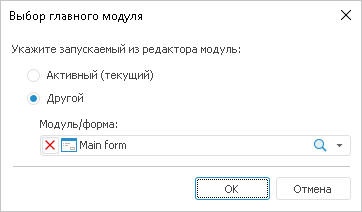

# Выбор главного модуля

Выбор главного модуля
-

# Выбор главного модуля

В настольном приложении для выбора главного модуля необходимо выполнить
 команду главного меню «Отладка > Выбрать
 главный модуль/форму»:

В данном окне необходимо установить переключатель, определяющий, какой
 объект будет запускаться в среде разработки. Данный выбор актуален только
 при запуске из среды разработки в режиме отладки.

Доступны следующие варианты:

	- Активный (текущий).
	 Запускается активный объект;

	- Другой. Из
	 раскрывающегося списка необходимо выбрать модуль/форму, который будет
	 запускаться. При выполнении команды главного меню «Отладка>Выполнить»
	 не зависимо от того, какой объект сейчас активен в среде разработки,
	 всегда будет запускаться указанный объект.

См. также:

[Создание
 сборки](../02_Work_in_Development_Environment/DevEnv_Object/DevEnv_Assembly.htm)

		Справочная
		 система на версию 10.9
		 от 18/08/2025,
		 © ООО «ФОРСАЙТ»,
