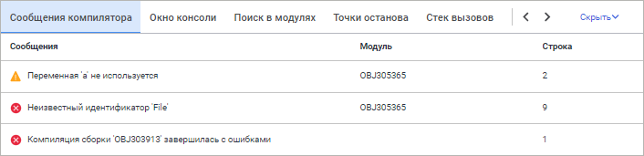
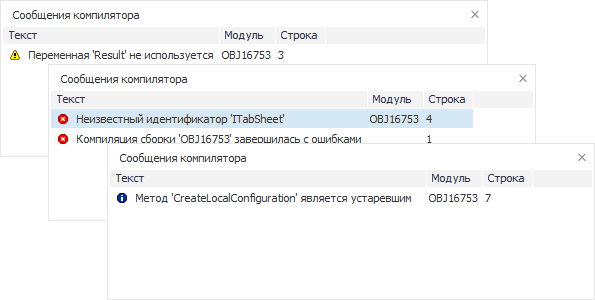

# Сообщения компилятора: Окно среды разработки

Сообщения компилятора: Окно среды разработки
-

# Сообщения компилятора

Данная панель используется компилятором языка Fore и предназначена для
 вывода системной информации о ходе компиляции объектов среды разработки.

	Веб-приложение Настольное приложение

		

		

Для открытия панели:

	- выберите панель «Сообщения
	 компилятора» в области панелей;

	- выполните команду «Вид >
	 Сообщения компилятора» главного меню.

В каждом сообщении содержится следующая информация:

	- Текст сообщения.
	 Отображается текст сообщения, сгенерированный компилятором;

	- Модуль. Отображается
	 имя модуля, к которому относится данное сообщение (необходимо в том
	 случае, если запущено несколько модулей);

	- Строка. Отображается
	 номер строки, в которой произошла ошибка при отладке программы.

При двойном щелчке по сообщению будет осуществлен переход к строке кода,
 в которой возник конфликт при компиляции.

Для сообщений доступно контекстное меню, содержащее следующие команды:

	- Копировать.
	 Осуществляет копирование в буфер обмена всей информации об ошибке;

	- Справка по данной
	 ошибке/предупреждению. Вызывает раздел справки, содержащий
	 описание соответствующего сообщения компилятора Fore.

См. также:

[Запуск
 и отладка](../02_Work_in_Development_Environment/Run_Debug.htm)

		Справочная
		 система на версию 10.9
		 от 18/08/2025,
		 © ООО «ФОРСАЙТ»,
