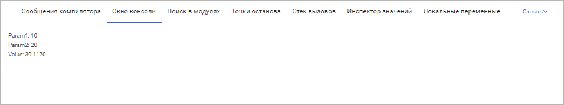
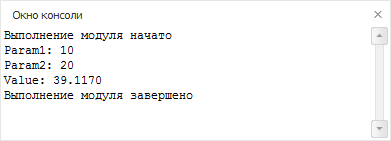

# Окно консоли

Окно консоли
-

# Окно консоли

Окно консоли предназначено для
 вывода различной промежуточной информации во время отладки модулей/форм/сборок.

	Веб-приложение Настольное приложение

		

		

В настольном приложении для окна консоли реализовано собственное контекстное
 меню, которое содержит следующие команды:

	- Выделить все.
	 Выделение содержимого окна консоли;

	- Копировать.
	 Копирование выделенных сообщений;

	- Очистить.
	 Очистка содержимого окна консоли.

Редактирование данных в данном окне запрещено.

## Вывод информации в окно консоли

Для работы с консолью среды разработки используются статические свойства
 и методы класса [Debug](ForeSys.chm::/Class/Debug/Debug.htm).

См. также:

[Запуск
 и отладка](../02_Work_in_Development_Environment/Run_Debug.htm)

		Справочная
		 система на версию 10.9
		 от 18/08/2025,
		 © ООО «ФОРСАЙТ»,
