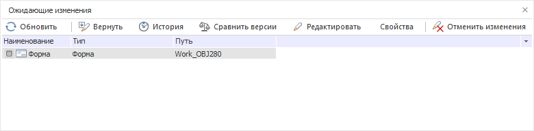

# Ожидающие изменения

Ожидающие изменения
-

# Ожидающие изменения

Данная панель предназначена для работы с объектами, включенными в систему
 управления версиями. На панели отображаются объекты, содержащие несохраненные
 на сервере изменения.

Список объектов оформлен в виде таблицы. Для каждого объекта выводится
 наименование, тип объекта и путь к папке, в которой хранятся файлы объекта.

Примечание.
 Для получения полного пути к файлам объекта необходимо также учитывать
 локальный путь, установленный в [настройках
 управления версиями](../../04_NavigatorSetting/VCS/Add_In_VCS.htm). Если файлы объектов хранятся в локальной папке,
 установленной в [настройках
 управления версиями](../../04_NavigatorSetting/VCS/Add_In_VCS.htm) (отсутствует внутренняя иерархия папок), то в
 поле «Путь» данной панели ничего
 не отображается.

Для выполнения каких-либо действий необходимо отметить нужный объект
 (группу объектов), после чего, используя соответствующие кнопки в верхней
 части панели и пункты контекстного меню, можно [сохранить
 изменения на сервере](../06_Version_Control_System/VSC_CheckIn_Object.htm), [отменить
 изменения](../06_Version_Control_System/VCS_Cancel_Change.htm), [просмотреть
 историю изменения объекта](../06_Version_Control_System/VCS_History_object.htm), а также [сравнить
 текущую версию с последней версией объекта на сервере](../06_Version_Control_System/VCS_Comparison_version_object.htm).

Кнопка  «Обновить»
 предназначена для обновления списка объектов, имеющих несохраненные на
 сервере изменения. Кнопка  «Редактировать», а также соответствующая
 команда контекстного меню, позволяют открыть выбранный объект в среде
 разработки. Команда контекстного меню «Открыть
 в проводнике Windows» позволяет открыть папку, в которой хранятся
 файлы соответствующего объекта.

Для просмотра информации о файле, который соответствует объекту и хранится
 в системе управления версиями, необходимо выделить объект и нажать кнопку
 «Свойства».

Примечание.
 Для модулей и форм при просмотре свойств соответствующего файла выводится
 информация о файле, содержащем текст модуля/формы.

См. также:

[Публикация
 изменений объектов](../06_Version_Control_System/VSC_CheckIn_Object.htm)

		Справочная
		 система на версию 10.9
		 от 18/08/2025,
		 © ООО «ФОРСАЙТ»,
