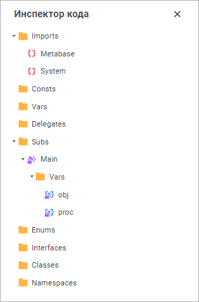
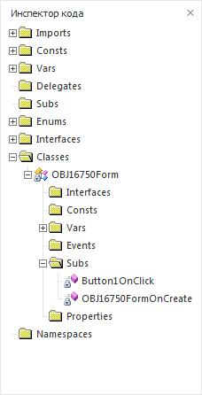

# Инспектор кода

Инспектор кода
-

# Инспектор кода

В данном окне отображается древовидная структура, содержащая все типы,
 классы, свойства, методы, глобальные переменные и глобальные процедуры,
 определённые в текущей сборке.

[Для открытия окна](javascript:TextPopup(this))

	Для открытия окна инспектора кода выполните одно из следующих действий:

		- выполнить команду главного меню «Вид
		 > Инспектор кода»;

		- нажать кнопку 
		 /  «Инспектор
		 кода» на панели инструментов;

		- выполнить команду контекстного меню среды разработки
		 «Перейти в инспектор кода»
		 в настольном приложении;

		- нажать сочетание клавиш CTRL+SHIFT+L в
		 настольном приложении.

После открытия инспектора кода фокус будет установлен на объект, в теле
 которого находится курсор.

	Веб-приложение Настольное приложение

		

		

Данное окно позволяет осуществить быстрый переход между различными элементами
 кода. При двойном щелчке мышью на любом элементе автоматически выполняется
 переход к соответствующей позиции в окне макроса.

В окне инспектора кода отображаются следующие элементы:

	- Imports. Список,
	 содержащий наименования модулей, используемых в текущем макросе.

	- Consts. Список,
	 содержащий наименования констант, используемых в текущем макросе.

	- Vars. Список,
	 содержащий наименования переменных, используемых в текущем макросе.

	- Subs. Список,
	 содержащий наименования процедур, используемых в текущем макросе.

	- Enums. Список,
	 содержащий наименования перечислений, используемых в текущем макросе.

	- Interfaces.
	 Список, содержащий наименования интерфейсов, используемых в макросе.

	- Classes. Список,
	 содержащий наименования и структуру классов, используемых в макросе.

	- Namespaces.
	 Список, содержащий наименования и структуру пространств имен, используемых
	 в макросе.

См. также:

[Наполнение
 кодом](Window_Macros.htm)

		Справочная
		 система на версию 10.9
		 от 18/08/2025,
		 © ООО «ФОРСАЙТ»,
