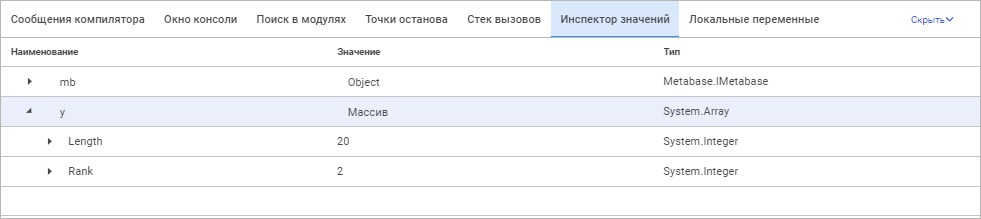

# Инспектор значений

Инспектор значений
-

# Инспектор значений

Инспектор значений позволяет вычислять различные выражения во время
 отладки кода.

Выражение - конструкция, определяющая правила вычисления с использованием
 констант и текущих значений переменных для получения новых значений с
 применением операций и функций. Поддерживается вычисление выражений, основанных
 на функциях и выражениях, которые импортированы с помощью оператора [Pyimport](Fore.chm::/08_Operators/Pyimport.htm)
 из Python-модулей. Обновление значений производится после выполнения каждой
 строки кода.

	Веб-приложение Настольное приложение

		

		

На панели отображается следующая информация:

	- Имя. Наименование
	 переменной или константы, значение которой необходимо отслеживать.

	- Значение.
	 Текущее значение переменной.

	- Тип. Тип переменной
	 или константы.

	- Адрес. Адрес
	 значения объекта в памяти компьютера (доступно только в настольном
	 приложении).

Для открытия панели «Инспектор значений»
 выполните одно из действий:

	- выполните команду главного меню «Вид
	 > Инспектор значений»;

	- перейдите на панель «Инспектор
	 значений» в области панелей;

	- нажмите кнопку 
	 на панели инструментов «Панели»
	 в настольном приложении.

Для добавления отслеживаемого выражения необходимо дважды щёлкнуть на
 свободном месте в инспекторе значений либо выполнить команду «Добавить»
 контекстного меню. После этого будет добавлен новый пункт и включится
 режим его редактирования. Для выражений вычисляется не только их значение,
 но и значения всех свойств. Свойства будут отображаться в виде дочерних
 элементов объекта. Глубина иерархии вычисления любого свойства равна семи
 уровням.

Для любого выражения есть возможность изменить его значение. Для этого
 необходимо осуществить щелчок мыши в области колонки «Значение».
 По истечению нескольких секунд значение будет переведено в режим редактирования.
 При невозможности установить введённое значение будет выдано соответствующее
 сообщение об ошибке.

Примечание.
 Изменение значения доступно только для самого вычисляемого выражения.
 Значения свойств объекта доступны только для чтения.

Для редактирования выражений необходимо выделить соответствующий элемент
 и выполнить команду «Редактировать»
 контекстного меню. Также переход в режим редактирования выражения осуществляется
 нажатием клавиши F2 либо щелчком в области наименования выражения.

Для удаления отслеживаемого выражения необходимо выделить соответствующий
 элемент и выполнить команду «Удалить»
 контекстного меню либо нажать клавишу DELETE.

См. также:

[Запуск
 и отладка](../02_Work_in_Development_Environment/Run_Debug.htm)

		Справочная
		 система на версию 10.9
		 от 18/08/2025,
		 © ООО «ФОРСАЙТ»,
