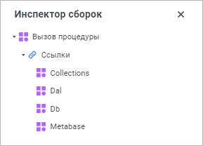
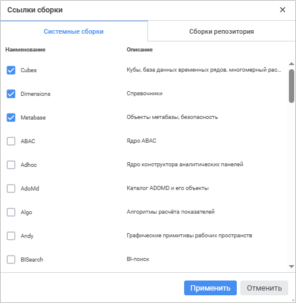
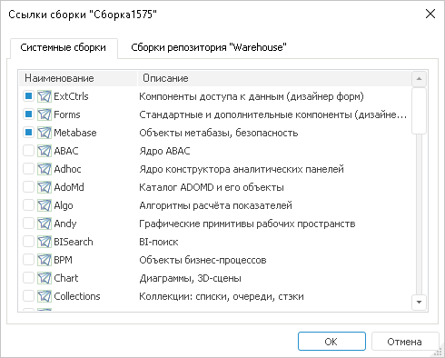
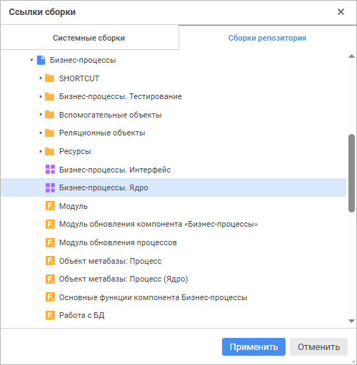
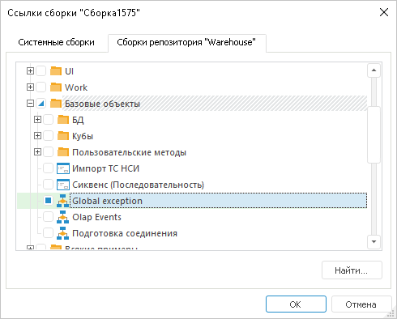

# Инспектор сборок

Инспектор сборок
-

# Инспектор сборок

На панели/окне «Инспектор сборок»
 отображается древовидная структура, содержащая все сборки репозитория
 и системные сборки, подключенные в текущей сборке/форме/веб-форме/модуле.

Для открытия панели/окна «Инспектор
 сборок»:

	- нажмите кнопку 
	 «Инспектор сборок» боковой
	 панели в веб-приложении или 
	 на панели инструментов в настольном приложении;

	- выполните команду «Вид
	 > Инспектор сборок» главного меню.

	Веб-приложение Настольное приложение

		

		

## Работа со ссылками

Ссылки можно добавлять на системные сборки, пользовательские сборки,
 модули, Python-модули, формы и веб-формы. Для настройки ссылок выполните
 одно из следующих действий:

	- в веб-приложении:

		- в навигаторе проекта дважды щёлкните по сборке;

		- для открытого в среде разработки объекта в инспекторе сборок
		 дважды щёлкните по элементу «Ссылки»
		 или нажмите кнопку .

	- в настольном приложении:

		- в навигаторе проекта дважды щёлкните по сборке или по элементу
		 сборки «Ссылки» или «Добавить ссылку»;

		- в навигаторе проекта для сборки выполните команду контекстного
		 меню «Ссылки» или для
		 элемента сборки «Ссылки»
		 команду контекстного меню «Редактировать»;

		- для открытого в среде разработки объекта выполните команду
		 главного меню «Сборка > Редактировать
		 ссылки»;

		- для открытого в среде разработки объекта в инспекторе сборок
		 дважды щёлкните по элементу «Ссылки»
		 или выполните для этого элемента команду контекстного меню «Сборки репозитория»/«Системные
		 сборки».

При выполнении указанных действий будет открыт диалог редактирования
 ссылок:

	- на вкладке «Системные
	 сборки» представлены список и краткое описание системных сборок
	 среды разработки. Для подключения сборки необходимо установить напротив
	 неё флажок. В веб-приложении вкладка выглядит следующим образом:

В настольном приложении вкладка выглядит следующим образом:

	- на вкладке «Сборки
	 репозитория» отображаются все сборки/модули/Python-модули/формы
	 репозитория, представленные в виде дерева. Для подключения какого-либо
	 объекта в веб-приложении необходимо его отметить выделением, а в настольном
	 приложении - отметить флажком. Также в настольном приложении если
	 отметить папку, то будут подключены все объекты, содержащиеся в ней.
	 Кнопка «Найти» позволяет быстро
	 найти и подключить требуемый объект.

	Можно добавлять ссылки на ярлыки, ссылающиеся на объекты среды разработки.
	 Если в настройках ярлыка изменить объект, то он автоматически будет
	 использоваться во всех объектах, в которых добавлена ссылка на ярлык.
	 Перенастройка этих объектов не потребуется. В веб-приложении вкладка
	 выглядит следующим образом:

В настольном приложении вкладка выглядит следующим образом:

См. также:

[Создание
 сборки](../02_Work_in_Development_Environment/DevEnv_Object/DevEnv_Assembly.htm)

		Справочная
		 система на версию 10.9
		 от 18/08/2025,
		 © ООО «ФОРСАЙТ»,
