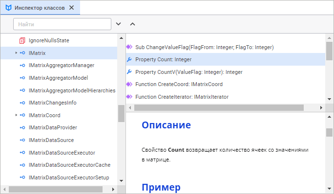
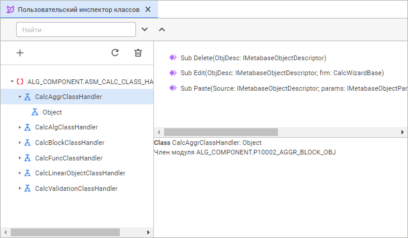
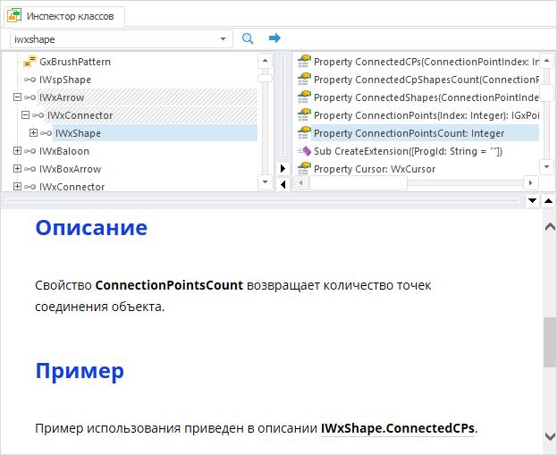
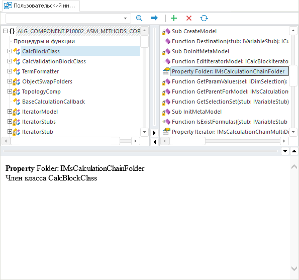

# Инспекторы классов

Инспекторы классов
-

# Инспекторы классов

В среде разработки для разработчика доступны
 три вида инспекторов классов:

	- инспектор классов Fore-сборок;

	- пользовательский инспектор классов.

[Для
 открытия окна](javascript:TextPopup(this))

	Для открытия инспектора классов выполните одно из следующих действий:

		- выполните команду главного меню «Вид
		 > Инспекторы классов» и выберите необходимый тип инспектора
		 классов;

		- на панели инструментов нажмите кнопку 
		 или  в настольном приложении;

		- находясь в [окне макроса](Window_Macros.htm),
		 зажмите клавишу CTRL и щелкните в коде текст с наименованием какого-либо
		 системного свойства/метода/интерфейса/класса;

		- находясь в [окне макроса](Window_Macros.htm),
		 установите курсор в коде в область текста, где указано какое-либо
		 системное свойство/метод/интерфейс/класс и нажмите клавишу F12
		 или выполните команду контекстного меню «Перейти
		 к определению».

В окне инспектора классов отображается древовидная структура сборок,
 доступных для использования.

Веб-приложение:

	Инспектор классов Пользовательский инспектор классов

		

		

Настольное приложение:

	Инспектор классов Пользовательский инспектор классов

		

		

Окно инспектора разделено на три части:

	- Список сборок и типов, реализованных в этих сборках.

	- Список членов, реализованных в выбранном типе.

	- Информация о выбранном типе/члене типа. Информация
	 берётся из справочной системы. Выбор используемой справочной системы
	 осуществляется в параметрах навигатора объектов на странице «[Справка](UiNav.chm::/02_Navigator/UiNav_RepoConfig_Help.htm)».

Для поиска необходимого типа/члена типа:

	- Введите наименование в поле ввода, расположенное в
	 верхней части окна.

	- Нажмите кнопку  или
	 клавишу ENTER для начала процедуры поиска.

В случае удачного поиска дерево элементов будет развернуто и первый
 найденный элемент будет выделен в дереве. Для продолжения поиска нажмите
 кнопку .

## Пользовательский инспектор классов

Пользовательский инспектор классов предназначен для просмотра содержимого
 Fore-сборок, реализованных в репозитории. Для наполнения инспектора классов
 нажмите кнопку  и выберите Fore-сборку репозитория.
 Содержимое сборки будет отображено в виде древовидной структуры. Отображаются
 только те типы и члены типов, которые имеют [модификатор доступа](Fore.chm::/06_SyntRules/Fore_Synt_Visible.htm) Public
 или Protected Friend.

Для удаления сборки выделите её или один из её членов в верхней левой
 части и нажмите кнопку . Кнопка 
 позволяет обновить деревья сборок в соответствии с их кодом.

См. также:

[Наполнение
 кодом](Window_Macros.htm)

		Справочная
		 система на версию 10.9
		 от 18/08/2025,
		 © ООО «ФОРСАЙТ»,
