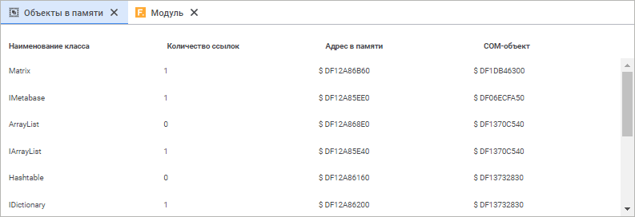
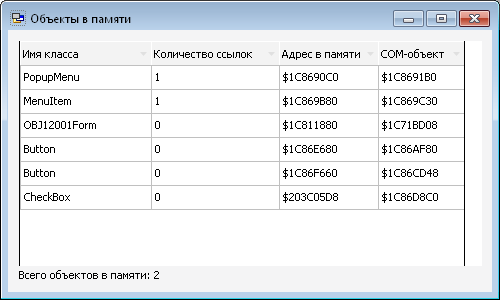

# Объекты в памяти

Объекты в памяти
-

# Объекты в памяти

В данном окне/панели отображаются все объекты, которые были созданы
 при выполнении прикладного кода и находятся в текущий момент в памяти
 компьютера.

Открыть окно/панель можно двумя способами:

	- воспользоваться командой главного меню «Вид
	 > Объекты в памяти».

	- использовать кнопку  /  «Объекты
	 в памяти» на панели инструментов.

	Веб-приложение Настольное приложение

		

		

Данные в окне будут отображены, если прикладной код запущен на отладку
 и произошло одно из следующих событий:

	- Выполнение кода было приостановлено по точке останова (Процесс
	 установки точек останова описан в разделе «[Запуск
	 и отладка объектов среды разработки](../02_Work_in_Development_Environment/Run_Debug.htm)»).

	- После завершения кода в памяти остались объекты, которые не
	 смог очистить [сборщик
	 мусора](KnowledgeBase.chm::/01_Fore/KB000030/KnowledgeBase_KB000030_2.htm).

## Объекты в памяти во время отладки

Отображение объектов в памяти позволяет отследить процессы создания
 и уничтожения объектов. В окне будет отображён класс созданного объекта,
 количество ссылок на него из других объектов, а также физический адрес
 в памяти компьютера. Двойной щелчок по элементу позволяет перейти к строке
 кода, в которой осуществлялась инициализация объекта.

## Объекты в памяти после завершения выполнения кода

Если объекты остались в памяти после завершения кода, то данное окно
 будет открыто автоматически. В этом случае наличие объектов свидетельствует
 о неэффективности кода, приводящей к утечкам памяти. При выделении необходимого
 объекта в таблице автоматически будет отображен его [стек
 вызова](Stack_of_the_call.htm). Двойной щелчок по элементу позволяет перейти к строке кода,
 в которой осуществлялась инициализация объекта.

Для избежания ситуаций, при которых остаются объекты в памяти, необходимо
 проверить прикладной код. Возможно, должно использоваться принудительное
 уничтожение объектов с помощью оператора [Dispose](KnowledgeBase.chm::/01_Fore/KnowledgeBase_KB000004.htm),
 либо в определенные моменты должно производиться обнуление ссылок на объекты
 путем присвоения значения Null.

См. также:

[Запуск
 и отладка объектов среды разработки](../02_Work_in_Development_Environment/Run_Debug.htm)

		Справочная
		 система на версию 10.9
		 от 18/08/2025,
		 © ООО «ФОРСАЙТ»,
