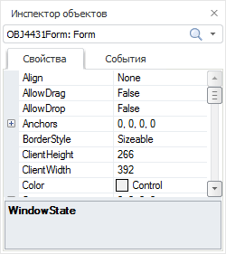
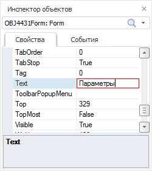
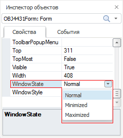
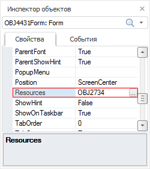
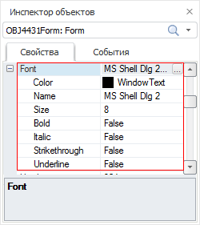

# Инспектор объектов

Инспектор объектов
-

# Инспектор объектов

Инспектор объектов - один из основных инструментов разработки интерфейса
 приложения. Он используется для настройки свойств и событий компонентов
 и формы.

Открыть окно «Инспектор объектов»
 можно двумя способами:

	- выполнить команду главного меню «Вид
	 > Инспектор объектов»;

	- нажать кнопку  на панели
	 инструментов.

В верхней части окна «Инспектора объектов»
 расположен раскрывающийся список, содержащий все компоненты проектируемой
 формы. В список входит также и сама форма. После выбора элемента списка
 он выделяется на форме. Инспектор объектов отображает свойства выбранного
 элемента. Если отмечено несколько объектов, то в инспекторе отображаются
 только общие свойства выбранных объектов.

Вкладки «Свойства» и «События» содержат таблицы, в первом
 столбце которых перечисляются свойства или события, а во втором - значения
 свойств или наименования подпрограмм-обработчиков событий.

В инспекторе объектов доступно контекстное меню, содержащее следующие
 команды:

	- Справка по данному свойству/событию;

	- Перейти в инспектор классов.

Для вызова справки также можно выделить необходимое свойство/событие
 и нажать клавишу F1.

## Свойства

Свойства - это атрибуты, присущие объекту. Чтобы отредактировать значение
 свойства, необходимо выделить его в инспекторе объектов и задать его значение
 во втором столбце. Новое значение свойства сохраняется при потере фокуса
 ввода или при нажатии клавиши ENTER. Если было введено недопустимое значение
 свойства, то будет восстановлено его предыдущее значение.

Вид редактора значения зависит от типа свойства:

	- Строка или число.
	 Редактор - поле ввода, в который можно ввести текст или число:

	- Перечислимое свойство.
	 Редактор - раскрывающийся список, поскольку свойство данного типа
	 может принимать значения только из предопределенного набора значений.
	 Значение можно либо выбрать из списка, либо ввести вручную, но введенное
	 значение обязательно должно входить в список допустимых значений.
	 Двойной щелчок по значению приводит к выбору следующего элемента списка.
	 Список допустимых значений для некоторых свойств может быть не только
	 фиксированным, но и динамическим, то есть состав его может изменяться
	 во время проектирования формы. Это справедливо для свойств, которые
	 задают имя другого компонента, расположенного на форме:

	- Объект. Редактор
	 - модальный диалог. Редактор вызывается по щелчку на кнопке с многоточием
	 либо двойным щелчком по самому значению свойства. Вид диалога зависит
	 от конкретного свойства:

	- Составное свойство.
	 В инспекторе объектов составное свойство отображается с экспандером.
	 Двойной щелчок по наименованию свойства либо щелчок по экспандеру
	 приведет к разворачиванию дерева подсвойств. Редактирование свойства
	 заключается в редактировании его подсвойств:

## События

Работа с событиями в инспекторе объектов производится почти так же,
 как и с перечислимыми свойствами. В список допустимых значений для событий
 входят имена подходящих подпрограмм текущего модуля. Двойной щелчок в
 правой колонке события приводит к автоматической генерации заготовки подпрограммы-обработчика
 события.

Если в качестве обработчика события ввести имя несуществующей подпрограммы,
 то заготовка подпрограммы-обработчика с таким именем также будет вставлена
 в окно редактирования.

Переименовать обработчик события можно, отредактировав его имя в инспекторе
 объектов.

См. также:

[Создание
 формы и размещение компонентов](../02_Work_in_Development_Environment/DevEnv_Object/DevEnv_Form.htm)

		Справочная
		 система на версию 10.9
		 от 18/08/2025,
		 © ООО «ФОРСАЙТ»,
