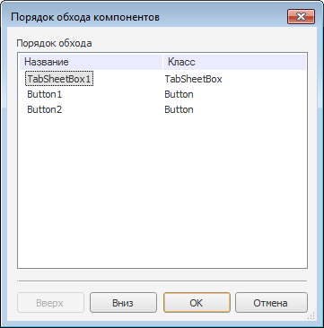

# Порядок обхода компонентов

Порядок обхода компонентов
-

# Порядок обхода компонентов

Окно «Порядок обхода компонентов»
 предназначено для определения порядка перехода по компонентам при использовании
 клавиши TAB (SHIFT+TAB).

Открыть окно «Порядок обхода компонент»
 можно, выполнив команду главного меню «Правка>Порядок
 обхода компонентов».

Порядок компонентов в списке зависит от установленного у них значения
 свойства [TabOrder](ModForms.chm::/Interface/IControl/IControl.TabOrder.htm).
 Для изменения порядка табуляции необходимо воспользоваться кнопками «Вверх» и «Вниз».
 После изменения порядка следования компонентов в списке значения свойства
 [TabOrder](ModForms.chm::/Interface/IControl/IControl.TabOrder.htm)
 этих компонентов меняются автоматически.

См. также:

[Создание
 формы и размещение компонентов](../02_Work_in_Development_Environment/DevEnv_Object/DevEnv_Form.htm)

		Справочная
		 система на версию 10.9
		 от 18/08/2025,
		 © ООО «ФОРСАЙТ»,
