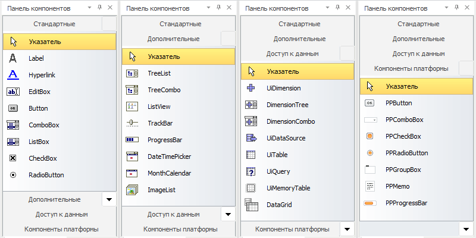

# Панели компонентов

Панели компонентов
-

# Панели компонентов

На панелях компонентов расположены компоненты, сгруппированные в соответствии
 с выполняемыми функциями. Внешний вид вкладок:

	- Вкладка «[Стандартные](../../02_Components_constructor_forms/01_Standart_Components/Standart_Components.htm)»
	 содержит базовые компоненты окон Windows-приложений;

	- Вкладка «[Дополнительные](../../02_Components_constructor_forms/02_Additional_components/Additional_components.htm)»
	 содержит компоненты, специально разработанные для придания создаваемым
	 формам более привлекательного и современного вида;

	- Вкладка «[Доступ
	 к данным](../../02_Components_constructor_forms/03_Components_of_the_access_to_data/03_components_of_the_access_to_data.htm)» содержит компоненты, предоставляющие доступ к
	 реляционным источникам данных, различным объектам репозитория и предназначенные
	 для управления данными подключенных объектов;

	- Вкладка «[Компоненты
	 платформы](../../02_Components_constructor_forms/04_PPControls/04_components_pp7.htm)» содержат стилизованные компоненты продукта «Форсайт.
	 Аналитическая платформа».

См. также:

[Создание
 формы и размещение компонентов](../02_Work_in_Development_Environment/DevEnv_Object/DevEnv_Form.htm)

		Справочная
		 система на версию 10.9
		 от 18/08/2025,
		 © ООО «ФОРСАЙТ»,
