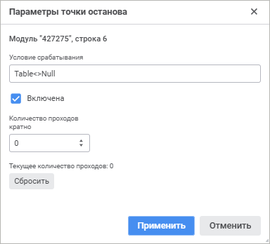
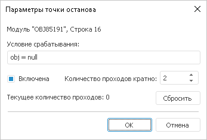
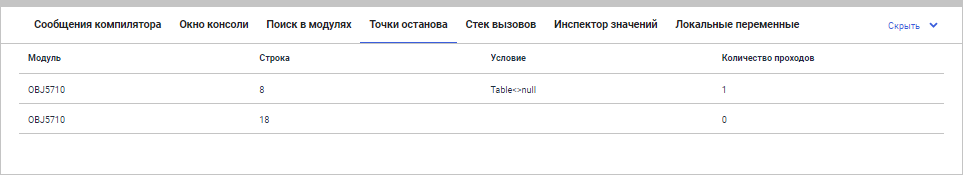
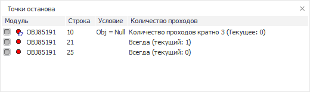

# Параметры точки останова

Параметры точки останова
-

# Параметры точки останова

Окно «Параметры точки останова»
 вызывается однократным щелчком правой кнопки мыши на установленной точке
 останова и выглядит следующим образом.

	Веб-приложение Настольное приложение

		

		

В окне «Параметры точки останова»
 определяются следующие атрибуты:

	- Условие срабатывания.
	 Любое логические выражение языка Fore, при значении которого True произойдет останов на точке;

	- Включена.
	 Определяет активность точки останова;

	- Количество проходов
	 кратно. Определяет, какое количество раз точка останова должна
	 быть пройдена перед прерыванием выполнения. По умолчанию установлено
	 значение «0», при этом выполнение
	 программы прерывается всякий раз при достижении точки останова. Если
	 задать какое-либо значение, то останов выполнения будет происходить
	 при каждом кратном указанному числу проходе.

	- Текущее количество
	 проходов. Количество проходов (анализа) текста программы компилятором;

	- Сбросить.
	 Кнопка, осуществляющая сброс числа текущих проходов программы в нуль.

## Управление точками останова

Во время отладки приложения все точки останова отображаются в отдельном
 окне.

	Веб-приложение Настольное приложение

		

		

В данном окне отображается список точек останова, установленных в открытых
 в данный момент макросах. В окне находится таблица, в которой отображаются:

	- Модуль. Идентификатор
	 отлаживаемого объекта среды разработки, в котором установлена точка
	 останова;

	- Строка. Номер
	 строки, в которой установлена точка останова;

	- Условие. Условие,
	 при выполнении которого производится остановка выполнения кода;

	- Количество проходов.
	 Количество проходов строки кода, на которой установлена точка останова.

Для исключения точек останова из процесса отладки (без сброса их параметров)
 используйте флажки в столбце «Модуль».
 Данный флажок также изменяет состояние флажка «Включена»
 в параметрах точки останова. Исключённые точки игнорируются, код в этих
 точках выполняется без остановки процесса отладки. В области окна «Точки останова» доступно контекстное
 меню, позволяющее управлять списком точек и настраивать их параметры.
 Также доступно множественное выделение точек, при этом их можно будет
 удалить или изменить состояние флажка.

См. также:

[Запуск
 и отладка](../02_Work_in_Development_Environment/Run_Debug.htm)

		Справочная
		 система на версию 10.9
		 от 18/08/2025,
		 © ООО «ФОРСАЙТ»,
