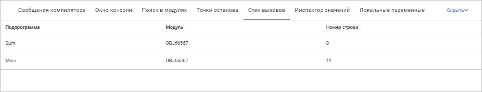

# Стек вызовов

Стек вызовов
-

# Стек вызовов

Стек вызовов - стек, в который
 функция со своими фактическими параметрами заносится при вызове и изымается
 при возврате. В окне «Стек вызовов»
 отображаются все подпрограммы, выполняемые в данный момент времени. Чем
 ниже в списке отображена подпрограмма тем раньше она была вызвана.

	Веб-приложение Настольное приложение

		

		

Для открытия панели:

	- перейдите на панель «Стек вызовов»
	 в области панелей;

	- выполните команду «Вид >
	 Стек вызовов» главного меню.

На панели «Стек вызовов» в виде
 списка отображается следующая информация:

	- Подпрограмма.
	 Список процедур и функций, выполняемых в данный момент времени;

	- Модуль. Имя
	 модуля, содержащего процедуры и функции, выполняемые в данный момент.

Панель «Стек вызовов» заполняется
 каждый раз при прерывании исполнения модуля. Прерывания возникают в двух
 случаях:

	- при остановке на точке останова;

	- при возникновении исключительных ситуаций.

Двойной щелчок по имени подпрограммы приведет к соответствующей строке
 кода.

См. также:

[Запуск
 и отладка](../02_Work_in_Development_Environment/Run_Debug.htm)

		Справочная
		 система на версию 10.9
		 от 18/08/2025,
		 © ООО «ФОРСАЙТ»,
