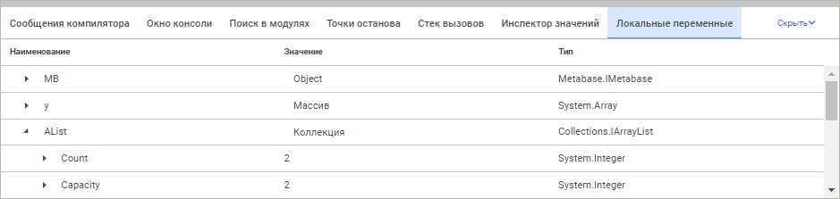
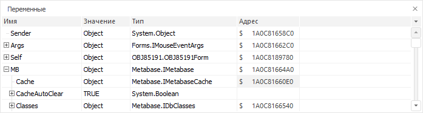

# Переменные: Окно среды разработки

Переменные: Окно среды разработки
-

# Переменные

Панель «Переменные»/«Локальные
 переменные» предназначено для просмотра значений переменных во
 время отладки приложения. Содержимое панели доступно только во время отладки
 кода. На панели отображаются локальные переменные, которые объявлены в
 той процедуре/функции, в которой сработала точка останова.

	Веб-приложение Настольное приложение

		

		

Для открытия панели:

	- перейдите на панель «Локальные
	 переменные» в области панелей;

	- выполните команду «Вид >
	 Локальные переменные» главного меню.

## Работа в панели «Переменные»

Переменные на панели отображаются в том порядке, в каком они определены
 в коде приложения. Если осуществляется работа с формой/веб-формой, то
 среди переменных будет доступна переменная Self,
 возвращающая контекст выполняемой формы.

На панели отображается следующая информация:

	- Имя/Наименование.
	 Наименование переменной, а также иерархия сопутствующих свойств, которые
	 могут быть вычислены для переменной.

	- Значение.
	 Текущее значение переменной.

	- Тип. Тип данных
	 переменной.

	- Адрес. Адрес
	 значения объекта в памяти компьютера.

Глубина иерархии вычисления свойств любой переменной равна семи уровням.
 Значение переменной может быть скопировано или изменено, для этого используйте
 соответствующие команды контекстного меню. Также, используя команду контекстного
 меню, переменная может быть добавлена в «[Инспектор
 значений](Inspector_Value.htm)». Таким образом можно сформировать отдельный список отслеживаемых
 переменных.

В веб-приложении для изменения значения переменной щёлкните в области
 столбца «Значение» и введите новое
 значение. Для матриц, массивов, коллекций по команде контекстного меню
 доступен просмотр значений.

См. также:

[Запуск
 и отладка](../02_Work_in_Development_Environment/Run_Debug.htm)

		Справочная
		 система на версию 10.9
		 от 18/08/2025,
		 © ООО «ФОРСАЙТ»,
