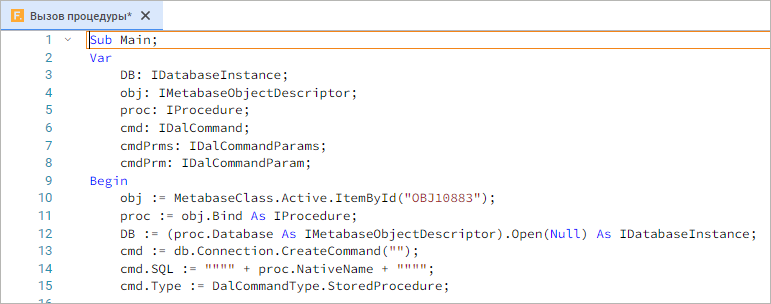
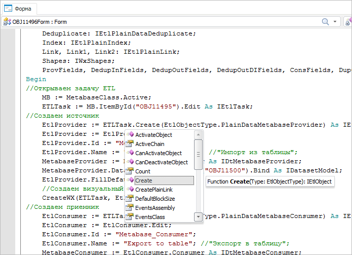
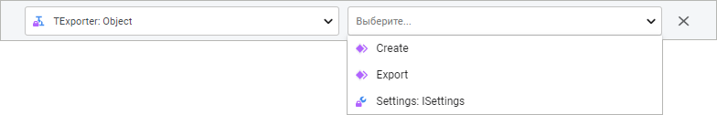
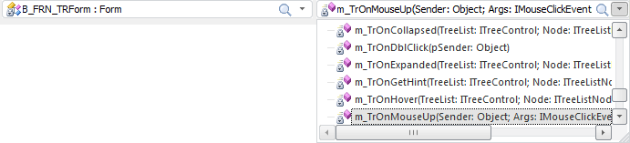
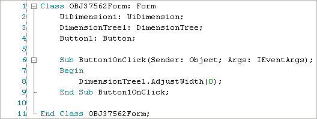

# Наполнение кодом

Наполнение кодом
-

# Наполнение кодом

В окне макроса при помощи реализованного в платформе языка Fore можно
 создавать (редактировать) основной код приложения.

	Веб-приложение Настольное приложение

		

		

## Отображение объектов в окне макроса

Все открытые в среде разработки объекты представляются в виде дочерних
 MDI-окон. Управление расположением окон открытых объектов осуществляется
 посредством команд главного меню «Окно»
 среды разработки. Каждому окну открытого объекта соответствует вкладка
 дочернего MDI-окна. Для изменения активного объекта необходимо щелкнуть
 по нужной вкладке либо выбрать объект из списка, который будет организован
 в виде команд главного меню «Окно».
 Для вкладок доступно контекстное меню, позволяющее сохранить соответствующий
 объект либо закрыть его.

Также доступно контекстное меню, вызываемое в свободном месте области
 вкладок. Данное меню содержит следующие команды:

	- закрыть окно;

	- закрыть все окна, кроме текущего;

	- закрыть все окна.

Закрытие объекта осуществляется при выполнении соответствующей команды
 одного из контекстного меню либо при выполнении одного из следующих действий:

	- после щелчка средней кнопки мыши (ролика мыши) в области
	 соответствующей вкладки;

	- при выполнении команды главного меню «Файл
	 > Закрыть»;

	- при нажатии кнопки ,
	 отображаемой с правой стороны в области вкладок;

	- при нажатии сочетания клавиш CTRL+F4.

При наличие несохраненных данных будет выдан соответствующий диалог
 на сохранение.

## Написание кода макроса

Написание кода осуществляется с использованием языка Fore. Для получения
 подробной информации обратитесь к разделу «[Руководство по языку Fore](Fore.chm::/Fore_Title.htm)».

 Дополнительные возможности, доступные при разработке кода, можно
 узнать в следующих разделах:

	- [Автоматические подстановки](Automatic_substitutions.htm);

	- [IntelliSense](../02_Work_in_Development_Environment/IntelliSense.htm);

	- [Инспекторы классов](Inspector_class.htm);

	- [Инспектор кода](Inspector_Code.htm);

	- [Поиск
	 и замена](../02_Work_in_Development_Environment/Search.htm);

	- [Горячие
	 клавиши](../02_Work_in_Development_Environment/Development_Environment_hot_keys.htm).

## Навигация по коду

При больших объемах макросов для облегчения навигации по коду реализованы
 два раскрывающихся списка, расположенных в верхней части окна.

	Веб-приложение Настольное приложение

		

		

Для отображения списков в веб-приложении выполните команду главного
 меню «Вид > Навигация по коду».

В первом списке содержатся наименования всех классов и пространств имён,
 реализованных в модуле. Во втором - список всех переменных, процедур,
 функций и пользовательских свойств, описанных в выбранном классе. Для
 перехода к нужному описанию необходимо сначала выбрать соответствующее
 наименование класса (пространства имен), а затем наименование необходимой
 процедуры (функции, переменной и т.д.). Если в модуле не содержится ни
 одного описания классов (пространств имен), то в первом списке отображается
 глобальное пространство имён - Global Scope. Принципы работы с раскрывающимися
 списками описаны в подразделе [Основные элементы интерфейса:
 Комбинированные списки](UiNav.chm::/GUI/combine_list.htm).

В правой части панели инструментов имеются кнопки для работы с историей
 навигации по коду. Для возврата к предыдущей позиции в коде нажмите кнопку
 
 или сочетание клавиш ALT+LEFT, для перехода к следующей позиции, которая
 была сформирована ранее - кнопку 
 или сочетание клавиш ALT+RIGHT. У кнопок имеется раскрывающееся меню,
 в котором имеется список ранее используемых позиций в коде. При необходимости
 можно выбрать конкретную позицию, к которой будет осуществлён переход.

Для быстрого перехода к нужной строке выберите пункт главного меню «Правка > Перейти к строке»
 или используйте сочетание клавиш CTRL+G. Для перехода в открывшемся диалоге
 введите номер строки.

Для облегчения поиска нужной строки можно настроить отображение нумерации
 строк кода:

Для этого необходимо установить флажок «Отображать
 нумерацию строк» в [параметрах среды разработки](Developer.chm::/About_Developing/Development_Environment_Options.htm).

### Переход к определению объекта

Для просмотра информации о классах/процедурах/функциях, используемых
 в коде, реализован быстрый переход к их описанию. Перейти к описанию элемента
 кода можно одним из следующих способов:

	- зажать клавишу CTRL и осуществить щелчок по элементу
	 кода;

	- установить курсор в области элемента кода и нажать
	 клавишу F12;

	- установить курсор в области элемента кода и выполнить
	 команду контекстного меню «Перейти
	 к определению».

Для системных классов/процедур/функций будет осуществлен переход в [инспектор классов](Inspector_class.htm) к соответствующему
 элементу и его описанию. Для пользовательских элементов кода осуществляется
 переход к месту реализации вызываемых классов/процедур/функций.

Для вызова справки по элементу, в области которого находится курсор,
 нажмите клавишу F1. Если курсор находится в области переменной, то справка
 будет вызвана для того типа, который имеет переменная.

См. также:

[Разработка
 прикладного приложения](../01_Purpose_of_the_constructor/Purpose_of_the_constructor.htm) | [Запуск
 и отладка](../02_Work_in_Development_Environment/Run_Debug.htm)

		Справочная
		 система на версию 10.9
		 от 18/08/2025,
		 © ООО «ФОРСАЙТ»,
