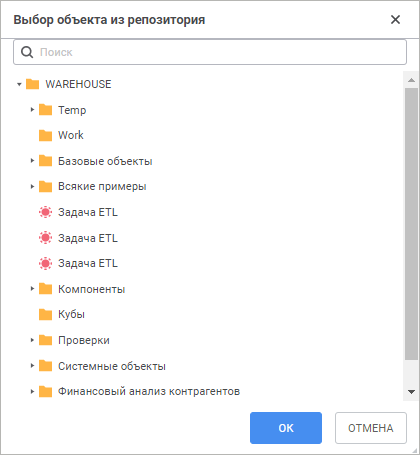

# Открытие объекта для отладки

Открытие объекта для отладки
-

# Открытие объекта для отладки

В среде разработки в веб-приложении можно выполнять отладку работы объектов
 репозитория, которые используют подключённые модули/веб-формы. Для отладки
 доступны следующие объекты:

	- [регламентные отчёты](UIReport.chm::/UiReport_purpose.htm);

	- [формы ввода](DataEntryForms.chm::/DataEntryForms_Purpose.htm);

	- [справочники](UiNavObj.chm::/reference_book/create.htm);

	- [алгоритмы расчёта](CalculationAlgorithm.chm::/purpose.htm);

	- [задачи
	 ETL](UiETL.chm::/Desktop/01_general_info/uietl_general.htm);

	- [процессы](BPM.chm::/Modeling_of_business_processes.htm).

Примечание.
 Из-за особенностей реализации механизма асинхронных запросов, необходимых
 для выполнения отладки объектов, отладка объектов на ОС Astra Linux SE
 1.6 не поддерживается, а для корректной работы отладки объектов на ОС
 Astra Linux SE 1.7 требуется [установить
 и настроить BI-сервер](Setup.chm::/uiwebsetup/03_setup_web/debian/install_bi_server_to_debian.htm).

Для открытия объекта для отладки:

	- Откройте в среде разработки Fore-модуль, используемый объектом
	 репозитория. Расставьте [точки
	 останова](Parameters_point_stop.htm) в необходимых местах.

	- Выполните команду главного меню «Отладка
	 > Открыть объект для отладки». Будет открыто окно «Выбор объекта из репозитория»:

	- Выберите в открывшемся окне требуемый объект репозитория. Для
	 быстрого поиска объекта начните писать его наименование частично или
	 полностью в строке поиска.

	- Нажмите кнопку «ОК».

В результате выполнения действий начнётся отладка выбранного объекта.
 Объект будет открыт на просмотр в новой вкладке браузера. При выполнении
 действий, которые приведут к выполнению Fore-кода и достижению точки останова,
 в заголовке вкладки со средой разработки будет отображен сигнализирующий
 текст « Отладка». Переключитесь
 на вкладку со средой разработки для продолжения процесса отладки.

Для приостановки выполнения отладки объекта нажмите кнопку  «Приостановить
 выполнение кода» или выполните команду главного меню «Отладка
 > Приостановить выполнение кода».

Для завершения выполнения отладки объекта выполните одно из действий:

	- нажмите сочетание клавиш CTRL+F2;

	- нажмите кнопку 
	 «Прервать выполнение кода»;

	- выполните команду главного меню «Отладка
	 > Прервать выполнение кода»;

	- закройте вкладку открытого на просмотр объекта.

См. также:

[Запуск
 и отладка](../02_Work_in_Development_Environment/Run_Debug.htm)

		Справочная
		 система на версию 10.9
		 от 18/08/2025,
		 © ООО «ФОРСАЙТ»,
