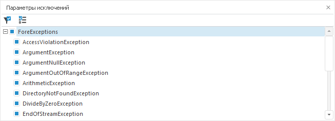

# Параметры исключений

Параметры исключений
-

# Параметры исключений

Окно «Параметры исключений»
 предназначено для выбора исключительных ситуаций, возникновение которых
 будет приводить к остановке выполнения программы и переходу в режим отладки:

Примечание.
 Окно доступно только в настольном приложении.

По умолчанию отслеживаются все возможные виды исключений. Для включения/отключения
 отслеживания какого-либо исключения используйте переключатель рядом с
 наименованием исключения. Описание доступных исключений представлено в
 подразделе «[Системные
 классы исключительных ситуаций](Fore.chm::/10_Processing_Exceptions/built_in_classes_of_the_exceptions.htm)». Кнопка  позволяет отфильтровать
 дерево и отобразить только те исключения, которые были оставлены в списке
 отслеживаемых. Кнопка  позволяет вернуть отметку всем
 имеющимся видам исключений.

Для того, чтобы программа была остановлена при возникновении какого-либо
 исключения в параметрах среды разработки на вкладке «[Выполнение](Developer.chm::/About_Developing/Development_Environment_Options.htm)»
 должен быть выставлен флажок «Приостановить выполнение при исключительной
 ситуации».

См. также:

[Запуск
 и отладка](../02_Work_in_Development_Environment/Run_Debug.htm)

		Справочная
		 система на версию 10.9
		 от 18/08/2025,
		 © ООО «ФОРСАЙТ»,
