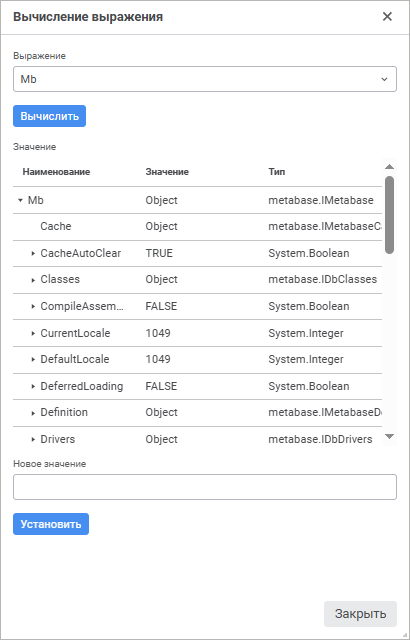
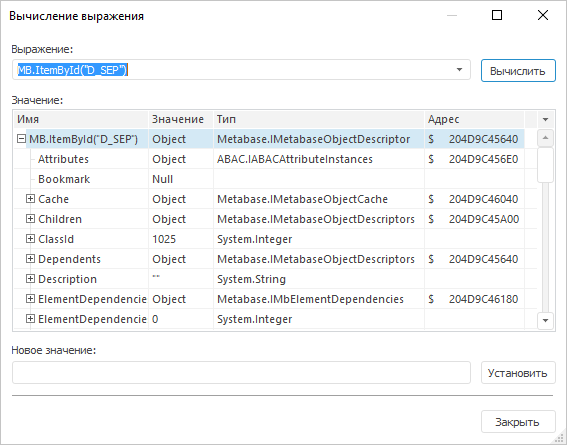
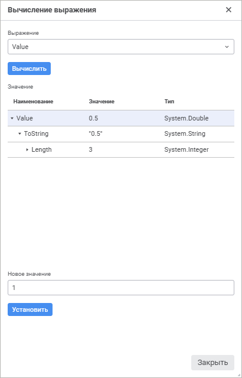
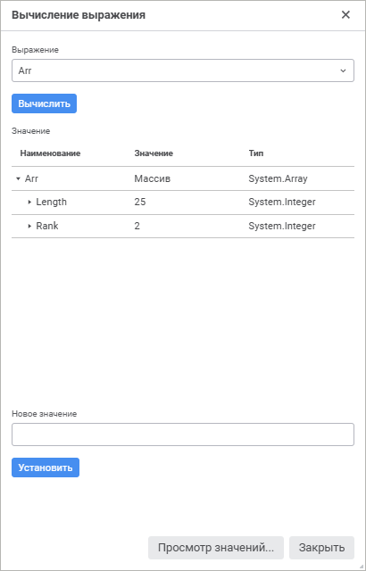
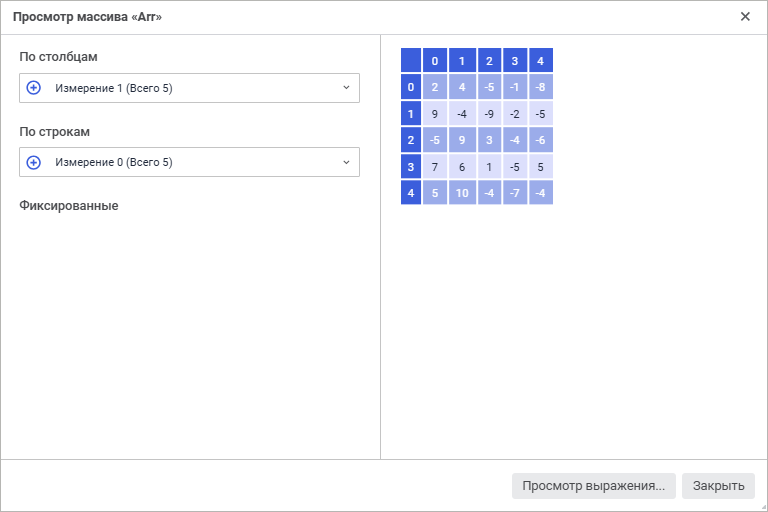
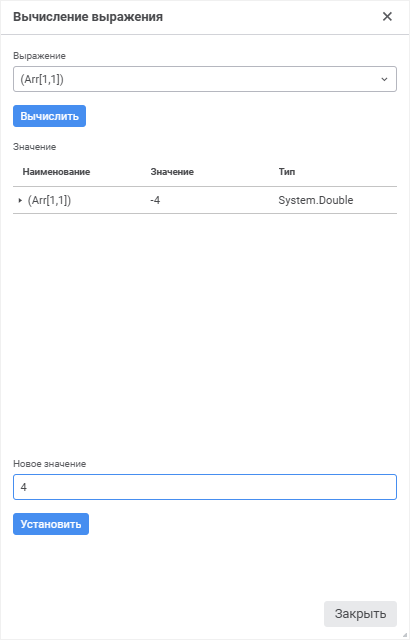
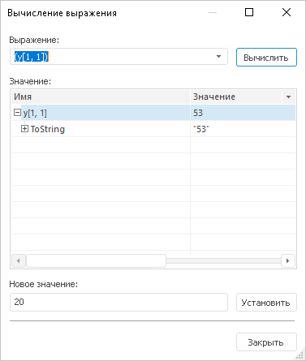

# Окно вычисления выражения

Окно вычисления выражения
-

# Окно вычисления выражения

В ходе выполнения программы в пошаговом режиме существует возможность
 вычисления значений переменных, массивов, выражений в специальном окне
 «Вычисление выражения».

	Веб-приложение Настольное приложение

		

		

Для открытия окна необходимо выполнить одно из следующих действий:

	- выполнить команду главного меню «Отладка
	 > Вычислить выражение».

	- нажать сочетание клавиш CTRL+F7.

	- выполнить команду контекстного меню в окне макроса
	 «Вычислить выражение».

	- нажать на кнопку  «Вычислить
	 выражение» на панели инструментов.

В поле «Выражение» отображается
 текст вычисляемого выражения. В комбинированном списке будут содержаться
 двадцать последних вычисленных выражений. При открытии окна в данное поле
 будет подставляться переменная, на которой установлен курсор в окне макроса,
 либо выражение, выделенное в окне макроса. В других случаях будет подставляться
 последнее вычисленное выражение, содержащееся в списке.

При первом открытии окна будет осуществлён автоматический расчёт указанного
 выражения. Результат вычисления будет представлен в виде дерева, содержащего
 все свойства объекта, их значения и тип данных. Для свойств, которые в
 свою очередь возвращают другой объект, также отображается физический адрес
 в памяти компьютера. Глубина иерархии вычисления любого свойства равна
 семи уровням. При изменении текста в поле «Выражение»
 для расчета новых значений необходимо нажать кнопку «Вычислить».

Для свойств объекта, доступных на запись, есть возможность изменить
 значение. Для этого необходимо в поле «Новое
 значение» указать соответствующие данные и нажать кнопку «Установить». При двойном щелчке
 по какому-либо свойству в области «Значение»,
 значение данного свойства автоматически подставляется в поле «Новое
 значение».

## Вычисление значений переменных (объектов)

Для просмотра информации о каком-либо объекте необходимо отметить соответствующую
 переменную или блок кода в тексте программы и вызвать окно «Вычисление
 выражения» одним из вышеперечисленных способов, либо в открытом
 окне «Вычисление выражения» ввести
 в поле ввода имя объекта и нажать кнопку «Вычислить»
 или клавишу ENTER на клавиатуре.

	Веб-приложение Настольное приложение

		

		

## Вычисление значений массивов

Для просмотра информации о массивах, матрицах и коллекциях, унаследованных
 от интерфейсов [IList](ModCollections.chm::/Interface/IList/IList.htm)
 и [IDictionary](ModCollections.chm::/Interface/IDictionary/IDictionary.htm),
 необходимо отметить соответствующую переменную в тексте программы и вызвать
 окно «Вычисление выражения» одним
 из вышеперечисленных способов, либо в открытом окне «Вычисление
 выражения» ввести в поле ввода имя соответствующей переменной и
 нажать кнопку «Вычислить». После
 этого будет выведено окно просмотра значений массива.

Если в окне просмотра значений массива нажать на кнопку «Просмотр
 выражения», то будет выведено окно с параметрами массива.

	Веб-приложение Настольное приложение

		

		

Кнопка «Просмотр значений» позволяет
 перейти обратно к окну просмотра значений массива.

### Просмотр значений элементов массива

Для просмотра элементов массива нажмите кнопку «Просмотр
 значений». После чего будет открыто окно «Просмотр
 массива <наименование
 массива>».

	Веб-приложение Настольное приложение

		

		

В левой части окна отображается список всех измерений массива. По умолчанию
 в измерениях, расположенных по строкам и столбцам, отмечены все элементы.
 В фиксированных измерениях отмечены первые элементы.

Для изменения расположения измерения зажмите кнопку мыши на пиктограмме
 в левой части и перетащите измерение в определенную область с помощью
 механизма Drag&Drop.

Для просмотра выражения и открытия окна «Вычисление
 выражения» нажмите кнопку «Просмотр
 выражения».

### Изменение значения элемента массива

Для изменения значения элемента массива выберите один из способов:

	- в окне «Вычисление выражения»:

		- Укажите элемент массива в поле «Выражение».
		 Для этого выполните одно из действий:

			- выделите элемент массива в тексте приложения и откройте
			 окно «Вычисление выражения».
			 Элемент массива будет подставлен автоматически;

			- введите элемент массива вручную.

		- Укажите новые данные в поле «Новое
		 значение».

		- Нажмите кнопку «Установить».

	- в окне «Просмотр массива <наименование массива>»:

		- Выполните одно из действий:

			- дважды щёлкните по значению элемента в массиве;

			- выделите значение элемента и нажмите клавишу F2.

		- Нажмите клавишу ENTER. При необходимости нажмите клавишу
		 ESC для возврата старого значения.

После выполнения действий значение элемента массива будет изменено.

	Веб-приложение Настольное приложение

		

		

См. также:

[Запуск
 и отладка](../02_Work_in_Development_Environment/Run_Debug.htm)

		Справочная
		 система на версию 10.9
		 от 18/08/2025,
		 © ООО «ФОРСАЙТ»,
