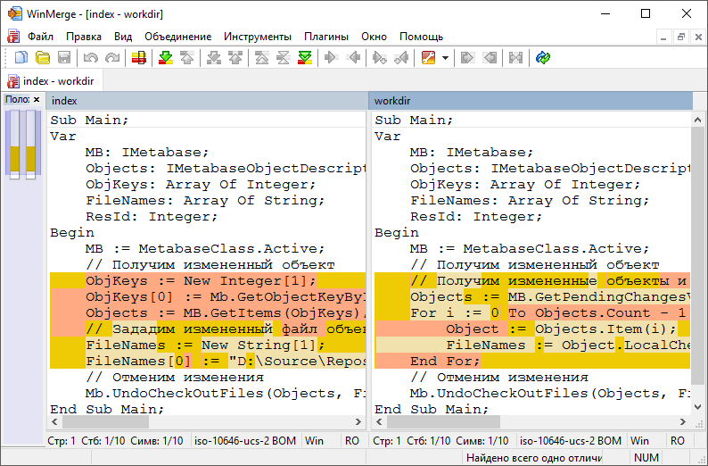
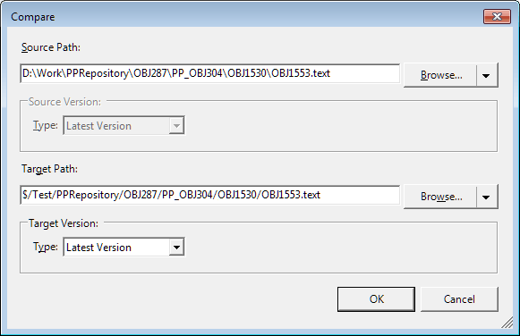
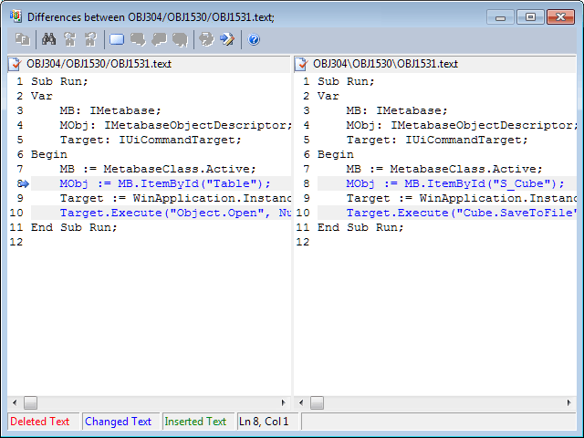

# Сравнение версий объекта

Сравнение версий объекта
-

# Сравнение версий объекта

При изменении объекта доступно визуальное сравнение [файлов](VSC_Add_Object.htm),
 содержащих информацию о версии объекта на сервере и в локальной папке
 на диске.

Для сравнения версий объекта выполните команду 
 «Сравнить версии»/  «Сравнить
 с последней версией» в контекстном меню измененного объекта в [навигаторе
 объектов](GetStarted.chm::/Interface/Interface_Navigator.htm), навигаторе проекта или на вкладке «Изменения» на панели «[Ожидающие изменения](VSC_Introduction.htm#control)»
 в [среде
 разработки](developer.chm::/Desktop_Title.htm).
 После выполнения действий будет открыто приложение для сравнения версий.

	Git Team Foundation Server

		В Git сравнение версий выполняется с помощью приложения WinMerge:

			- Скачайте и установите приложение [WinMerge](https://winmerge.org/downloads/).

			- Добавьте в переменные среды Windows путь до папки с
			 установленным приложением WinMerge в переменную «Path».

		При сравнении версий объекта будет запускаться приложение WinMerge:

		

		Примечание.
		 Приложение WinMerge также используется при [решении
		 конфликтов](VSC_get_latest_version.htm#decision) в системе управления версиями Git.

		В Team Foundation Server сравнения версий выполняется с помощью
		 стандартного окна системы управления версиями:

		

		Выберите файлы, которые необходимо сравнить и нажмите кнопку
		 «ОK». После выполнения
		 действий будет открыто окно сравнения:

		

		Примечание.
		 В зависимости от выбранного объекта на сервере и в локальной копии
		 сохраняется различное количество файлов. По умолчанию осуществляется
		 сравнение файлов с текстом модуля/формы. Для сборки осуществляется
		 сравнение файла, содержащего список модулей/форм.

См. также:

[Разработка
 приложений в команде](VSC_Introduction.htm) | [Получение
 последней версии объектов](VSC_get_latest_version.htm) | [Извлечение
 объекта для редактирования](VSC_CheckOut_Object.htm)

		Справочная
		 система на версию 10.9
		 от 18/08/2025,
		 © ООО «ФОРСАЙТ»,
