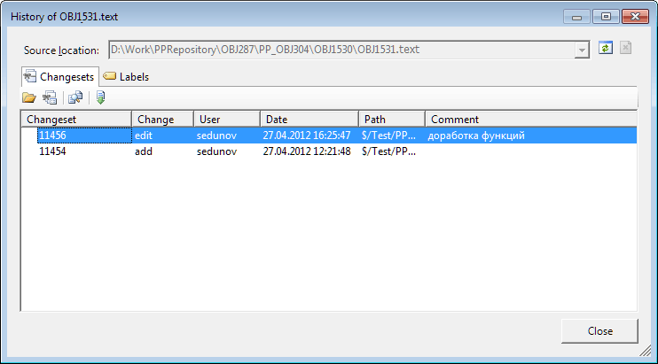
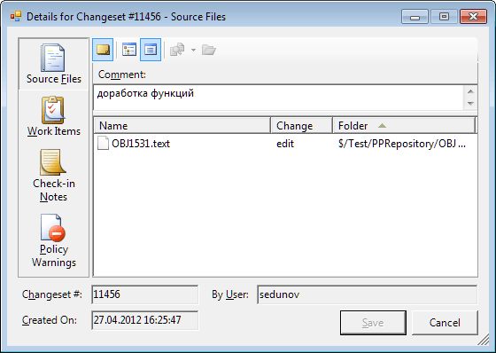

# Журнал изменений объектов

Журнал изменений объектов
-

# Журнал изменений объектов

Для объектов, добавленных в систему управления версиями, сохраняется
 история каждой публикации. Для просмотра истории необходимо отметить объект
 в дереве навигатора проекта и нажать кнопку  либо
 выбрать пункт контекстного меню «Журнал
 изменений».

После этого будет выведено стандартное окно с историей изменения объекта:

Для просмотра информации по конкретному изменению можно воспользоваться
 контекстным меню. Меню содержит следующие команды:

	- View. Позволяет
	 просмотреть текст модуля/формы для выбранной версии объекта. Для сборок
	 выводится содержимое XML файла, включающего список модулей/форм, содержащихся
	 в данной сборке;

	- Changeset Details.
	 Позволяет просмотреть информацию об изменениях, которые были произведены
	 в рамках выбранной публикации:

	

	- Compare. Используется
	 для сравнения версии объекта на выбранную дату с текущей версией,
	 содержащейся в локальных файлах;

	- Get This Version.
	 Используется, если необходимо произвести слияние текущей версии, хранящейся
	 в локальных файлах, с выбранной версией объекта;

	- Copy. Предназначен
	 для копирования информации о выбранной в истории записи в буфер
	 обмена.

См. также:

[Разработка приложений в команде](VSC_Introduction.htm)
 | [Сравнение версий объекта](VCS_Comparison_version_object.htm)

		Справочная
		 система на версию 10.9
		 от 18/08/2025,
		 © ООО «ФОРСАЙТ»,
