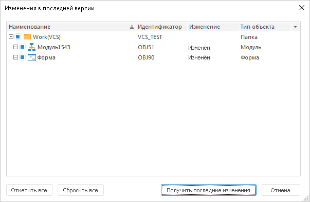

# Проверка изменений в последней версии объектов

Проверка изменений в последней версии объектов
-

# Проверка изменений в последней версии объектов

При совместной разработке приложений могут возникнуть различия в версиях
 объектов на различных компьютерах разработчиков. Прежде чем начать работу
 с объектами, проверьте объекты на наличие определённых изменений.

Для проверки изменений конкретных объектов в последней версии выполните
 команду «Изменения в последней версии»
 в контекстном меню [навигатора
 объектов](GetStarted.chm::/Interface/Interface_Navigator.htm) или навигатора
 проекта среды разработки перед [получением
 последней версии объектов](VSC_get_latest_version.htm). После выполнения действия будет открыто
 окно «Изменения в последней версии»:

В окне отображается результат проверки файлов на сервере системы управления
 версиями и соответствующих объектов репозитория. Проверка осуществляется
 для текущего объекта, а также для всех его дочерних объектов. Объекты,
 имеющие какие-либо расхождения, отображаются в виде дерева.

Примечание.
 Объекты, для которых версия в репозитории совпадает с версией системы
 управления версиями, в списке не отображаются.

Для получения последних изменений объектов установите флажки напротив
 объектов и нажмите кнопку «Получить последние
 изменения» или обратитесь к разделу «[Получение
 последней версии объектов](VSC_get_latest_version.htm)».

Для отметки всех объектов нажмите кнопку «Отметить
 все».

Для снятия флажков напротив всех объектов нажмите кнопку «Сбросить
 все».

См. также:

[Разработка
 приложений в команде](VSC_Introduction.htm) | [Получение
 последней версии объектов](VSC_get_latest_version.htm) | [Сравнение
 версий объекта](VCS_Comparison_version_object.htm)

		Справочная
		 система на версию 10.9
		 от 18/08/2025,
		 © ООО «ФОРСАЙТ»,
