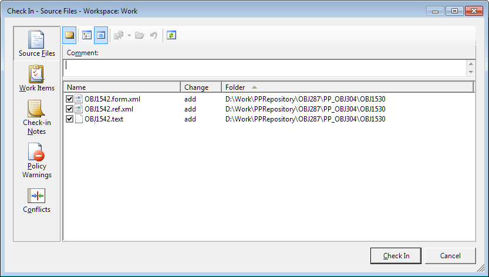

# Добавление объектов в систему управления версиями

Добавление объектов в систему управления версиями
-

# Добавление объектов в систему управления версиями

Для добавления объектов в [систему управления
 версиями](VSC_Introduction.htm):

	- Выделите объекты в [навигаторе
	 объектов](GetStarted.chm::/Interface/Interface_Navigator.htm) или навигаторе проекта в среде разработки.

	- Выполните одно из действий:

		- нажмите кнопку 
		 «Добавить в VCS» на ленте
		 инструментов навигатора объектов или в меню навигатора проекта
		 среды разработки;

		- выполните команду 
		 «Добавить в VCS» в контекстном
		 меню объектов.

После выполнения действий результат добавления объектов будет отличаться
 в зависимости от используемой системы управления версиями.

	 Team Foundation Server
	  Git

		В Team Foundation Server будет выведен стандартный диалог добавления
		 файлов в систему управления версиями:

		

		В зависимости от выбранного объекта на сервере и в локальной
		 папке на компьютере пользователя будет храниться различный набор
		 файлов, содержащих в себе информацию о версии объекта. Наименования
		 файлов формируются следующим образом: <идентификатор объекта>.<расширение>.

		Примечание.
		 Team Foundation Server накладывает ограничение на длину пути серверной
		 системы управления версиями. Путь серверной системы управления
		 версиями - это полный путь к местонахождению файла, хранимого
		 в системе управления версиями. Для данного пути имеются следующие
		 ограничения:

		-
		 Не более 248 символов юникод для имени каталога;

		-
		 Не более 260 символов юникод для имени каталога с именем файла.

		Необходимо учитывать
		 данное ограничение при добавлении объектов в систему управления
		 версиями.

		В Git объект будет добавлен в систему управления версиями без
		 каких-либо дополнительных подтверждений. На сервере и в локальной
		 папке на компьютере пользователя будет создан необходимый набор
		 файлов.

После добавления объекта в систему управления версиями объект будет
 заблокирован и ярлык объекта в навигаторе объектов и навигаторе проекта
 примет следующий вид: .

Примечание.
 Блокировка объекта осуществляется только в системе управления версиями
 Team Foundation Server. После добавления объекта в систему управления
 версиями для всех других разработчиков объект будет доступен только на
 чтение. При попытке редактирования такого объекта будет выдано соответствующее
 сообщение. Для работы с этими объектами
 у всех разработчиков должен быть [подключен
 репозиторий](../../04_NavigatorSetting/VCS/Add_In_VCS.htm) к одному и тому же серверу системы управления версиями.
 Для изменения объекта [извлеките объект
 для редактирования](VSC_CheckOut_Object.htm).

При добавлении объектов в систему управления версиями на сервере и в
 локальной папке на компьютере сохраняется набор файлов, содержащих информацию
 о версии объекта:

		 Объект
		 Файлы

		 Ресурсы
		 <идентификатор>.bin.
		 Файл с изображениями из ресурсов;

		<идентификатор>.res.xml.
		 Файл с текстовыми ресурсами.

		 Сборка
		 <идентификатор>.ref.xml.
		 XML-файл, содержащий список модулей/форм, находящихся в данной
		 сборке.

		 Модуль
		 <идентификатор>.ref.xml.
		 XML-файл, содержащий список ссылок на системные сборки и сборки
		 репозитория;

		<идентификатор>.text.
		 Текстовый файл, содержащий код модуля.

		 Форма
		 <идентификатор>.form.xml.
		 XML-файл, содержащий параметры формы (размеры, наличие и расположение
		 компонентов, параметры компонентов);

		<идентификатор>.ref.xml.
		 XML - файл, содержащий список ссылок на системные сборки и сборки
		 репозитория;

		<идентификатор>.text.
		 Текстовый файл, содержащий код формы.

		 Запрос
		 <идентификатор>.params.xml.
		 XML-файл, содержащий настройки параметров запроса;

		<идентификатор>.query.xml.
		 XML-файл, содержащий текст запроса.

		 Представление
		 <идентификатор>.params.xml.
		 XML-файл, содержащий настройки параметров представления;

		<идентификатор>.view.xml.
		 XML-файл, содержащий текст представления.

		 Процедура
		 <идентификатор>.params.xml.
		 XML-файл, содержащий настройки параметров процедуры;

		<идентификатор>.procedure.xml.
		 XML-файл, содержащий текст процедуры.

		 Команда СУБД
		 <идентификатор>.params.xml.
		 XML-файл, содержащий настройки параметров команды СУБД;

		<идентификатор>.sql.xml.
		 XML-файл, содержащий текст команды СУБД.

		 Веб-форма
		 <идентификатор>.ref.xml.
		 XML-файл, содержащий список ссылок на системные сборки и сборки
		 репозитория;

		<идентификатор>.text.
		 Текстовый файл, содержащий код веб-формы.

## Перемещение объектов, добавленных в систему управления версиями

Для избежания ошибок, которые могут возникнуть у разных разработчиков
 из-за перемещения/переименования объектов, добавленных в VCS, соблюдайте
 следующие правила.

	 Team Foundation Server
	  Git

		В Team Foundation Server перед перемещением/переименованием
		 объекта проверьте, что данный объект не заблокирован другими разработчиками.
		 Проверка осуществляется с использованием Microsoft Visual Studio
		 Team Explorer. Если имеются неопубликованные изменения, то свяжитесь
		 с соответствующими разработчиками и сообщите о необходимости публикации
		 всех изменений. После проверки прикладной разработчик может переместить/переименовать
		 необходимый объект в репозитории. При перемещении/переименовании
		 соответствующие действия автоматически будут произведены над всеми
		 файлами, которые соответствуют объекту на сервере.

		Примечание.
		 При перемещении/переименовании объектов в репозитории будут выданы
		 подтверждения на выполнение соответствующих действий с файлами
		 на сервере.

		После перемещения/переименования объекта сообщите об этом всем
		 прикладным разработчикам, которые также работают с данным объектом.
		 После чего им необходимо обновить навигатор объектов, [получить
		 последнюю версию папки](VSC_get_latest_version.htm), из которой выполнялось перемещение,
		 и папки, в которую осуществлялось перемещение.

		При возникновении конфликта, связанного с неопубликованными
		 изменениями в перемещенных объектах, разработчик, получивший сообщение
		 об ошибке «TF10141: No files
		 checked in: resolve the conflicts and try again», должен
		 [разрешить конфликт](VSC_get_latest_version.htm#decision)
		 у себя. Для этого следует обновить репозиторий в навигаторе объектов,
		 получить последнюю версию папки, в которую было выполнено перемещение,
		 и выполнить [публикацию изменений](VSC_CheckIn_Object.htm).
		 В появившемся окне разрешения конфликтов следует выбрать способ
		 разрешения конфликта. Если выбрано автоматическое разрешение конфликтов,
		 то в появившемся окне с запросом нового имени файла нужно выбрать
		 имя файла на сервере.

		В Git перед перемещением/переименованием объекта [получите
		 последнюю версию объектов](VSC_get_latest_version.htm) с сервера. После чего переместите/переименуйте
		 необходимый объект в репозитории. При перемещении/переименовании
		 соответствующие действия автоматически будут произведены над всеми
		 файлами, которые соответствуют объекту на сервере.

		После перемещения/переименования объекта [опубликуйте
		 изменения](VSC_CheckIn_Object.htm) на сервер и сообщите об этом всем прикладным разработчикам,
		 которые также работают с данным объектом. После чего им необходимо
		 обновить навигатор объектов и [получить
		 последнюю версию объектов](VSC_get_latest_version.htm) с сервера.

		При возникновении конфликта, связанного с неопубликованными
		 изменениями в перемещенных объектах, разработчик, получивший сообщение
		 о наличии конфликта, должен [разрешить
		 конфликт](VSC_get_latest_version.htm#decision) у себя и опубликовать разрешенные изменения объектов
		 на сервер.

См. также:

[Разработка приложений в команде](VSC_Introduction.htm)
 | [Проверка изменений в последней
 версии объектов](VCS_changes_to_last_version.htm) | [Получение последней
 версии объектов](VSC_get_latest_version.htm)

		Справочная
		 система на версию 10.9
		 от 18/08/2025,
		 © ООО «ФОРСАЙТ»,
