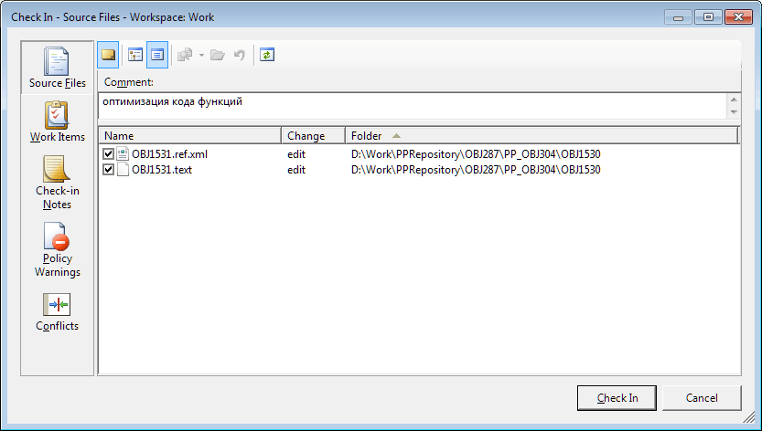
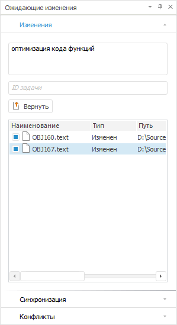
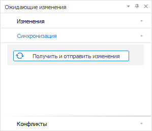

# Публикация изменений объектов

Публикация изменений объектов
-

# Публикация изменений объектов

Для публикации изменений объектов на сервер:

	- Выделите изменённые объекты в [навигаторе
	 объектов](GetStarted.chm::/Interface/Interface_Navigator.htm), в навигаторе проекта среды разработки
	 или откройте окно «[Ожидающие
	 изменения](../03_Windows_of_Development_Environment/Executed_Change.htm)».

Примечание.
 Пиктограмма измененного объекта в навигаторе проекта отмечается соответствующей
 пиктограммой. Например, пиктограмма измененного модуля принимает вид .

	- Выполните одно из действий:

		- нажмите кнопку 
		 «Вернуть изменения» на
		 ленте инструментов навигатора объектов или в меню навигатора проекта;

		- выполните команду 
		 «Вернуть ожидающие изменения»
		 в контекстном меню объектов.

После выполнения действий продолжите публикацию изменений объектов на
 сервер в зависимости от используемой системы управления версиями.

	 Team Foundation Server
	  Git

		В Team Foundation Server публикация изменений объектов на сервер
		 выполняется стандартными средствами системы управления версиями.
		 При этом выдается запрос на сохранение внесенных изменений и после
		 положительного ответа открывается стандартное окно для публикации
		 изменений объектов на сервер.

		

		После нажатия на кнопку «Check
		 In» на сервере будут обновлены версии файлов, добавлена
		 запись в историю изменений. При публикации могут возникнуть конфликты
		 версий, если один и тот же объект был отредактирован разными пользователями.
		 Разрешение конфликтов осуществляется в рамках локальной копии,
		 поэтому после разрешения необходимо повторно опубликовать изменения.

		Для разрешения конфликтов обратитесь к разделу «[Разрешение
		 конфликтующих изменений объекта](VSC_get_latest_version.htm#decision)».

		В Git публикация изменений объектов на сервер выполняется на
		 вкладке «Изменения» на
		 панели «[Ожидающие
		 изменения](VSC_Introduction.htm#control)» в среде разработки:

		

		Выполните действия:

			- Установите флажки напротив публикуемых файлов объектов.

			- Введите комментарий для публикации и ID задачи в соответствующие
			 поля.

			- Нажмите кнопку «Вернуть».

		При необходимости до публикации объекта откройте измененный
		 файл для просмотра с помощью команды «Просмотр
		 файла» в контекстном меню объекта. После выполнения действий
		 будет открыто содержимое файла в текстовом редакторе по умолчанию.

В результате выполнения действий изменения объектов будут опубликованы
 на сервер и доступны всей команде для продолжения разработки после [получения последней версии объектов](VSC_get_latest_version.htm)
 на каждом компьютере разработчиков.

## Синхронизация локальных файлов и изменений с сервера

Для синхронизации локальных файлов на диске и изменений с сервера нажмите
 кнопку  «Получить
 и отправить изменения» на вкладке «Синхронизация»
 на панели «Ожидающие изменения»
 в среде разработки:

После выполнения действий будут опубликованы все ожидающие изменения
 объектов на сервер и выполнена синхронизация локальных файлов на диске
 и изменений с сервера.

Примечание.
 Синхронизация доступна только для системы управления версиями Git.

При выполнении синхронизации могут возникнуть конфликты версий. [Разрешите
 конфликты](VSC_get_latest_version.htm#decision) и опубликуйте изменения объектов заново.

См. также:

[Разработка
 приложений в команде](VSC_Introduction.htm) |[Ожидающие
 изменения](../03_Windows_of_Development_Environment/Executed_Change.htm) | [Отмена изменений объектов](VCS_Cancel_Change.htm)

		Справочная
		 система на версию 10.9
		 от 18/08/2025,
		 © ООО «ФОРСАЙТ»,
