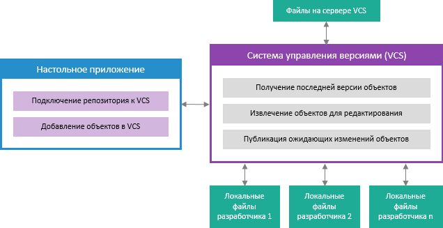
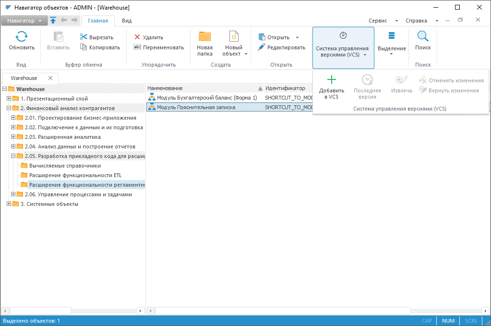
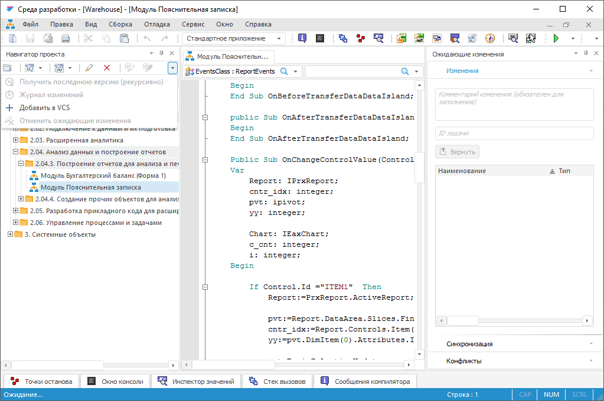

# Разработка приложений в команде

Разработка приложений в команде
-

# Разработка приложений в команде

Для разработки приложений в команде используется система управления
 версиями (англ. Version Control
 System, VCS) на базе Microsoft Team Foundation Server или Git.
 Система управления версиями позволяет организовать совместную разработку
 приложений, контролировать внесенные изменения и объединять программный
 код разрабатываемого приложения несколькими разработчиками. В системе
 управления версиями могут храниться параметры следующих объектов: «[Ресурсы](UiNav.chm::/Multilanguage/Resources.htm)»,
 «[Сборка](../02_Work_in_Development_Environment/DevEnv_Object/DevEnv_Assembly.htm)», «[Модуль](../02_Work_in_Development_Environment/DevEnv_Object/DevEnv_Module.htm)»,
 «[Форма](../02_Work_in_Development_Environment/DevEnv_Object/DevEnv_Form.htm)», «[Веб-форма](../02_Work_in_Development_Environment/DevEnv_Object/Web_Form.htm)»,
 «[Запрос](UiNavObj.chm::/Query/query.htm)»,
 «[Представление](UiNavObj.chm::/conception/UiDb_relational_conception.htm)»,
 «[Процедура](UiNavObj.chm::/procedure/UiDb_relationa_procedure.htm)»,
 «[Команда
 СУБД](UiNavObj.chm::/CUBD/UiDb_relationa_CUBD.htm)».

Примечание.
 Разработка приложений в команде доступна только в настольном приложении.

Общая схема взаимодействия продукта «Форсайт. Аналитическая платформа»
 с системой управления версиями:

Для совместной разработки приложений:

	- Подключите репозиторий к системе управления версиями в [Windows](../../04_NavigatorSetting/VCS/Add_In_VCS.htm)
	 / [Linux](../../04_NavigatorSetting/VCS/connecting_to_vcs_on_linux.htm).

Примечание.
 Репозиторий должен быть подключен к системе управления версиями на каждом
 компьютере разработчиков.

	- [Добавьте объекты в систему управления
	 версиями](VSC_Add_Object.htm).

	- [Получите последнюю версию
	 объектов](VSC_get_latest_version.htm).

	- [Извлеките объекты для редактирования](VSC_CheckOut_Object.htm).

Примечание.
 Извлечение объектов выполняется только для системы управления версиями
 Team Foundation Server.

	- [Опубликуйте изменения объектов
	 на сервер](VSC_CheckIn_Object.htm).

После выполнения действий будут опубликованы изменения объектов на сервер
 и доступны всей команде для продолжения разработки после получения последней
 версии объектов на каждом компьютере разработчиков.

## Управление версиями объектов

Управление версиями объектов осуществляется в [навигаторе
 объектов](GetStarted.chm::/Interface/Interface_Navigator.htm) и [среде разработки](developer.chm::/Desktop_Title.htm).

	Навигатор объектов Среда разработки

		После [подключения
		 репозитория к системе управления версиями](../../04_NavigatorSetting/VCS/Add_In_VCS.htm) в навигаторе объектов
		 добавляется раздел «Система управления
		 версиями (VCS)» на ленте инструментов и соответствующие
		 команды контекстного меню объектов:

		

		После [подключения
		 репозитория к системе управления версиями](../../04_NavigatorSetting/VCS/Add_In_VCS.htm) в среде разработки
		 добавляются кнопки в меню навигатора проекта, соответствующие
		 команды контекстного меню объектов и вкладки для управления версиями
		 объектов на панели «[Ожидающие изменения](../03_Windows_of_Development_Environment/Executed_Change.htm)»:

		

Для добавления объектов в систему
 управления версиями обратитесь к разделу «[Добавление объектов в систему управления
 версиями](VSC_Add_Object.htm)».

Для проверки изменений в последней
 версии объектов обратитесь к разделу «[Проверка изменений в последней
 версии объектов](VCS_changes_to_last_version.htm)».

Для получения последней версии объектов
 обратитесь к разделу «[Получение
 последней версии объектов](VSC_get_latest_version.htm)».

Для извлечения объекта для редактирования
 обратитесь к разделу «[Извлечение
 объекта для редактирования](VSC_CheckOut_Object.htm)».

Для сравнения версий объекта обратитесь
 к разделу «[Сравнение
 версий объекта](VCS_Comparison_version_object.htm)».

Для публикации изменений объектов
 на сервер обратитесь к разделу «[Публикация изменений объектов](VSC_CheckIn_Object.htm)».

Для отмены изменений объектов обратитесь
 к разделу «[Отмена
 изменений объектов](VCS_Cancel_Change.htm)».

Для просмотра журнала изменений
 объектов обратитесь к разделу «[Журнал изменений объектов](VCS_History_object.htm)».

См. также:

[Разработка в среде разработки
 «Форсайт. Аналитическая платформа»](Developer.chm::/Desktop_Title.htm)
 | [Подключение репозитория
 к системе управления версиями](../../04_NavigatorSetting/VCS/Add_In_VCS.htm)

		Справочная
		 система на версию 10.9
		 от 18/08/2025,
		 © ООО «ФОРСАЙТ»,
