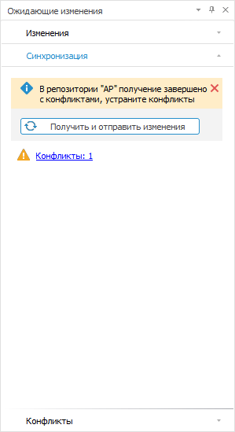
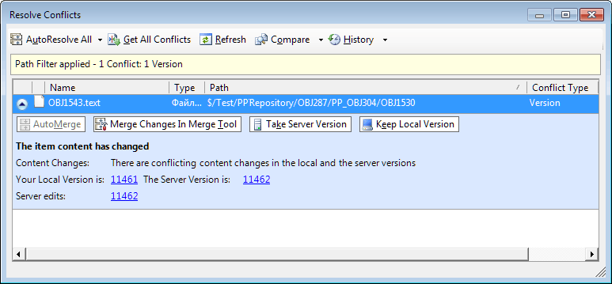
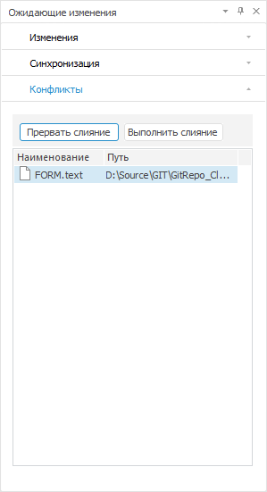

# Получение последней версии объектов

Получение последней версии объектов
-

# Получение последней версии объектов

Для получения последней версии объектов:

	- Убедитесь, что объекты [добавлены
	 в систему управления версиями](VSC_Add_Object.htm).

	- Проверьте [изменения
	 объектов в последней версии](VCS_changes_to_last_version.htm) при необходимости.

	- Выделите объекты в [навигаторе
	 объектов](GetStarted.chm::/Interface/Interface_Navigator.htm) или навигаторе проекта в среде разработки.

	- Выполните одно из действий:

		- нажмите кнопку  «Последняя
		 версия» на ленте инструментов навигатора объектов или в
		 меню навигатора проекта среды разработки;

		- выполните команду  «Получить
		 последнюю версию» в контекстном меню объектов.

После выполнения действий будет получена последняя версия выбранных
 объектов, синхронизированы файлы объектов на сервере и локальном диске.
 Если объект состоит из нескольких объектов, то будет получена последняя
 версия всех дочерних объектов.

Примечание.
 При получении последней версии обновляются только локальные [файлы](VSC_Add_Object.htm)
 на диске, которые соответствуют объектам репозитория. Версия объекта в
 системе управления не обновляется.

При получении последней версии объектов могут возникнуть конфликты версий,
 если один и тот же объект был изменен разными разработчиками. Сообщение
 о конфликтах отображается на вкладке «Синхронизация»
 на панели «[Ожидающие
 изменения](../03_Windows_of_Development_Environment/Executed_Change.htm)» в среде разработки:

При нажатии на гиперссылку будет открыта вкладка «Конфликты»
 для [разрешения возникших
 конфликтов](VSC_get_latest_version.htm#decision).

Примечание.
 Сообщение о конфликтах, вкладка «Синхронизация»
 и «Конфликты» отображаются только
 для системы управления версиями Git.

## Разрешение конфликтующих изменений объекта

Для публикации изменений объектов на сервер должны быть разрешены все
 возникшие конфликты после получения последней версии объектов.

	Team Foundation Server Git

		Для разрешения конфликтующих изменений в Team Foundation Server
		 используйте стандартные средства системы управления версиями:

		

		Для разрешения конфликтующих изменений объекта в Git:

			- Скачайте и установите приложение [WinMerge](https://www.softportal.com/software-39580-winmerge.html)
			 для объединения конфликтующих изменений. Добавьте в переменные
			 среды Windows путь до папки с установленным приложением WinMerge
			 в переменную «Path».

			- Откройте вкладку «Конфликты»
			 на панели «[Ожидающие
			 изменения](../03_Windows_of_Development_Environment/Executed_Change.htm)» в среде разработки:

		

			- Выделите файл с конфликтующими изменениями и нажмите
			 кнопку «Выполнить слияние».
			 После выполнения действий будет открыто приложение [WinMerge](VCS_Comparison_version_object.htm)
			 для объединения конфликтующих изменений.

		Примечание.
		 Для отложения решения конфликта нажмите кнопку «Прервать
		 слияние». После выполнения действия будет доступна [публикация](VSC_CheckIn_Object.htm)
		 других изменений объектов. При синхронизации локальных файлов
		 на диске и изменений с сервера отложенный конфликт возникнет заново.

			- Объедините изменения объекта вручную и сохраните файл.

			- Повторите шаги с 3 по 5, если возникло несколько конфликтов.

		После выполнения действий конфликты будут разрешены. При разрешении
		 последнего конфликта автоматически выполняется [синхронизация](VSC_CheckIn_Object.htm#synch).

См. также:

[Разработка
 приложений в команде](VSC_Introduction.htm) | [Проверка
 изменений в последней версии объектов](VCS_changes_to_last_version.htm) | [Сравнение
 версий объекта](VCS_Comparison_version_object.htm) | [Журнал изменений](VCS_History_object.htm)

		Справочная
		 система на версию 10.9
		 от 18/08/2025,
		 © ООО «ФОРСАЙТ»,
