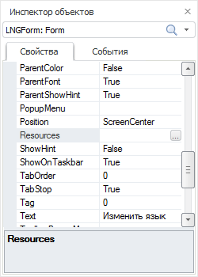
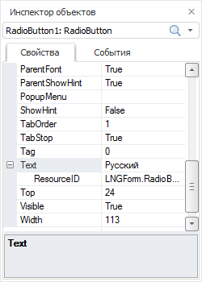
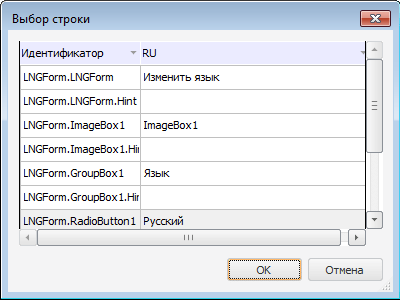

# Подключение ресурсов к форме

Подключение ресурсов к форме
-

# Подключение ресурсов к форме

Подключить ресурсы к форме можно:

	- [непосредственно
	 в среде разработки](UiDevEnv_MLng_Append_Res.htm#normal_appending);

	- [через
	 язык Fore](UiDevEnv_MLng_Append_Res.htm#fore_appending).

## Подключение ресурсов
 к форме в среде разработки

Для подключения ресурсов к форме в среде разработки запустите среду
 разработки и откройте в ней нужную форму. В инспекторе объектов для формы
 установите значение свойства [Resources](ModForms.chm::/Interface/IFormControl/IFormControl.Resources.htm):

В свойстве [Resources](ModForms.chm::/Interface/IFormControl/IFormControl.Resources.htm)
 укажите идентификатор используемых ресурсов:

	- ввести идентификатор ресурсов в соответствующее поле;

	- нажмите кнопку  в поле
	 Resources. Будет открыт диалог
	 «Выбор ресурсов», в котором
	 укажите требуемые ресурсы.

После подключения ресурсов к форме для всех визуальных компонентов в
 инспекторе объектов к свойствам, имеющим строковый тип данных, будет добавлен
 дополнительный атрибут «ResourcesID». Данный
 атрибут соотносит значения строковых элементов ресурсов с значениями свойств
 строкового типа для визуальных компонентов. Значение атрибута формируется
 автоматически и состоит из имени компонента, содержащего объект, имени
 объекта и имени свойства, разделенных точками.

Примечание.
 Для свойства Text значение атрибута
 «ResourcesID» будет состоять только
 из имени компонента, содержащего объект, и имени объекта, разделенных
 точкой.

В ресурсы, подключенные к форме, для всех языков будут добавлены новые
 строковые элементы с идентификаторами, которые указаны в атрибуте «ResourcesID».

При изменении значения атрибута «ResourcesID»,
 будет изменен идентификатор соответствующего элемента, в подключенных
 ресурсах.

При изменении значения свойства строкового типа, будет изменено значение
 соответствующего элемента для всех языков ресурсов.

Для сопоставления строкового свойства визуального компонента с другим
 строковым элементом ресурсов нажмите кнопку  в поле
 атрибута «ResourcesID». Будет
 открыт диалог «Выбор строки»:

Диалог содержит все строковые элементы ресурсов, подключенных к форме.
 Для каждого элемента ресурсов отображаются идентификатор и значение для
 языка по умолчанию. После выбора нового строкового элемента нажмите кнопку
 «ОК».

## Подключение ресурсов
 к форме через язык Fore

Для динамического подключения ресурсов к форме через язык Fore используйте
 следующий код:

			Sub SetResource;

Var

    MB: IMetabase;

    Res: IResourceObject;

Begin

    MB := MetabaseClass.Active;

    Res := MB.ItemById("RESOURCE_1").Bind As IResourceObject;

    Self.Resources := Res;

End Sub SetResource;

После выполнения процедуры для используемой формы в качестве источника
 ресурсов будут использоваться ресурсы с идентификатором «Resource_1».

Примечание.
 Для применения кода замените идентификатор, используемый в коде, на реальный
 идентификатор ресурсов.

См. также:

[Разработка
 мультиязычных приложений](UiDevEnv_MLng_Applications.htm)

		Справочная
		 система на версию 10.9
		 от 18/08/2025,
		 © ООО «ФОРСАЙТ»,
