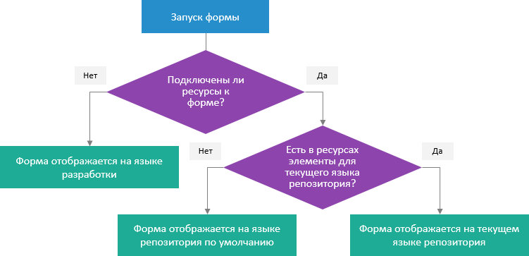

# Разработка мультиязычных приложений

Разработка мультиязычных приложений
-

# Разработка мультиязычных приложений

Продукт «Форсайт. Аналитическая платформа» поддерживает несколько языков
 интерфейса, выбор языка производится в [языковых параметрах
 платформы](GetStarted.chm::/Interface/Intro_Language.htm). Для корректного отображения текста при работе
 в репозитории следует определять язык репозитория, можно также настроить
 [синхронизацию
 языка](setup.chm::/06_AK_Client_Config/UiNav_RepoConfig_repo1.htm#more) интерфейса и репозитория для текущего пользователя.

При использовании мультиязычности следует помнить о [языке репозитория
 по умолчанию](UiNav.chm::/02_Navigator/Repo_Default.htm), который будет использоваться для отображения
 наименований объектов, для которых отсутствует наименование на языке репозитория.

Для получения подробной информации о настройке мультиязычности содержимого
 репозитория и общей системы обратитесь к разделу «[Настройка
 мультиязычности](uinav.chm::/Multilanguage/Multilanguage_setting.htm)».

## Прикладные мультиязычные системы

Прикладные системы могут поддерживать несколько языков
 пользовательского интерфейса, например, система может иметь русскоязычный
 и англоязычный интерфейс. При разработке подобных систем требуется, создание
 мультиязычных форм. Перевод различных элементов визуального интерфейса
 на различные языки может осуществляться самим разработчиком в прикладном
 коде, но при этом снижается скорость разработки и требуется написание
 дополнительного кода, который будет проверять текущий язык репозитория
 и формировать переводы на соответствующем языке.

Для повышения скорости разработки и улучшения качества перевода необходима
 совместная работа разработчика и переводчика. Для организации подобной
 работы требуется вынесение всех элементов системы, требующих перевода,
 в отдельный контейнер, который можно передавать переводчикам. Таким контейнером
 в «Форсайт. Аналитическая платформа»
 является объект «[Ресурсы](uinav.chm::/Multilanguage/Resources.htm)»,
 хранящий различные текстовые и графические значения для заданных языков.

Для передачи контейнера переводчику и внесения результатов перевода
 в разрабатываемую систему «[Ресурсы](uinav.chm::/Multilanguage/Resources.htm)»
 поддерживает операции экспорта и импорта. Переводчик может осуществлять
 перевод как непосредственно в [редакторе ресурсов](UiNav.chm::/Multilanguage/Resources.htm),
 так и при помощи другого программного обеспечения.

Работа форм с объектом «Ресурсы»
 осуществляется следующим образом:

	- При запуске формы проверяется: [подключены
	 ли к ней ресурсы](UiDevEnv_MLng_Append_Res.htm).

	- Если ресурсы не подключены, то элементы формы, требующие
	 перевода, будут отображаться на языке, использовавшемся при разработке
	 формы.

	- Если ресурсы подключены, то проверяется наличие в
	 нём элементов для [текущего
	 языка репозитория](Setup.chm::/06_AK_Client_Config/UiNav_RepoConfig_repo1.htm#more).

Важно. Для
 корректной работы ресурсов должен быть установлен [язык репозитория
 по умолчанию](uinav.chm::/02_Navigator/Repo_Default.htm).

	- Если в ресурсах найдены элементы для текущего языка
	 репозитория, то форма будет отображаться на [текущем
	 языке репозитория](Setup.chm::/06_AK_Client_Config/UiNav_RepoConfig_repo1.htm#more).

	- Если элементы для текущего языка репозитория не найдены,
	 то форма будет отображаться на [языке по умолчанию](uinav.chm::/02_Navigator/Repo_Default.htm)
	 для репозитория.

Все стадии создания и использования ресурсов приведены в примере [создания мультиязычной формы](UiDevEnv_MLng_Res_Example.htm).

См. также:

[Параметры
 репозитория](Setup.chm::/06_AK_Client_Config/UiNav_RepoConfig_repo1.htm#lang) | [Подключение ресурсов к форме](UiDevEnv_MLng_Append_Res.htm)

		Справочная
		 система на версию 10.9
		 от 18/08/2025,
		 © ООО «ФОРСАЙТ»,
