# Пример создания мультиязычной формы

Пример создания мультиязычной формы
-

# Пример создания мультиязычной формы

В данном примере описан процесс создания мультиязычной формы. Сначала
 будут созданы ресурсы, затем форма. После этого ресурсы и форма будут
 настроены для использования двух языков в интерфейсе: русского и английского.

## Создание ресурсов

	- Создайте объект «[Ресурсы](UiNav.chm::/Multilanguage/Resources.htm)».
	 Выполните команду «Создать > Среда
	 разработки > Ресурсы» в контекстном меню навигатора
	 объектов. Будет открыто окно редактора ресурсов:

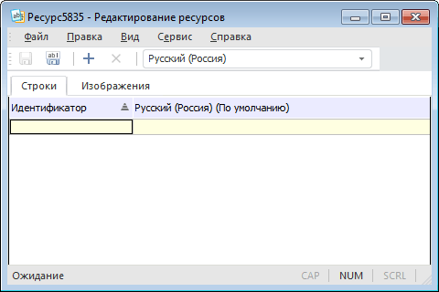

Изначально в ресурсах присутствует язык,
 который совпадает с [языком
 репозитория по умолчанию](uinav.chm::/02_Navigator/Repo_Default.htm). В примере это русский язык.

	- Добавьте язык, на который будет переведена форма. Выполните
	 команду «Файл > Добавить язык»
	 в главном меню ресурсов. Будет открыт диалог:

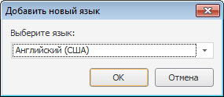

	- В списке «Выберите язык»
	 выберите значение «Английский (США)»
	 и нажмите кнопку «ОК». В ресурсы
	 будет добавлен новый язык.

	- Сохраните ресурсы. Выполните команду «Файл > Сохранить»
	 в главном меню ресурсов. Будет открыт диалог «Сохранение
	 ресурсов»:

		- В поле «Имя объекта»
		 укажите наименование ресурсов: «ResForAppl».

		- В поле «Идентификатор»
		 укажите идентификатор ресурсов: «ResForAppl».

		- Выберите папку в репозитории, в которой будут храниться
		 ресурсы.

Таким образом, в репозитории будут созданы ресурсы для работы с двумя
 языками.

## Создание формы

	- Создайте форму. Выполните команду «Создать > Среда
	 разработки > Форма» в контекстном меню навигатора
	 объектов. Будет открыт диалог «Создание
	 объекта»:

		- В поле «Наименование»
		 укажите наименование формы: «LngForm».

		- В поле «Идентификатор»
		 укажите идентификатор формы: «Lng».

После нажатия кнопки «ОК»
 будет открыто окно
 среды разработки.

	- Перейдите в [инспектор
	 объектов](../03_Windows_of_Development_Environment/Object_Inspector.htm) и найдите свойство [Resources](ModForms.chm::/Interface/IFormControl/IFormControl.Resources.htm):

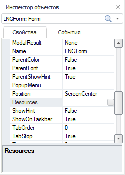

	- Выделите свойство [Resources](ModForms.chm::/Interface/IFormControl/IFormControl.Resources.htm)
	 и нажмите кнопку . Будет
	 открыт диалог «Выбор ресурсов».

	- Укажите ранее созданные ресурсы «ResForAppl»
	 и нажмите кнопку «ОК». После
	 этого в [инспекторе объектов](../03_Windows_of_Development_Environment/Object_Inspector.htm) у
	 всех визуальных компонентов к свойствам, имеющим строковый тип данных,
	 будет добавлен дополнительный атрибут «ResourcesID».
	 Значение данного атрибута будет формироваться автоматически:

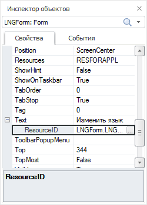

	- [Разместите
	 на форме](../02_Work_in_Development_Environment/Accomodation_component_on_form.htm) следующие компоненты:

		- [GroupBox](../../02_Components_constructor_forms/01_Standart_Components/GroupBox.htm).

		- На компонент [GroupBox](../../02_Components_constructor_forms/01_Standart_Components/GroupBox.htm)
		 поместите два компонента [RadioButton](../../02_Components_constructor_forms/01_Standart_Components/RadioButton.htm).

		- Ниже компонента [GroupBox](../../02_Components_constructor_forms/01_Standart_Components/GroupBox.htm)
		 поместите компонент [ImageBox](../../02_Components_constructor_forms/02_Additional_components/ImageBox.htm).

Форма будет выглядеть следующим образом:

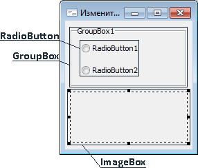

	- В [инспектор объектов](../03_Windows_of_Development_Environment/Object_Inspector.htm) задайте
	 значение свойства Text для
	 формы и компонентов:

		 Наименование компонента
		 Значение свойства Text

		 LngForm
		 Смена языка

		 GroupBox1
		 Язык

		 RadioButton1
		 Русский

		 RadioButton2
		 Английский

Таким образом, после создания форма будет иметь следующий вид:

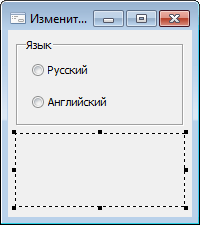

## Перевод ресурсов

	- В навигаторе объектов перейдите к созданным ресурсам «ResForAppl».
	 Дважды щёлкните по ним или выполните команду
	 «Редактировать» в контекстном
	 меню. Ресурсы будут открыты для редактирования.

	- Выберите язык перевода. На панели инструментов в списке языков
	 выберите значение «Английский (США)»:

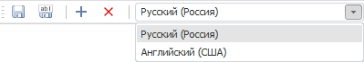

В редакторе ресурсов будет отображен столбец
 для перевода на английский язык:

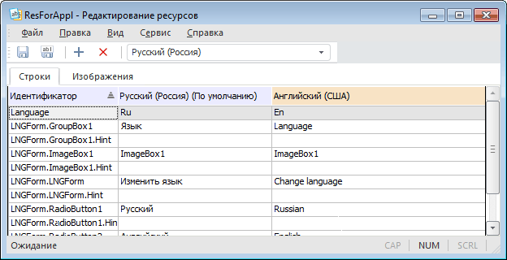

В редакторе ресурсов уже содержатся строковые
 элементы, соответствующие текстовым свойствам визуальных компонентов,
 расположенных на форме. Идентификатор элемента совпадает со значением
 атрибута ResourcesID, а значение
 элемента для языка по умолчанию соответствует значению свойства Text.

	- Задайте значения элементов для языка перевода. Перейдите в соответствующую
	 ячейку строки элемента и введите перевод. Перевод элементов представлен
	 в таблице:

		 Идентификатор элемента
		 Значение для языка по умолчанию (Русский)
		 Значение для языка перевода (Английский (США))

		 LngForm.LngForm
		 Смена языка
		 Change language

		 LngForm.GroupBox1
		 Язык
		 Language

		 GroupBox1.RadioButton1
		 Русский
		 Russian

		 GroupBox1.RadioButton2
		 Английский
		 English

	- Добавьте в ресурсы графический элемент для языка по умолчанию:

		- Перейдите на вкладку «Изображение»;

		- Нажмите кнопку  на панели инструментов.
		 Будет открыт стандартный диалог открытия файла.

		- Выберите изображение, добавляемое в ресурсы.

	- Измените идентификатор изображения:

		- Дважды щёлкните по нему. Идентификатор
		 будет переведен в режим редактирования.

		- Введите идентификатор: «IMG_1».

		- Нажмите клавишу ENTER или щёлкните по свободному пространству
		 на вкладке.

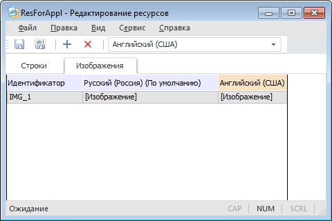

	- Добавьте изображение для языка перевода:

		- Дважды щёлкните по элементу «[Изображение]», расположенному
		 в столбце «Английский (США)».
		 Будет открыт диалог «Редактирование
		 изображения».

		- Нажмите кнопку «Изменить».
		 Будет открыт стандартный диалог открытия файла.

		- Выберите изображение, добавляемое в ресурсы.

	- Сохраните ресурсы. Выполните команду «Файл > Сохранить»
	 в главном меню ресурсов.

Таким образом, будет выполнен перевод ресурсов.

## Настройка формы

	- В навигаторе объектов перейдите к созданной форме «LngForm».
	 Дважды щёлкните по ней или выполните команду
	 «Редактировать» в контекстном
	 меню. Форма будет открыта в среде разработки.

	- Добавьте ссылки на системные сборки «IO»
	 и «Metabase»:

		- Выполните команду «Сборка
		 > Редактировать ссылки» в главном меню среды разработки.

		- В отобразившемся диалоге на вкладке «Системные
		 сборки» установите флажки напротив соответствующих сборок.

	- Для компонентов RadioButton1
	 и RadioButton2 создайте общий
	 обработчик события OnClick:

		- В [инспекторе
		 объектов](../03_Windows_of_Development_Environment/Object_Inspector.htm) выберите компонент RadioButton1
		 и перейдите на вкладку «События».

		- Дважды щелкните по ячейке, соответствующей событию OnClick. Будет создан обработчик
		 события с наименованием «RadioButton1OnClick».

		- На вкладке «События»
		 измените наименование обработчика на «RadioButtonOnClick».

		- В [инспекторе
		 объектов](../03_Windows_of_Development_Environment/Object_Inspector.htm) выберите компонент RadioButton2.

		- Для события OnClick
		 выберите обработчик с наименованием «RadioButtonOnClick».

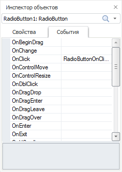

Текст обработчика приведен ниже. В обработчике
 производится проверка выбранного переключателя и установка соответствующего
 языка и ресурсов.

	- Для формы создайте обработчик события OnCreate:

		- В [инспекторе
		 объектов](../03_Windows_of_Development_Environment/Object_Inspector.htm) выберите форму и перейдите на вкладку «События».

		- Дважды щелкните по ячейке, соответствующей событию OnCreate. Будет создан обработчик
		 события с наименованием «LNGFormOnCreate».

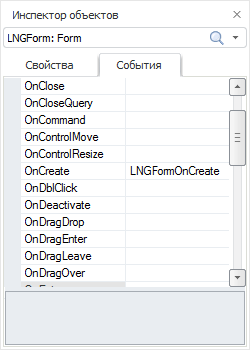

Текст обработчика приведен ниже. В обработчике
 вызывается событие OnClick для
 RadioButton1.

Таким образом, при запуске формы подписи компонентов и изображение в
 ImageBox1 будут соответствовать
 значению элементов ресурсов для русского языка.

Полный код формы:

			Class LNGForm: Form

    GroupBox1: GroupBox;

    RadioButton1: RadioButton;

    RadioButton2: RadioButton;

    ImageBox1: ImageBox;

    Sub LNGFormOnCreate(Sender: Object; Args: IEventArgs);

    Begin

        RadioButton1.Checked := True;

        RadioButtonOnClick(RadioButton1, Null);

    End Sub LNGFormOnCreate;

    Sub RadioButtonOnClick(Sender: Object; Args: IMouseEventArgs);

    Var

        MB: IMetabase;

        Res: IResourceObject;

        ResSt: IResourceStrings;

    Begin

        MB := MetabaseClass.Active;

        If (Sender As IRadioButton) = RadioButton1 Then

            MB.CurrentLocale := LocaleCodeID.Russian;

        Else

            MB.CurrentLocale := LocaleCodeID.English_UnitedStates;

        End If;

        Res := Self.Resources;

        ResSt := Res.Locales.CurrentLocale.Strings;

        Self.Text := ResSt.Value("LNGForm.LNGForm");

        GroupBox1.Text := ResSt.Value("LNGForm.GroupBox1");

        RadioButton1.Text := ResSt.Value("LNGForm.RadioButton1");

        RadioButton2.Text := ResSt.Value("LNGForm.RadioButton2");

        ImageBox1.LoadImageFromStream(Res.Binaries.Value("IMG_1"));

    End Sub RadioButtonOnClick;

End Class LNGForm;

## Запуск формы

Для запуска формы нажмите клавишу F9.

Вид формы при запуске или при установке
 переключателя «Русский»/«Russian»:

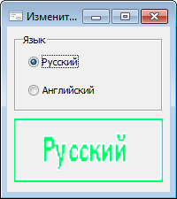

Вид формы при установке переключателя «Английский»/«English»:

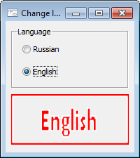

См. также:

[Разработка
 мультиязычных приложений](UiDevEnv_MLng_Applications.htm)

		Справочная
		 система на версию 10.9
		 от 18/08/2025,
		 © ООО «ФОРСАЙТ»,
