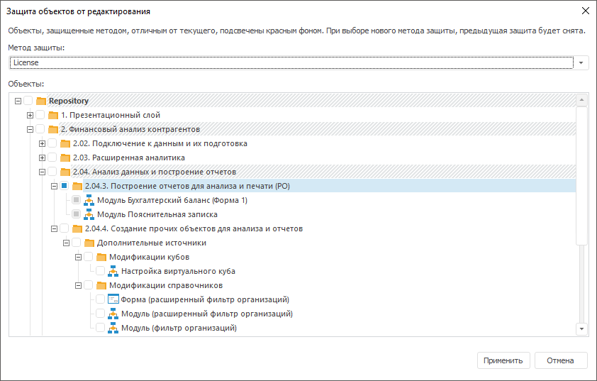
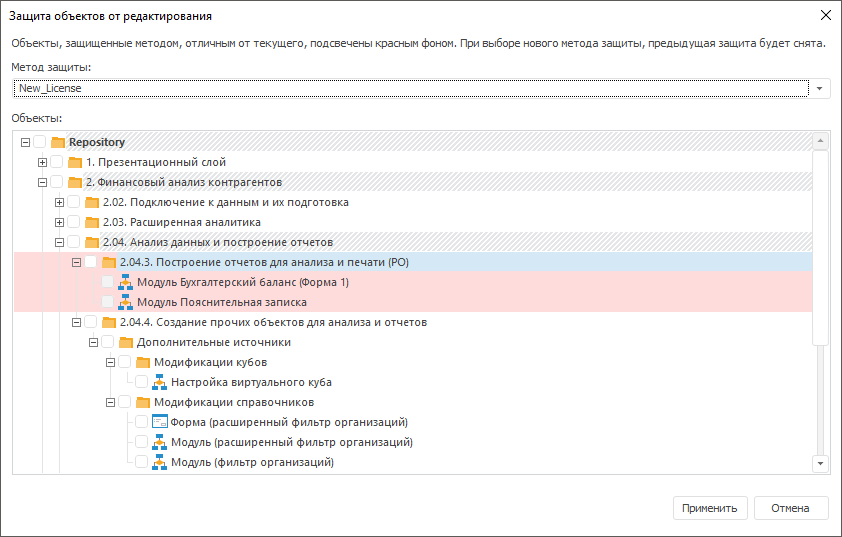
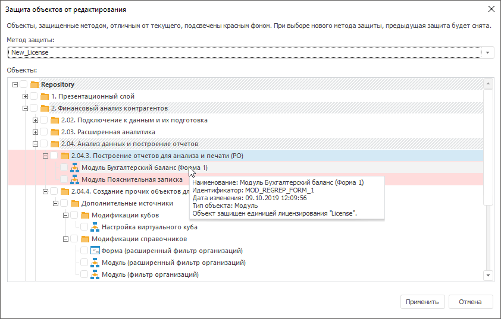

# Защита объектов репозитория от редактирования

Защита объектов репозитория от редактирования
-

# Защита объектов репозитория от редактирования

В настольном приложении объекты репозитория могут быть защищены от редактирования
 с помощью [прикладной
 единицы лицензирования](Setup.chm::/08_Licensing/ApplicationSystemLicensing.htm), которая не входит в набор [стандартных единиц
 лицензирования](Setup.chm::/08_Licensing/AboutFeatures.htm) продукта «Форсайт. Аналитическая платформа»,
 а заказывается и генерируется отдельно. В дальнейшем полученная прикладная
 единица лицензирования не передается заказчикам.

Защита от редактирования доступна для объектов репозитория: ресурсы,
 сборка, форма, модуль.

Если объект защищен прикладной единицей лицензирования, то при открытии
 объекта проверяется наличие соответствующей прикладной единицы лицензирования.
 После успешной проверки доступны любые действия с объектом. В случае отсутствия
 соответствующей прикладной единицы лицензирования объект будет недоступен
 для редактирования и перемещения, но доступен для удаления. Если объект
 является объектом-контейнером, то в нем будет недоступно создание новых
 объектов и добавление существующих объектов из репозитория.

Для просмотра доступных единиц лицензирования используйте [менеджер
 лицензий](Setup.chm::/08_Licensing/RMS/Intro_LicenseManager.htm), окно «[О программе](UiNav.chm::/GUI/Info.htm)»
 или метод [ILicenseManager.GetAllFeatures](KeSomHost.chm::/Interface/ILicenseManager/ILicenseManager.GetAllFeatures.htm).

Для защиты объекта репозитория от редактирования:

	- Откройте окно «Защита объектов
	 от редактирования»:

		- выполните команду «Сервис
		 > Защита объектов» в главном меню [среды разработки](developer.chm::/Desktop_Title.htm);

		- выполните команду «Защита
		 (<наименование
		 единицы лицензирования>)»
		 в контекстном меню выбранного объекта в навигаторе проекта.

Примечание.
 Если объект защищен, то в команде контекстного меню выбранного объекта
 содержится наименование прикладной единицы лицензирования. Если объект
 не защищен, то содержится надпись «Отсутствует».

После выполнения одного из действий будет
 открыто окно «Защита объектов от редактирования»:

	- Выберите прикладную единицу лицензирования в качестве метода
	 защиты в раскрывающемся списке «Метод
	 защиты».

	- Установите флажок напротив объекта в дереве объектов.

При установке флажка напротив папки автоматически
 устанавливаются флажки напротив всех содержащихся объектов в папке. Снятие
 флажка напротив отдельного объекта недоступно при установленном флажке
 напротив папки.

При установке флажка напротив сборки автоматически
 устанавливаются флажки напротив всех содержащихся объектов в сборке. Отдельные
 объекты в сборке недоступны для отметки.

	- Нажмите кнопку «Применить».

После выполнения действий объект будет защищен от редактирования заданной
 прикладной единицей лицензирования.

Для снятия защиты с объекта репозитория:

	- Откройте окно «[Защита
	 объектов от редактирования](Objects_protection.htm#open)».

	- Выберите прикладную единицу лицензирования в раскрывающемся
	 списке «Метод защиты», с помощью
	 которой защищен выбранный объект.

	- Снимите флажок напротив объекта в дереве объектов.

	- Нажмите кнопку «Применить».

После выполнения действий с объекта репозитория будет снята защита от
 редактирования заданной прикладной единицей лицензирования.

Также управление защитой объектов репозитория доступно с помощью свойства
 [IMetabaseObject.EditRequiresAdditionalLicense](KeSom.chm::/Interface/IMetabaseObject/IMetabaseObject.EditRequiresAdditionalLicense.htm).

## Изменение метода защиты

Для изменения метода защиты объекта репозитория, защищенного другим
 методом:

	- Откройте окно «[Защита
	 объектов от редактирования](Objects_protection.htm#open)».

	- Выберите прикладную единицу лицензирования в качестве нового
	 метода защиты в раскрывающемся списке «Метод
	 защиты».

Объект, защищенный другим методом, будет
 подсвечиваться красным фоном, например:

	- Установите флажок напротив подсвеченного объекта.

	- Нажмите кнопку «Применить».

После выполнения действий будет изменен метод защиты объекта репозитория.

Для просмотра прикладной единицы лицензирования, с помощью которой защищен
 объект, в окне «Защита объектов от редактирования»
 доступна всплывающая подсказка:

См. также:

[Разработка
 прикладного приложения](01_Purpose_of_the_constructor/Purpose_of_the_constructor.htm)

		Справочная
		 система на версию 10.9
		 от 18/08/2025,
		 © ООО «ФОРСАЙТ»,
