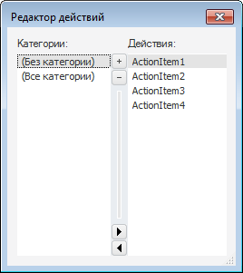
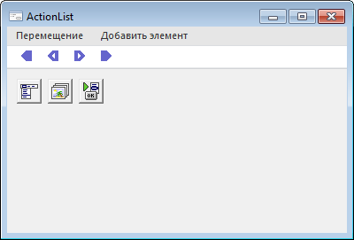
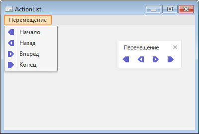

# ActionList: Компонент

ActionList: Компонент
-

# ActionList

## Иерархия наследования

           [IComponent](modforms.chm::/Interface/IComponent/IComponent.htm)

           [IActionList](ModForms.chm::/Interface/IActionList/IActionList.htm)

           [ActionList](ModForms.chm::/Class/ActionList/ActionList.htm)

## Описание

Компонент ActionList позволяет
 реализовать одинаковые действия для соответствующих пунктов [главного
 меню](MainMenu.htm), [контекстного меню](PopupMenu.htm), кнопок на [панели инструментов](../02_Additional_components/ToolBar.htm)
 и кнопок [ленты](../02_Additional_components/Ribbon.htm).

## Работа с компонентом

После размещения компонента на форме выполните для него команду контекстного
 меню «Редактор действий»:

В открывшемся редакторе кнопки «+»
 и «-» используются для создания/удаления
 действий. Выбрав необходимое действие в списке, в инспекторе объектов
 для него можно настроить различные свойства, а также установить обработчик
 события [OnExecute](ModForms.chm::/Class/ActionItem/ActionItem.OnExecute.htm),
 которое будет вызвано при выполнении действия.

Каждое действие реализуется классом [ActionItem](ModForms.chm::/Class/ActionItem/ActionItem.htm)
 и может быть создано динамически в прикладном коде. После создания и настройки
 свойств действия, его необходимо включить в коллекцию действий компонента
 ActionList с помощью метода [IActionList.AddAction](ModForms.chm::/Interface/IActionList/IActionList.AddAction.htm).

Действие может быть назначено какому-либо пункту меню или кнопке. Для
 этого его необходимо указать в свойстве Action
 у соответствующего элемента в инспекторе объектов или прикладном коде:

	- [IMenuItem.Action](ModForms.chm::/Interface/IMenuItem/IMenuItem.Action.htm);

	- [IRibbonButton.Action](ModForms.chm::/Interface/IRibbonButton/IRibbonButton.Action.htm);

	- [IToolbarButton.Action](ModForms.chm::/Interface/IToolbarButton/IToolbarButton.Action.htm).

Все пункты меню/кнопки, для которых назначено одно действие, будут иметь
 одинаковый набор свойств (все свойства будут взяты из настроек действия)
 и выполнять одинаковую функцию (выполняемая функция реализуется в событии
 [OnExecute](ModForms.chm::/Class/ActionItem/ActionItem.OnExecute.htm)
 для действия).

### Горячие клавиши

Для действий есть возможность назначить одно или несколько сочетаний
 горячих клавиш. Для назначения горячих клавиш в режиме дизайнера формы
 необходимо выбрать действие, в инспекторе объектов выделить свойство [ShortCut](modforms.chm::/Interface/IActionItem/IActionItem.ShortCut.htm)
 и нажать требуемое сочетание. Дополнительные сочетания горячих клавиш
 задаются в коллекции [AdditionalShortCuts](modforms.chm::/Interface/IActionItem/IActionItem.AdditionalShortCuts.htm)
 в прикладном коде во время выполнения формы.

## Пример

Добавьте на форму компоненты [MainMenu](MainMenu.htm), [ImageList](../02_Additional_components/ImageList.htm), [ToolBar](../02_Additional_components/ToolBar.htm) и [ActionList](ActionList.htm).
 В компонент [ImageList](../02_Additional_components/ImageList.htm)
 загрузите любые четыре пиктограммы. В компоненте [MainMenu](MainMenu.htm)
 в список элементов добавьте пункт главного меню и четыре пункта подменю.
 На панели инструментов [ToolBar](../02_Additional_components/ToolBar.htm)
 создайте четыре кнопки. Для компонента [ActionList](ActionList.htm)
 в свойстве [Images](ModForms.chm::/Interface/IActionList/IActionList.Images.htm)
 выберите добавленный компонент [ImageList](../02_Additional_components/ImageList.htm).
 В редакторе действий создайте четыре действия, для каждого действия задайте
 уникальное значение свойства [Caption](ModForms.chm::/Interface/IActionItem/IActionItem.Caption.htm)
 и [ImageIndex](ModForms.chm::/Interface/IActionItem/IActionItem.ImageIndex.htm),
 а также определите событие [OnExecute](ModForms.chm::/Class/ActionItem/ActionItem.OnExecute.htm).
 Для каждого пункта подменю/кнопки панели инструментов выберите в свойстве
 Action какое-либо действие.

В режиме дизайнера форма будет выглядеть примерно следующим образом:

После запуска форма примет следующий вид:

При выборе пункта меню или при нажатии на кнопку панели инструментов,
 имеющих одинаковую пиктограмму, будет выполнено одинаковое действие.

## Свойства компонента ActionList

		 Имя свойства
		 Краткое описание

		 
		 [ActionCount](ModForms.chm::/Interface/IActionList/IActionList.ActionCount.htm)

		 Свойство ActionCount
		 возвращает количество действий в списке компонента.

		 
		 [Actions](ModForms.chm::/Interface/IActionList/IActionList.Actions.htm)

		 Свойство Actions возвращает
		 параметры указанного действия.

		 
		 [ComponentCount](ModForms.chm::/Interface/IComponent/IComponent.ComponentCount.htm)

		 Свойство ComponentCount
		 возвращает количество дочерних компонентов.

		 
		 [Components](ModForms.chm::/Interface/IComponent/IComponent.Components.htm)

		 Свойство Components
		 возвращает дочерний компонент.

		 
		 [Data](ModForms.chm::/Interface/IComponent/IComponent.Data.htm)

		 Свойство Data предназначено
		 для хранения любых пользовательских данных.

		 
		 [Images](ModForms.chm::/Interface/IActionList/IActionList.Images.htm)

		 Свойство Images определяет
		 компонент, изображения которого будут использоваться в действиях
		 текущего компонента.

		 
		 [Name](ModForms.chm::/Interface/IComponent/IComponent.Name.htm)

		 Свойство Name определяет
		 наименование компонента.

		 
		 [Suspended](ModForms.chm::/Interface/IActionList/IActionList.Suspended.htm)

		 Свойство Suspended
		 определяет состояние компонента и его действий.

		 
		 [Tag](ModForms.chm::/Interface/IComponent/IComponent.Tag.htm)

		 Свойство Tag не используется
		 компилятором. Пользователь может изменить значение свойства Tag и использовать его по своему
		 усмотрению.

## Методы компонента ActionList

		 Имя метода
		 Краткое описание

		 
		 [AddAction](ModForms.chm::/Interface/IActionList/IActionList.AddAction.htm)

		 Метод AddAction осуществляет
		 добавление указанного действия в список действий данного компонента.

		 
		 [RemoveAction](ModForms.chm::/Interface/IActionList/IActionList.RemoveAction.htm)

		 Метод RemoveAction
		 осуществляет удаление указанного действия из списка действий данного
		 компонента.

## События компонента ActionList

		 Имя события
		 Краткое описание

		 
		 [OnExecute](ModForms.chm::/Class/ActionList/ActionList.OnExecute.htm)

		 Событие OnExecute наступает
		 при выполнении какого-либо действия компонента ActionList.

		 
		 [OnUpdate](ModForms.chm::/Class/ActionList/ActionList.OnUpdate.htm)

		 Событие OnUpdate наступает
		 при обновлении действий компонента ActionList.

См. также:

[Стандартные компоненты](Standart_Components.htm)

		Справочная
		 система на версию 10.9
		 от 18/08/2025,
		 © ООО «ФОРСАЙТ»,
