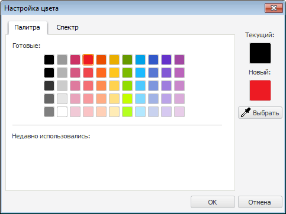
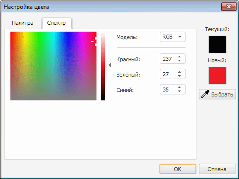

# ColorDialog: Компонент

ColorDialog: Компонент
-

# ColorDialog

## Иерархия наследования

           [IComponent](modforms.chm::/Interface/IComponent/IComponent.htm)

           [IColorDialog](ModForms.chm::/Interface/IColorDialog/IColorDialog.htm)

           [ColorDialog](ModForms.chm::/Class/ColorDialog/ColorDialog.htm)

## Описание

Компонент ColorDialog реализует
 стандартный диалога выбора цвета из палитры цветов.

## Работа с компонентом

Для инициализации диалога необходимо в коде вызвать метод [Execute](ModForms.chm::/Interface/IColorDialog/IColorDialog.Execute.htm).
 После выбора цвета и нажатия кнопки «ОК»
 цвет будет доступен в свойстве [Color](ModForms.chm::/Interface/IColorDialog/IColorDialog.Color.htm).

## Пример

Вкладка «Палитра»;

Вкладка «Спектр»;

## Свойства компонента ColorDialog

		 Имя свойства
		 Краткое описание

		 
		 [Color](ModForms.chm::/Interface/IColorDialog/IColorDialog.Color.htm)
		 Свойство Color определяет
		 цвет, выбранный в компоненте.

		 
		 [ComponentCount](ModForms.chm::/Interface/IComponent/IComponent.ComponentCount.htm)
		 Свойство ComponentCount
		 возвращает количество дочерних компонентов.

		 
		 [Components](ModForms.chm::/Interface/IComponent/IComponent.Components.htm)
		 Свойство Components
		 возвращает дочерний компонент.

		 
		 [Data](ModForms.chm::/Interface/IComponent/IComponent.Data.htm)
		 Свойство Data предназначено
		 для хранения любых пользовательских данных.

		 
		 [Name](ModForms.chm::/Interface/IComponent/IComponent.Name.htm)
		 Свойство Name определяет
		 наименование компонента.

		 
		 [Tag](ModForms.chm::/Interface/IComponent/IComponent.Tag.htm)
		 Свойство Tag не используется
		 компилятором. Пользователь может изменить значение свойства Tag и использовать его по своему
		 усмотрению.

## Методы компонента ColorDialog

		 Имя метода
		 Краткое описание

		 
		 [Execute](ModForms.chm::/Interface/IColorDialog/IColorDialog.Execute.htm)
		 Метод Execute инициализирует
		 диалог выбора цвета.

См. также:

[Стандартные компоненты](Standart_Components.htm)

		Справочная
		 система на версию 10.9
		 от 18/08/2025,
		 © ООО «ФОРСАЙТ»,
