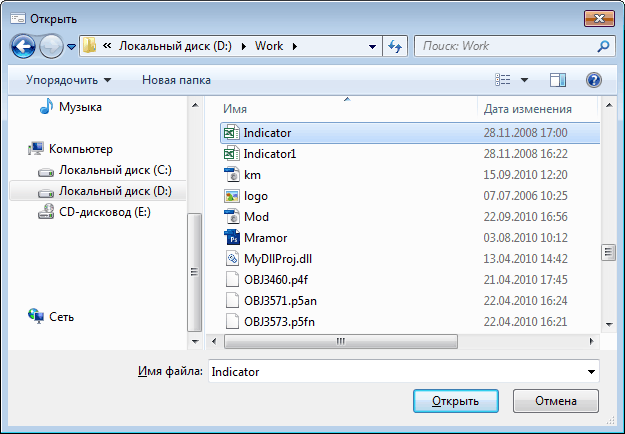

# FileOpenDialog: Компонент

FileOpenDialog: Компонент
-

# FileOpenDialog

## Иерархия наследования

           [IComponent](modforms.chm::/Interface/IComponent/IComponent.htm)

           [IFileDialog](ModForms.chm::/Interface/IFileDialog/IFileDialog.htm)

           [IFileOpenDialog](ModForms.chm::/Interface/IFileOpenDialog/IFileOpenDialog.htm)

           [FileOpenDialog](ModForms.chm::/Class/FileOpenDialog/FileOpenDialog.htm)

## Описание

Компонент FileOpenDialog предназначен
 для организации диалога открытия файла.

## Работа с компонентом

Используя различные свойства компонента можно определить какие именно
 файлы будут доступны для выбора в диалоге. Для инициализации диалога необходимо
 в коде вызвать метод [Execute](ModForms.chm::/Interface/IFileDialog/IFileDialog.Execute.htm).
 После выбора файла и нажатия кнопки «Открыть»
 файл будет доступен в свойстве [FileName](ModForms.chm::/Interface/IFileDialog/IFileDialog.FileName.htm).
 Если выбраны несколько файлов, то выбранная коллекция будет доступна в
 свойстве [FileNames](ModForms.chm::/Interface/IFileDialog/IFileDialog.FileNames.htm).

После установки всех параметров диалога существует возможность просмотра
 результатов работы без компиляции основной формы. Для этого нужно выбрать
 пункт контекстного меню «Проверка...»
 диалога открытия файла.

## Пример

## Свойства компонента FileOpenDialog

		 Имя свойства
		 Краткое описание

		 
		 [CheckFileExists](ModForms.chm::/Interface/IFileDialog/IFileDialog.CheckFileExists.htm)
		 Свойство CheckFileExists
		 определяет реакцию системы при выборе пользователем несуществующего
		 файла.

		 
		 [CheckPathExists](ModForms.chm::/Interface/IFileDialog/IFileDialog.CheckPathExists.htm)
		 Свойство CheckPathExists
		 определяет реакцию системы при попытке пользователя выбрать файл
		 в несуществующем каталоге.

		 
		 [ComponentCount](ModForms.chm::/Interface/IComponent/IComponent.ComponentCount.htm)
		 Свойство ComponentCount
		 возвращает количество дочерних компонентов.

		 
		 [Components](ModForms.chm::/Interface/IComponent/IComponent.Components.htm)
		 Свойство Components
		 возвращает дочерний компонент.

		 
		 [Data](ModForms.chm::/Interface/IComponent/IComponent.Data.htm)
		 Свойство Data предназначено
		 для хранения любых пользовательских данных.

		 
		 [DefaultExt](ModForms.chm::/Interface/IFileDialog/IFileDialog.DefaultExt.htm)
		 Свойство DefaultExt
		 определяет расширение файла, которое будет использовано по умолчанию
		 данным компонентом диалога.

		 
		 [DereferenceLinks](ModForms.chm::/Interface/IFileDialog/IFileDialog.DereferenceLinks.htm)
		 Свойство DereferenceLinks
		 определяет значение, которое возвращает диалог при выборе ярлыка.

		 
		 [FileName](ModForms.chm::/Interface/IFileDialog/IFileDialog.FileName.htm)
		 Свойство FileName указывает
		 имя и путь к каталогу последнего выбранного файла.

		 
		 [FileNames](ModForms.chm::/Interface/IFileDialog/IFileDialog.FileNames.htm)
		 Свойство FileNames
		 возвращает коллекцию наименований и путей к файлам, при выборе
		 более одного файла.

		 
		 [Filter](ModForms.chm::/Interface/IFileDialog/IFileDialog.Filter.htm)
		 Свойство Filter определяет
		 текст текущего фильтра для набора данных.

		 
		 [FilterIndex](ModForms.chm::/Interface/IFileDialog/IFileDialog.FilterIndex.htm)
		 Свойство FilterIndex
		 определяет какой из добавленных фильтров будет устанавливаться
		 по умолчанию при открытии диалога.

		 
		 [InitialDirectory](ModForms.chm::/Interface/IFileDialog/IFileDialog.InitialDirectory.htm)
		 Свойство InitialDirectory
		 определяет директорию, которая будет открываться по умолчанию
		 при запуске диалога.

		 
		 [MultiSelect](ModForms.chm::/Interface/IFileOpenDialog/IFileOpenDialog.MultiSelect.htm)
		 Свойство MultiSelect
		 определяет возможность множественного выбора файлов в окне.

		 
		 [Name](ModForms.chm::/Interface/IComponent/IComponent.Name.htm)
		 Свойство Name определяет
		 наименование компонента.

		 
		 [ReadOnlyChecked](ModForms.chm::/Interface/IFileOpenDialog/IFileOpenDialog.ReadOnlyChecked.htm)
		 Свойство ReadOnlyChecked
		 определяет состояние флага "Только чтение" диалога.

		 
		 [ShowHelp](ModForms.chm::/Interface/IFileDialog/IFileDialog.ShowHelp.htm)
		 Свойство ShowHelp определяет
		 будет ли отображаться кнопка «Справка» в окне диалога.

		 
		 [ShowReadOnly](ModForms.chm::/Interface/IFileOpenDialog/IFileOpenDialog.ShowReadOnly.htm)
		 Свойство ShowReadOnly
		 определяет признак отображения в диалоге флага, используемого
		 для выбора режима открытия файла.

		 
		 [Tag](ModForms.chm::/Interface/IComponent/IComponent.Tag.htm)
		 Свойство Tag не используется
		 компилятором. Пользователь может изменить значение свойства Tag и использовать его по своему
		 усмотрению.

		 
		 [Title](ModForms.chm::/Interface/IFileDialog/IFileDialog.Title.htm)
		 Свойство Title определяет
		 заголовок окна.

		 
		 [ValidateNames](ModForms.chm::/Interface/IFileDialog/IFileDialog.ValidateNames.htm)
		 Свойство ValidateNames
		 определяет признак проверки корректности имени файла.

## Методы компонента FileOpenDialog

		 Имя метода
		 Краткое описание

		 
		 [Execute](ModForms.chm::/Interface/IFileDialog/IFileDialog.Execute.htm)
		 Метод Execute осуществляет
		 инициализацию диалога и возвращает результат выбора пользователя.

См. также:

[Стандартные компоненты](Standart_Components.htm)

		Справочная
		 система на версию 10.9
		 от 18/08/2025,
		 © ООО «ФОРСАЙТ»,
