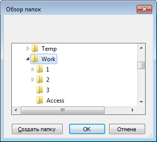

# FolderBrowserDialog: Компонент

FolderBrowserDialog: Компонент
-

# FolderBrowserDialog

## Иерархия наследования

           [IComponent](modforms.chm::/Interface/IComponent/IComponent.htm)

           [IFolderBrowserDialog](ModForms.chm::/Interface/IFolderBrowserDialog/IFolderBrowserDialog.htm)

           [FolderBrowserDialog](ModForms.chm::/Class/FolderBrowserDialog/FolderBrowserDialog.htm)

## Описание

Компонент FolderBrowserDialog
 реализует стандартный диалог Windows открытия папки.

## Работа с компонентом

Для работы компонента, используя свойства [RootFolder](ModForms.chm::/Interface/IFolderBrowserDialog/IFolderBrowserDialog.RootFolder.htm)
 и [SelectedPath](ModForms.chm::/Interface/IFolderBrowserDialog/IFolderBrowserDialog.SelectedPath.htm),
 задайте папку, в рамках которой будет доступен выбор в диалоге, и папку,
 которая будет сфокусирована при открытии диалога. Для инициализации диалога
 необходимо в коде вызвать метод [Execute](ModForms.chm::/Interface/IFolderBrowserDialog/IFolderBrowserDialog.Execute.htm).
 После выбора папки и нажатия кнопки «ОК»
 путь к папке будет доступен в свойстве [SelectedPath](ModForms.chm::/Interface/IFolderBrowserDialog/IFolderBrowserDialog.SelectedPath.htm).

## Пример

## Свойства компонента FolderBrowserDialog

		 Имя свойства
		 Краткое описание

		 
		 [Description](ModForms.chm::/Interface/IFolderBrowserDialog/IFolderBrowserDialog.Description.htm)
		 Свойство Description
		 определяет заголовок окна, в котором будут отображаться открываемые
		 папки.

		 
		 [ComponentCount](ModForms.chm::/Interface/IComponent/IComponent.ComponentCount.htm)
		 Свойство ComponentCount
		 возвращает количество дочерних компонентов.

		 
		 [Components](ModForms.chm::/Interface/IComponent/IComponent.Components.htm)
		 Свойство Components
		 возвращает дочерний компонент.

		 
		 [Data](ModForms.chm::/Interface/IComponent/IComponent.Data.htm)
		 Свойство Data предназначено
		 для хранения любых пользовательских данных.

		 
		 [Name](ModForms.chm::/Interface/IComponent/IComponent.Name.htm)
		 Свойство Name определяет
		 наименование компонента.

		 
		 [RootFolder](ModForms.chm::/Interface/IFolderBrowserDialog/IFolderBrowserDialog.RootFolder.htm)
		 Свойство RootFolder
		 позволяет выбрать стандартную папку, которая будет корневой при
		 открытии стандартного окна Windows открытия папки.

		 
		 [SelectedPath](ModForms.chm::/Interface/IFolderBrowserDialog/IFolderBrowserDialog.SelectedPath.htm)
		 Свойство SelectedPath
		 указывает пользовательскую папку, которая будет искаться в системной
		 папке и фокусироваться при открытии стандартного окна
		 Windows открытия папки.

		 
		 [ShowNewFolderButton](ModForms.chm::/Interface/IFolderBrowserDialog/IFolderBrowserDialog.ShowNewFolderButton.htm)
		 Свойство ShowNewFolderButton
		 определяет, будет ли отображаться кнопка создания новой папки
		 «Создать папку».

		 
		 [Tag](ModForms.chm::/Interface/IComponent/IComponent.Tag.htm)
		 Свойство Tag не используется
		 компилятором. Пользователь может изменить значение свойства Tag и использовать его по своему
		 усмотрению.

## Методы компонента FolderBrowserDialog

		 Имя метода
		 Краткое описание

		 
		 [Execute](ModForms.chm::/Interface/IFolderBrowserDialog/IFolderBrowserDialog.Execute.htm)
		 Метод Execute осуществляет
		 инициализацию стандартного окна Windows открытия папки.

См. также:

[Стандартные компоненты](Standart_Components.htm)

		Справочная
		 система на версию 10.9
		 от 18/08/2025,
		 © ООО «ФОРСАЙТ»,
