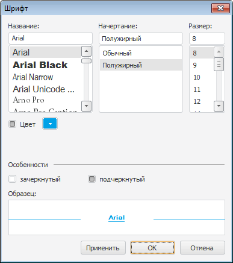

# FontDialog: Компонент

FontDialog: Компонент
-

# FontDialog

## Иерархия наследования

           [IComponent](modforms.chm::/Interface/IComponent/IComponent.htm)

           [IFontDialog](ModForms.chm::/Interface/IFontDialog/IFontDialog.htm)

           [FontDialog](ModForms.chm::/Class/FontDialog/FontDialog.htm)

## Описание

Компонент FontDialog реализует стандартный диалог выбора шрифта.

## Работа с компонентом

Используя свойство [Options](ModForms.chm::/Interface/IFontDialog/IFontDialog.Options.htm) можно определить, какие шрифты будут доступны для выбора в диалоге. Для инициализации диалога необходимо в коде вызвать метод [Execute](ModForms.chm::/Interface/IFontDialog/IFontDialog.Execute.htm). После выбора шрифта, настройки его параметров и нажатия кнопки ОК, шрифт будет доступен в свойстве [Font](ModForms.chm::/Interface/IFontDialog/IFontDialog.Font.htm).

## Пример

## Свойства компонента FontDialog

 Имя свойства
 Краткое описание

 
 [ComponentCount](ModForms.chm::/Interface/IComponent/IComponent.ComponentCount.htm)
 Свойство ComponentCount возвращает количество дочерних компонентов, расположенных на родительском компоненте.

 
 [Components](ModForms.chm::/Interface/IComponent/IComponent.Components.htm)
 Свойство Components возвращает дочерний компонент, индекс которого передается посредством входного параметра.

 
 [Data](ModForms.chm::/Interface/IComponent/IComponent.Data.htm)
 Свойство Data предназначено для хранения любых пользовательских данных.

 
 [Device](ModForms.chm::/Interface/IFontDialog/IFontDialog.Device.htm)
 Свойство Device определяет, какие шрифты будут входить в список доступных шрифтов при инициализации диалога выбора шрифта.

 
 [Font](ModForms.chm::/Interface/IFontDialog/IFontDialog.Font.htm)
 Свойство Font определяет шрифт, выбранный в диалоге.

 
 [MaxFontSize](ModForms.chm::/Interface/IFontDialog/IFontDialog.MaxFontSize.htm)
 Свойство MaxFontSize определяет максимальный размер шрифта, который можно будет установить для выбранного в диалоге шрифта.

 
 [MinFontSize](ModForms.chm::/Interface/IFontDialog/IFontDialog.MinFontSize.htm)
 Свойство MinFontSize определяет минимальный размер шрифта, который можно будет установить для выбранного в диалоге шрифта.

 
 [Name](ModForms.chm::/Interface/IComponent/IComponent.Name.htm)
 Свойство Name определяет наименование компонента.

 
 [Options](ModForms.chm::/Interface/IFontDialog/IFontDialog.Options.htm)
 Свойство Options определяет дополнительные параметры диалога.

 
 [Tag](ModForms.chm::/Interface/IComponent/IComponent.Tag.htm)
 Свойство Tag не используется компилятором. Пользователь может изменить значение свойства Tag и использовать его по своему усмотрению.

## Методы компонента FontDialog

 Имя метода
 Краткое описание

 
 [Execute](ModForms.chm::/Interface/IFontDialog/IFontDialog.Execute.htm)
 Метод Execute осуществляет инициализацию диалога и возвращает результат выбора пользователя.

## События компонента FontDialog

 Имя события
 Краткое описание

 
 [OnApply](ModForms.chm::/Class/FontDialog/FontDialog.OnApply.htm)
 Событие OnApply наступает, когда пользователь нажимает кнопку "Применить" диалога выбора шрифта.

См. также:

[Стандартные компоненты](Standart_Components.htm)

		Справочная
		 система на версию 10.9
		 от 18/08/2025,
		 © ООО «ФОРСАЙТ»,
