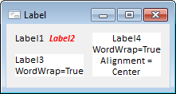

# Label: Компонент

Label: Компонент
-

# Label

## Иерархия наследования

           [IComponent](modforms.chm::/Interface/IComponent/IComponent.htm)

           [IControl](ModForms.chm::/Interface/IControl/IControl.htm)

           [ILabel](ModForms.chm::/Interface/ILabel/ILabel.htm)

           [Label](ModForms.chm::/Class/Label/Label.htm)

## Описание

Компонент Label позволяет размещать
 надписи на форме. Основное назначение компонента - создание надписей к
 компонентам, не имеющим собственного заголовка.

## Пример

## Свойства компонента Label

		 Имя свойства
		 Краткое описание

		 
		 [Align](modforms.chm::/interface/icontrol/IControl.Align.htm)
		 Свойство Align определяет
		 выравнивание компонента в рамках содержащего его родительского
		 компонента.

		 
		 [Alignment](ModForms.chm::/Interface/ILabel/ILabel.Alignment.htm)
		 Свойство Alignment определяет
		 выравнивание текста по горизонтали.

		 
		 [AllowDrag](modforms.chm::/interface/icontrol/IControl.AllowDrag.htm)
		 Свойство AllowDrag
		 определяет возможность взять у компонента перетаскиваемый объект.

		 
		 [AllowDrop](modforms.chm::/interface/icontrol/IControl.AllowDrop.htm)
		 Свойство AllowDrop
		 определяет, будет ли возможность у компонента принять перетаскиваемый
		 объект.

		 
		 [Anchors](modforms.chm::/interface/icontrol/IControl.Anchors.htm)
		 Свойство Anchors возвращает
		 настройки, определяющие в процентном соотношении изменение размеров
		 текущего компонента при изменении размеров родительского компонента.

		 
		 [AutoSize](ModForms.chm::/Interface/ILabel/ILabel.AutoSize.htm)
		 Свойство AutoSize определяет,
		 будет ли производиться автоматический подгон размеров компонента
		 под текст компонента.

		 
		 [Brush](modforms.chm::/interface/icontrol/IControl.Brush.htm)
		 Свойство Brush определяет
		 кисть, используемую для заливки области компонента.

		 
		 [ClientHeight](modforms.chm::/interface/icontrol/IControl.ClientHeight.htm)
		 Свойство ClientHeight
		 определяет высоту клиентской области компонента.

		 
		 [ClientWidth](modforms.chm::/interface/icontrol/IControl.ClientWidth.htm)
		 Свойство ClientWidth
		 определяет ширину клиентской области компонента.

		 
		 [Color](modforms.chm::/interface/icontrol/IControl.Color.htm)
		 Свойство Color определяет
		 цвет фона компонента.

		 
		 [Cursor](modforms.chm::/interface/icontrol/IControl.Cursor.htm)
		 Свойство Cursor определяет
		 вид курсора, отображаемого при наведении курсора мыши на компонент,
		 во время выполнения формы.

		 
		 [Data](ModForms.chm::/Interface/IComponent/IComponent.Data.htm)
		 Свойство Data предназначено
		 для хранения любых пользовательских данных.

		 
		 [Enabled](modforms.chm::/interface/icontrol/IControl.Enabled.htm)

		 Свойство Enabled определяет
		 доступность компонента для пользователя.

		 
		 [Focused](modforms.chm::/interface/icontrol/IControl.Focused.htm)
		 Свойство Focused возвращает
		 True, если фокус установлен
		 на данном компоненте.

		 
		 [Font](modforms.chm::/interface/icontrol/IControl.Font.htm)
		 Свойство Font определяет
		 параметры шрифта, используемого при отображении текста в компоненте.

		 
		 [Height](modforms.chm::/interface/icontrol/IControl.Height.htm)
		 Свойство Height определяет
		 высоту компонента в пикселях.

		 
		 [HelpContext](modforms.chm::/interface/icontrol/IControl.HelpContext.htm)
		 Свойство HelpContext
		 определяет уникальный индекс раздела контекстно-зависимой справки
		 для данного компонента.

		 
		 [Hint](modforms.chm::/interface/icontrol/IControl.Hint.htm)
		 Свойство Hint определяет
		 текст подсказки, появляющийся при задержке указателя мыши над
		 компонентом.

		 
		 [HintTimeout](modforms.chm::/interface/icontrol/IControl.HintTimeout.htm)
		 Свойство HintTimeout
		 определяет время отображения всплывающей подсказки.

		 
		 [Layout](ModForms.chm::/Interface/ILabel/ILabel.Layout.htm)
		 Свойство Layout определяет
		 выравнивание текста по вертикали.

		 
		 [Left](modforms.chm::/interface/icontrol/IControl.Left.htm)
		 Свойство Left определяет
		 координату левого края компонента в пикселях.

		 
		 [Name](ModForms.chm::/Interface/IComponent/IComponent.Name.htm)
		 Свойство Name определяет
		 наименование компонента.

		 
		 [Parent](modforms.chm::/interface/icontrol/IControl.Parent.htm)
		 Свойство Parent определяет
		 родительский компонент.

		 
		 [ParentColor](modforms.chm::/interface/icontrol/IControl.ParentColor.htm)
		 Свойство ParentColor
		 определяет, будет ли для компонента заимствован цвет родительского
		 компонента.

		 
		 [ParentFont](modforms.chm::/interface/icontrol/IControl.ParentFont.htm)
		 Свойство ParentFont
		 определяет, будет ли для компонента использоваться шрифт родительского
		 компонента.

		 
		 [ParentShowHint](modforms.chm::/interface/icontrol/IControl.ParentShowHint.htm)
		 Свойство ParentShowHint
		 определяет условие отображения всплывающей подсказки.

		 
		 [PopupMenu](modforms.chm::/interface/icontrol/IControl.PopupMenu.htm)
		 Свойство PopupMenu
		 определяет контекстное меню, которое будет появляться по щелчку
		 правой кнопки мыши на компоненте.

		 
		 [Scrolls](modforms.chm::/interface/icontrol/IControl.Scrolls.htm)
		 Свойство Scrolls возвращает
		 параметры полос прокрутки компонента.

		 
		 [ShowHint](modforms.chm::/interface/icontrol/IControl.ShowHint.htm)
		 Свойство ShowHint определяет,
		 будет ли показываться всплывающая подсказка при задержке курсора
		 мыши над компонентом.

		 
		 [TabOrder](modforms.chm::/interface/icontrol/IControl.TabOrder.htm)
		 Свойство TabOrder определяет
		 позицию компонента в последовательности табуляции.

		 
		 [TabStop](modforms.chm::/interface/icontrol/IControl.TabStop.htm)
		 Свойство TabStop определяет
		 признак необходимости компоненту получать фокус при нажатии кнопки
		 «TAB».

		 
		 [Tag](ModForms.chm::/Interface/IComponent/IComponent.Tag.htm)
		 Свойство Tag не
		 используется компилятором. Пользователь может изменить значение
		 свойства Tag и
		 использовать его по своему усмотрению.

		 
		 [Text](modforms.chm::/interface/icontrol/IControl.Text.htm)
		 Свойство Text определяет
		 строку, идентифицирующую компонент для пользователя.

		 
		 [Top](modforms.chm::/interface/icontrol/IControl.Top.htm)
		 Свойство Top определяет
		 координату верхнего края компонента в пикселях.

		 
		 [Transparent](ModForms.chm::/Interface/ILabel/ILabel.Transparent.htm)
		 Свойство Transparent определяет
		 признак прозрачности компонента.

		 
		 [Visible](modforms.chm::/interface/icontrol/IControl.Visible.htm)
		 Свойство Visible определяет
		 видимость компонента во время выполнения формы.

		 
		 [Width](modforms.chm::/interface/icontrol/IControl.Width.htm)
		 Свойство Width определяет
		 горизонтальный размер компонента в пикселях.

		 
		 [WordWrap](ModForms.chm::/Interface/ILabel/ILabel.WordWrap.htm)
		 Свойство WordWrap определяет,
		 будут ли переноситься слова длинной надписи, превышающие длину
		 компонента, на новую строку.

## Методы компонента Label

		  Имя метода

		 Краткое описание

		 
		 [ClientToScreen](ModForms.chm::/Interface/IControl/icontrol.clienttoscreen.htm)
		 Метод ClientToScreen
		 преобразовывает координаты точки, указанные относительно системы
		 координат компонента, в экранные координаты.

		 
		 [DoDragDrop](ModForms.chm::/Interface/IControl/icontrol.dodragdrop.htm)
		 Метод DoDragDrop позволяет
		 начать операцию перетаскивания.

		 
		 [GetImage](ModForms.chm::/Interface/IControl/icontrol.getimage.htm)
		 Метод GetImage возвращает
		 графическое изображение компонента со всеми дочерними компонентами.

		 
		 [ScreenToClient](ModForms.chm::/Interface/IControl/icontrol.screentoclient.htm)
		 Метод ScreenToClient
		 преобразовывает экранные координаты точки в координаты, указываемые
		 относительно системы координат компонента.

		 
		 [SetFocus](ModForms.chm::/Interface/IControl/icontrol.setfocus.htm)
		 Метод SetFocus устанавливает
		 фокус на данный компонент.

Примечание.
 Использование метода [SetFocus](ModForms.chm::/Interface/IControl/icontrol.setfocus.htm)
 недоступно для компонента Label.

## События компонента Label

		 Имя события

		 Краткое описание

		 

		 [OnBeginDrag](ModForms.chm::/Interface/IControl/icontrol.onbegindrag.htm)
		 Событие OnBeginDrag
		 для компонента наступает, когда пользователь начинает перетаскивать
		 объект от компонента.

		 

		 [OnClick](ModForms.chm::/Interface/IControl/icontrol.onclick.htm)
		 Событие OnClick наступает,
		 если пользователь щёлкнул в области компонента.

		 

		 [OnDblClick](ModForms.chm::/Interface/IControl/icontrol.ondblclick.htm)
		 Событие OnDblClick
		 наступает, если пользователь дважды щёлкнул в области компонента.

		 

		 [OnDragDrop](ModForms.chm::/Interface/IControl/icontrol.ondragdrop.htm)
		 Событие OnDragDrop
		 для компонента наступает, когда пользователь отпускает над ним
		 перетаскиваемый объект.

		 

		 [OnDragEnter](ModForms.chm::/Interface/IControl/icontrol.ondragenter.htm)
		 Событие OnDragEnter
		 наступает, когда перетаскиваемый объект входит в область данного
		 компонента.

		 

		 [OnDragLeave](ModForms.chm::/Interface/IControl/icontrol.ondragleave.htm)
		 Событие OnDragLeave
		 наступает, когда перетаскиваемый объект выходит за границы данного
		 компонента.

		 

		 [OnDragOver](ModForms.chm::/Interface/IControl/icontrol.ondragover.htm)
		 Событие OnDragOver
		 для компонента наступает, когда пользователь протаскивает над
		 ним перетаскиваемый объект.

		 

		 [OnEnter](ModForms.chm::/Interface/IControl/icontrol.onenter.htm)
		 Событие OnEnter
		 наступает в момент получения фокуса компонентом.

		 

		 [OnExit](ModForms.chm::/Interface/IControl/icontrol.onexit.htm)
		 Событие OnExit наступает
		 в момент потери фокуса компонентом.

		 

		 [OnHScroll](ModForms.chm::/Interface/IControl/icontrol.onhscroll.htm)
		 Событие OnHScroll
		 наступает при изменении положения ползунка горизонтальной полосы
		 прокрутки.

		 

		 [OnKeyDown](ModForms.chm::/Interface/IControl/icontrol.onkeydown.htm)
		 Событие OnKeyDown
		 наступает, если компонент находится в фокусе и производится нажатие на клавиатуру.

		 

		 [OnKeyPress](ModForms.chm::/Interface/IControl/icontrol.onkeypress.htm)
		 Событие OnKeyPress
		 наступает, если компонент находится в фокусе, при нажатии пользователем
		 символьной клавиши.

		 

		 [OnKeyPreview](ModForms.chm::/Interface/IControl/icontrol.onkeypreview.htm)
		 Событие OnKeyPreview
		 наступает перед каждым событием, связанным с нажатием клавиш.

		 

		 [OnKeyUp](ModForms.chm::/Interface/IControl/icontrol.onkeyup.htm)
		 Событие OnKeyUp
		 наступает, если компонент находится в фокусе, при отпускании пользователем
		 любой, ранее нажатой клавиши.

		 

		 [OnMouseDown](ModForms.chm::/Interface/IControl/icontrol.onmousedown.htm)
		 Событие OnMouseDown
		 наступает, если указатель находится в области компонента и была
		 нажата любая кнопка мыши.

		 

		 [OnMouseEnter](ModForms.chm::/Interface/IControl/icontrol.onmouseenter.htm)
		 Событие OnMouseEnter
		 наступает в момент входа курсора мыши в область компонента.

		 

		 [OnMouseHover](ModForms.chm::/Interface/IControl/icontrol.onmousehover.htm)
		 Событие OnMouseHover
		 наступает при задержке курсора мыши в области компонента.

		 

		 [OnMouseLeave](ModForms.chm::/Interface/IControl/icontrol.onmouseleave.htm)
		 Событие OnMouseLeave
		 наступает в момент выхода курсора мыши за пределы области компонента.

		 

		 [OnMouseMove](ModForms.chm::/Interface/IControl/icontrol.onmousemove.htm)
		 Событие OnMouseMove
		 наступает при перемещении курсора мыши над компонентом.

		 

		 [OnMouseUp](ModForms.chm::/Interface/IControl/icontrol.onmouseup.htm)
		 Событие OnMouseUp
		 наступает при отпускании кнопки мыши, когда указатель находится
		 в области компонента.

		 

		 [OnMouseWheel](ModForms.chm::/Interface/IControl/icontrol.onmousewheel.htm)
		 Событие OnMouseWheel
		 наступает, если компонент находится в фокусе при вращении колеса
		 мыши.

		 

		 [OnVScroll](ModForms.chm::/Interface/IControl/icontrol.onvscroll.htm)
		 Событие OnVScroll
		 наступает при изменении положения ползунка вертикальной полосы
		 прокрутки.

Примечание.
 Использование событий [OnEnter](ModForms.chm::/Interface/IControl/icontrol.onenter.htm)
 и [OnExit](ModForms.chm::/Interface/IControl/icontrol.onexit.htm)
 недоступно для компонента Label.

См. также:

[Стандартные компоненты](Standart_Components.htm)

		Справочная
		 система на версию 10.9
		 от 18/08/2025,
		 © ООО «ФОРСАЙТ»,
