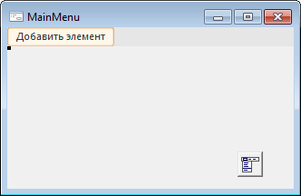
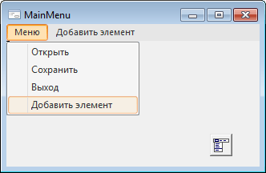

# MainMenu: Компонент

MainMenu: Компонент
-

# MainMenu

## Иерархия наследования

           [IComponent](modforms.chm::/Interface/IComponent/IComponent.htm)

           [IMenu](ModForms.chm::/Interface/IMenu/IMenu.htm)

           [IMainMenu](ModForms.chm::/Interface/IMainMenu/IMainMenu.htm)

           [MainMenu](ModForms.chm::/Class/MainMenu/MainMenu.htm)

## Описание

Компонент MainMenu предназначен
 для создания главного меню на форме.

## Работа с компонентом

На форме может быть помещено несколько компонентов MainMenu,
 содержащих разные наборы команд. В этом случае свойству формы [MainMenu](ModForms.chm::/Interface/IFormControl/IFormControl.MainMenu.htm) в качестве
 значения необходимо установить имя одного из компонентов MainMenu.

После формирования списка элементов меню можно определить свойства и
 события для каждого элемента меню. Каждый элемент меню является объектом
 класса [MenuItem](ModForms.chm::/Class/MenuItem/MenuItem.htm),
 обладающим определенным набором свойств, методов и событий.

Примечание.
 Для корневых элементов меню нельзя выставить свойству [Enabled](ModForms.chm::/Interface/IMenuItem/IMenuItem.Enabled.htm) значение
 False.

Добавление пунктов меню осуществляется на этапе создания формы или динамически
 в прикладном коде. Для добавления необходимо найти на панели инструментов
 «Стандартные» компонент MainMenu и разместить его на форме,
 при этом форма примет вид:

При щелчке по компоненту MainMenu
 в инспекторе объектов появится список свойств данного компонента, необходимо
 выбрать свойство Items и нажать
 кнопку  данного свойства. Откроется список свойств добавляемого
 элемента меню, в котором нужно задать значения свойства Text.
 Текст надписи может содержать символ амперсанта «&», вызывающий подчеркивания
 следующего после него символа, соответствующего горячей клавише доступа.
 После выполнения этих действий в меню появится пункт с заданным наименованием,
 а также появятся новые пункты меню и подменю:

Для добавления новых элементов меню необходимо выбрать нужный пункт
 «Добавить элемент» и задать для
 выбранного элемента свойство Text.
 После создания меню появится возможность изменения порядка расположения
 пунктов меню на панели меню с помощью механизма перетаскивания объектов
 Drag&Drop.

Для пунктов меню, расположенных на одном уровне иерархии, существует
 возможность настройки общих свойств. Для это нужно, удерживая нажатой
 клавишу CTRL, выделить необходимые пункты и изменить необходимые свойства
 в инспекторе объектов.

### Горячие клавиши

Для быстрого выполнения какой-либо команды меню есть возможность назначить
 одно или несколько сочетаний горячих клавиш. Для назначения горячих клавиш
 в режиме дизайнера формы необходимо выбрать пункт меню, в инспекторе объектов
 выделить свойство [ShortCut](ModForms.chm::/Interface/IMenuItem/IMenuItem.ShortCut.htm)
 и нажать требуемое сочетание. Дополнительные сочетания горячих клавиш
 задаются в коллекции [AdditionalShortCuts](ModForms.chm::/Interface/IMenuItem/IMenuItem.AdditionalShortCuts.htm)
 через язык Fore во время выполнения формы.

## Пример

После запуска формы меню примет вид:

## Свойства компонента MainMenu

		 Имя свойства
		 Краткое описание

		 
		 [AllowUndock](ModForms.chm::/Interface/IMainMenu/IMainMenu.AllowUndock.htm)
		 Свойство AllowUndock
		 определяет, будет ли у пользователя возможность открепить меню
		 во время выполнения формы.

		 
		 [ComponentCount](ModForms.chm::/Interface/IComponent/IComponent.ComponentCount.htm)
		 Свойство ComponentCount
		 возвращает количество дочерних компонентов.

		 
		 [Components](ModForms.chm::/Interface/IComponent/IComponent.Components.htm)
		 Свойство Components
		 возвращает дочерний компонент.

		 
		 [Data](ModForms.chm::/Interface/IComponent/IComponent.Data.htm)
		 Свойство Data предназначено
		 для хранения любых пользовательских данных.

		 
		 [Images](ModForms.chm::/Interface/IMenu/IMenu.Images.htm)
		 Свойство Images определяет
		 наименование компонента [ImageList](../02_Additional_components/ImageList.htm)
		 , изображения которого будут использоваться в компоненте.

		 
		 [Items](ModForms.chm::/Interface/IMenu/IMenu.Items.htm)
		 Свойство Items возвращает
		 коллекцию элементов меню.

		 
		 [Name](ModForms.chm::/Interface/IComponent/IComponent.Name.htm)
		 Свойство Name определяет
		 наименование компонента.

		 
		 [Tag](ModForms.chm::/Interface/IComponent/IComponent.Tag.htm)
		 Свойство Tag не используется
		 компилятором. Пользователь может изменить значение свойства Tag и использовать его по своему
		 усмотрению.

См. также:

[Стандартные компоненты](Standart_Components.htm)

		Справочная
		 система на версию 10.9
		 от 18/08/2025,
		 © ООО «ФОРСАЙТ»,
