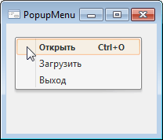

# PopupMenu: Компонент

PopupMenu: Компонент
-

# PopupMenu

## Иерархия наследования

           [IComponent](modforms.chm::/Interface/IComponent/IComponent.htm)

           [IMenu](ModForms.chm::/Interface/IMenu/IMenu.htm)

           [IPopupMenu](ModForms.chm::/Interface/IPopupMenu/IPopupMenu.htm)

           [PopupMenu](ModForms.chm::/Class/PopupMenu/PopupMenu.htm)

## Описание

Компонент PopupMenu представляет
 собой контекстное меню, которое появляется, когда пользователь нажимает
 правую кнопку мыши в рабочей области формы или компонента.

## Работа с компонентом

Для создания контекстного меню добавьте компонент PopupMenu
 на форму и установите его в качестве значения свойства [PopupMenu](ModForms.chm::/Interface/IControl/IControl.PopupMenu.htm)
 формы или компонента.

Список элементов контекстного меню создается так же, как и для компонента
 [MainMenu](MainMenu.htm).

После создания меню существует возможность изменения порядка расположения
 пунктов меню на панели меню с помощью механизма перетаскивания объектов
 Drag&Drop.

При отсутствии элементов в компоненте PopupMenu
 оно отображаться не будет.

## Пример

## Свойства компонента PopupMenu

		 Имя свойства
		 Краткое описание

		 
		 [Alignment](ModForms.chm::/Interface/IPopupMenu/IPopupMenu.Alignment.htm)
		 Свойство Alignment
		 определяет, с какой стороны относительно курсора мыши будет появляться
		 контекстное меню.

		 
		 [AutoPopup](ModForms.chm::/Interface/IPopupMenu/IPopupMenu.AutoPopup.htm)
		 Свойство AutoPopup
		 определяет автоматическое появление контекстного меню при щелчке
		 правой кнопкой мыши.

		 
		 [ComponentCount](ModForms.chm::/Interface/IComponent/IComponent.ComponentCount.htm)
		 Свойство ComponentCount
		 возвращает количество дочерних компонентов.

		 
		 [Components](ModForms.chm::/Interface/IComponent/IComponent.Components.htm)
		 Свойство Components
		 возвращает дочерний компонент.

		 
		 [Data](ModForms.chm::/Interface/IComponent/IComponent.Data.htm)
		 Свойство Data предназначено
		 для хранения любых пользовательских данных.

		 
		 [Images](ModForms.chm::/Interface/IMenu/IMenu.Images.htm)
		 Свойство Images определяет
		 наименование компонента [ImageList](../02_Additional_components/ImageList.htm)
		 , изображения которого будут использоваться в компоненте.

		 
		 [Items](ModForms.chm::/Interface/IMenu/IMenu.Items.htm)
		 Свойство Items возвращает
		 коллекцию элементов меню.

		 
		 [Name](ModForms.chm::/Interface/IComponent/IComponent.Name.htm)
		 Свойство Name определяет
		 наименование компонента.

		 
		 [Tag](ModForms.chm::/Interface/IComponent/IComponent.Tag.htm)
		 Свойство Tag не используется
		 компилятором. Пользователь может изменить значение свойства Tag и использовать его по своему
		 усмотрению.

## Методы компонента PopupMenu

		 Имя метода
		 Краткое описание

		 
		 [Popup](ModForms.chm::/Interface/IPopupMenu/IPopupMenu.Popup.htm)
		 Метод Popup отображает
		 контекстное меню в заданной позиции.

## События компонента PopupMenu

		 Имя события
		 Краткое описание

		 
		 [OnClose](ModForms.chm::/Class/PopupMenu/PopupMenu.OnClose.htm)
		 Событие OnClose наступает
		 после закрытия контекстного меню.

		 
		 [OnPopup](ModForms.chm::/Class/PopupMenu/PopupMenu.OnPopup.htm)
		 Событие OnPopup наступает
		 непосредственно перед появлением контекстного меню.

См. также:

[Стандартные компоненты](Standart_Components.htm)

		Справочная
		 система на версию 10.9
		 от 18/08/2025,
		 © ООО «ФОРСАЙТ»,
