# Стандартные компоненты

Стандартные компоненты
-

# Стандартные компоненты

К стандартным компонентам относятся:

		 Значок компонента
		 Наименование компонента

		 
		 [Label](Label.htm)

		 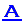
		 [HyperLink](Hyperlink.htm)

		 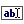
		 [EditBox](EditBox.htm)

		 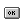
		 [Button](Button.htm)

		 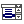
		 [ComboBox](ComboBox.htm)

		 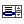
		 [ListBox](ListBox.htm)

		 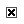
		 [CheckBox](CheckBox.htm)

		 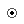
		 [RadioButton](RadioButton.htm)

		 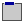
		 [GroupBox](GroupBox.htm)

		 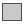
		 [Panel](Panel.htm)

		 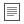
		 [Memo](Memo.htm)

		 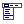
		 [MainMenu](MainMenu.htm)

		 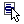
		 [PopupMenu](PopupMenu.htm)

		 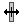
		 [Splitter](Splitter.htm)

		 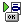
		 [ActionList](ActionList.htm)

		 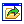
		 [FileOpenDialog](FileOpenDialog.htm)

		 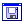
		 [FileSaveDialog](FileSaveDialog.htm)

		 
		 [FolderBrowserDialog](FolderBrowserDialog.htm)

		 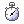
		 [Timer](Timer.htm)

		 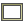
		 [Frame](Frame.htm)

		 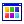
		 [ColorDialog](ColorDialog.htm)

		 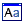
		 [FontDialog](FontDialog.htm)

См. также:

[Дополнительные
 компоненты](../02_Additional_components/Additional_components.htm) | [Компоненты
 доступа к данным](../03_Components_of_the_access_to_data/03_components_of_the_access_to_data.htm) | [Компоненты
 платформы](../04_PPControls/04_components_pp7.htm)

		Справочная
		 система на версию 10.9
		 от 18/08/2025,
		 © ООО «ФОРСАЙТ»,
