# Дополнительные компоненты

Дополнительные компоненты
-

# Дополнительные компоненты

К дополнительным компонентам относятся:

		 Значок компонента
		 Наименование компонента

		 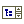
		 [TreeList](TreeList.htm)

		 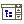
		 [TreeCombo](TreeCombo.htm)

		 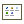
		 [ListView](ListView.htm)

		 
		 [TrackBar](TrackBar.htm)

		 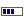
		 [ProgressBar](ProgressBar.htm)

		 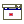
		 [DateTimePicker](DateTimePicker.htm)

		 
		 [MonthCalendar](MonthCalendar.htm)

		 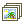
		 [ImageList](ImageList.htm)

		 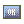
		 [ImageButton](ImageButton.htm)

		 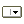
		 [MenuButton](MenuButton.htm)

		 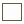
		 [Bevel](Bevel.htm)

		 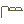
		 [PageControl](PageControl.htm)

		 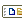
		 [Toolbar](ToolBar.htm)

		 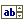
		 [SpinEdit](SpinEdit.htm)

		 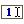
		 [IntegerEdit](IntegerEdit.htm)

		 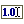
		 [FloatEdit](FloatEdit.htm)

		 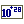
		 [DecimalEdit](DecimalEdit.htm)

		 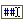
		 [MaskEdit](MaskEdit.htm)

		 
		 [ImageBox](ImageBox.htm)

		 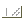
		 [StatusBar](StatusBar.htm)

		 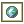
		 [WebBrowserBox](WebBrowserBox.htm)

		 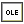
		 [OleDocumentBox](OleDocumentBox.htm)

		 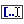
		 [TermEdit](TermEdit.htm)

		 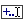
		 [ExpressionEdit](ExpressionEdit.htm)

		 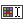
		 [CalcCubeFormulaEdit](CalcCubeFormulaEdit.htm)

		 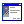
		 [Wizard](Wizard.htm)

		 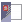
		 [WizardSplash](WizardSplash.htm)

		 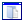
		 [MetabaseOpenDialog](MetabaseOpenDialog.htm)

		 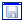
		 [MetabaseSaveDialog](MetabaseSaveDialog.htm)

		 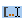
		 [TermEditEx](TermEditEx.htm)

		 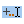
		 [ExpressionEditEx](ExpressionEditEx.htm)

		 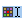
		 [CalcCubeFormulaEditEx](CalcCubeFormulaEditEx.htm)

		 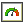
		 [SpeedometerBox](SpeedometerBox.htm)

		 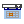
		 [DateTimePickerEx](DateTimePickerEx.htm)

		 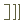
		 [ControlBar](ControlBar.htm)

		 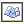
		 [Chart3DBox](Chart3DBox.htm)

		 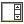
		 [ScrollBox](ScrollBox.htm)

		 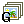
		 [GlobalImageList](GlobalImageList.htm)

		 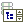
		 [MetabaseTreeList](MetabaseTreeList.htm)

		 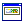
		 [BannerBar](BannerBar.htm)

		 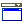
		 [DropForm](DropForm.htm)

		 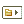
		 [Breadcrumb](Breadcrumb.htm)

		 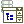
		 [MetabaseTreeCombo](MetabaseTreeCombo.htm)

		 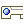
		 [Ribbon](Ribbon.htm)

		 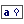
		 [SearchEdit](SearchEdit.htm)

		 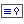
		 [SearchDataSourcesBox](SearchDataSourcesBox.htm)

		 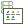
		 [MetabaseListView](MetabaseListView.htm)

		 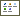
		 [CtrlGroupConditions](CtrlGroupConditions.htm)

См. также:

[Стандартные
 компоненты](../01_Standart_Components/Standart_Components.htm) | [Компоненты
 доступа к данным](../03_Components_of_the_access_to_data/03_components_of_the_access_to_data.htm) | [Компоненты
 платформы](../04_PPControls/04_components_pp7.htm)

		Справочная
		 система на версию 10.9
		 от 18/08/2025,
		 © ООО «ФОРСАЙТ»,
