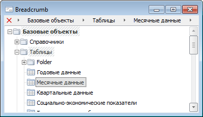

# Breadcrumb: Компонент

Breadcrumb: Компонент
-

# Breadcrumb

## Иерархия наследования

           [IComponent](modforms.chm::/Interface/IComponent/IComponent.htm)

           [IControl](ModForms.chm::/Interface/IControl/IControl.htm)

           [IBreadcrumb](ModForms.chm::/Interface/IBreadcrumb/IBreadcrumb.htm)

           [Breadcrumb](ModForms.chm::/Class/Breadcrumb/Breadcrumb.htm)

## Описание

Компонент Breadcrumb используется
 для создания цепочки навигации по каким-либо объектам.

## Работа с компонентом

Цепочка навигации строится из горизонтально расположенных элементов
 компонента.

Каждый элемент соответствует какому-либо действию. Доступ к коллекции
 элементов осуществляется посредством свойства [Items](ModForms.chm::/Interface/IBreadcrumb/IBreadcrumb.Items.htm).
 Каждому элементу могут быть сопоставлены какие-либо данные. Для их хранения
 во время работы формы используйте свойство [Data](ModForms.chm::/Interface/IBreadcrumbItem/IBreadcrumbItem.Data.htm).
 Для обработки действий, связанных с элементами, можно использовать событие
 [OnItemClick](ModForms.chm::/Class/Breadcrumb/Breadcrumb.OnItemClick.htm)
 - возникает при щелчке кнопкой мыши по наименованию элемента, либо [OnButtonClick](ModForms.chm::/Class/Breadcrumb/Breadcrumb.OnButtonClick.htm)
 - возникает при щелчке кнопкой мыши по дополнительной кнопке, отображаемой
 рядом с наименованием элемента.

Кнопка  используется для удаления всех
 элементов.

Если список элементов не вмещается в область компонента, то по краям
 автоматически появляются кнопки прокрутки списка .
 При нажатии на соответствующую кнопку список будет смещен на один элемент.
 Свойство [BorderStyle](ModForms.chm::/Interface/IBreadcrumb/IBreadcrumb.BorderStyle.htm)
 позволяет изменить стиль границ компонента.

## Пример

## Свойства компонента Breadcrumb

		 Имя свойства
		 Краткое описание

		 
		 [Align](ModForms.chm::/Interface/IControl/IControl.Align.htm)
		 Свойство Align определяет,
		 как поведет себя компонент при изменении размеров содержащего
		 его родительского компонента.

		 
		 [AllowDrag](ModForms.chm::/Interface/IControl/IControl.AllowDrag.htm)
		 Свойство AllowDrag
		 определяет возможность взять у компонента перетаскиваемый объект.

		 
		 [AllowDrop](ModForms.chm::/Interface/IControl/IControl.AllowDrop.htm)
		 Свойство AllowDrop
		 определяет, будет ли возможность у компонента принять перетаскиваемый
		 объект.

		 
		 [Anchors](ModForms.chm::/Interface/IControl/IControl.Anchors.htm)
		 Свойство Anchors возвращает
		 настройки, определяющие в процентном соотношении изменение размеров
		 текущего компонента при изменении размеров родительского компонента.

		 
		 [AutoScroll](ModForms.chm::/Interface/IBreadcrumb/IBreadcrumb.AutoScroll.htm)
		 Свойство находится в стадии разработки.

		 
		 [BorderStyle](ModForms.chm::/Interface/IBreadcrumb/IBreadcrumb.BorderStyle.htm)
		 Свойство BorderStyle
		 определяет стиль границ компонента.

		 
		 [Brush](ModForms.chm::/Interface/IControl/IControl.Brush.htm)
		 Свойство Brush определяет
		 кисть, используемую для заливки области компонента.

		 
		 [ClientHeight](ModForms.chm::/Interface/IControl/IControl.ClientHeight.htm)
		 Свойство ClientHeight
		 используется для получения или задания высоты клиентской области
		 компонента.

		 
		 [ClientWidth](ModForms.chm::/Interface/IControl/IControl.ClientWidth.htm)
		 Свойство ClientWidth
		 используется для получения или задания ширины клиентской области
		 компонента.

		 
		 [Color](ModForms.chm::/Interface/IControl/IControl.Color.htm)
		 Свойство Color определяет
		 цвет фона компонента.

		 
		 [ComponentCount](ModForms.chm::/Interface/IComponent/IComponent.ComponentCount.htm)
		 Свойство ComponentCount
		 возвращает количество дочерних компонентов.

		 
		 [Components](ModForms.chm::/Interface/IComponent/IComponent.Components.htm)
		 Свойство Components
		 возвращает дочерний компонент.

		 
		 [Cursor](ModForms.chm::/Interface/IControl/IControl.Cursor.htm)
		 Свойство Cursor определяет
		 вид курсора над компонентом.

		 
		 [Data](ModForms.chm::/Interface/IComponent/IComponent.Data.htm)
		 Свойство Data предназначено
		 для хранения любых пользовательских данных.

		 
		 [DeleteButton](ModForms.chm::/Interface/IBreadcrumb/IBreadcrumb.DeleteButton.htm)
		 Свойство DeleteButton
		 определяет признак отображения кнопки, используемой для удаления
		 всех элементов компонента.

		 
		 [Enabled](ModForms.chm::/Interface/IControl/IControl.Enabled.htm)
		 Свойство Enabled определяет
		 доступность компонента для пользователя.

		 
		 [Focused](ModForms.chm::/Interface/IControl/IControl.Focused.htm)
		 Свойство Focused возвращает
		 True, если фокус установлен
		 на данном компоненте.

		 
		 [Font](ModForms.chm::/Interface/IControl/IControl.Font.htm)
		 Свойство Font определяет
		 множество характеристик, описывающих шрифт, используемый при отображении
		 текста.

		 
		 [Height](ModForms.chm::/Interface/IControl/IControl.Height.htm)
		 Свойство Height определяет
		 высоту компонента.

		 
		 [HelpContext](ModForms.chm::/Interface/IControl/IControl.HelpContext.htm)
		 Свойство HelpContext
		 определяет уникальный индекс раздела контекстно-зависимой справки
		 для данного компонента.

		 
		 [Hint](ModForms.chm::/Interface/IControl/IControl.Hint.htm)
		 Свойство Hint определяет
		 текст подсказки для компонента.

		 
		 [Items](ModForms.chm::/Interface/IBreadcrumb/IBreadcrumb.Items.htm)
		 Свойство Items возвращает
		 коллекцию элементов компонента.

		 
		 [Left](ModForms.chm::/Interface/IControl/IControl.Left.htm)
		 Свойство Left определяет
		 координату левого края компонента.

		 
		 [Name](ModForms.chm::/Interface/IComponent/IComponent.Name.htm)
		 Свойство Name определяет
		 наименование компонента.

		 
		 [Parent](ModForms.chm::/Interface/IControl/IControl.Parent.htm)
		 Свойство Parent определяет
		 родительский компонент.

		 
		 [ParentColor](ModForms.chm::/Interface/IControl/IControl.ParentColor.htm)
		 Свойство ParentColor
		 определяет, будет ли для компонента заимствован цвет родительского
		 компонента.

		 
		 [ParentFont](ModForms.chm::/Interface/IControl/IControl.ParentFont.htm)
		 Свойство ParentFont
		 определяет, будет ли для компонента использоваться шрифт родительского
		 компонента.

		 
		 [ParentShowHint](ModForms.chm::/Interface/IControl/IControl.ParentShowHint.htm)
		 Свойство ParentShowHint
		 определяет условие отображения всплывающей подсказки.

		 
		 [PopupMenu](ModForms.chm::/Interface/IControl/IControl.PopupMenu.htm)
		 Свойство PopupMenu
		 определяет контекстное меню, которое будет появляться по щелчку
		 дополнительной кнопки мыши на компоненте.

		 
		 [ScrollLeft](ModForms.chm::/Interface/IBreadcrumb/IBreadcrumb.ScrollLeft.htm)
		 Свойство находится в стадии разработки.

		 
		 [ScrollRight](ModForms.chm::/Interface/IBreadcrumb/IBreadcrumb.ScrollRight.htm)
		 Свойство находится в стадии разработки.

		 
		 [Scrolls](ModForms.chm::/Interface/IControl/IControl.Scrolls.htm)
		 Свойство Scrolls возвращает
		 параметры полос прокрутки компонента.

		 
		 [ShowHint](ModForms.chm::/Interface/IControl/IControl.ShowHint.htm)
		 Свойство ShowHint включает
		 и выключает показ всплывающего окна подсказки для компонента.

		 
		 [StartDownButton](ModForms.chm::/Interface/IBreadcrumb/IBreadcrumb.StartDownButton.htm)
		 Свойство StartDownButton
		 определяет признак отображения дополнительной кнопки после кнопки
		 удаления элементов.

		 
		 [Suffix](ModForms.chm::/Interface/IBreadcrumb/IBreadcrumb.Suffix.htm)
		 Свойство Suffix определяет
		 вспомогательный текст, отображаемый в области компонента после
		 цепочки навигации.

		 
		 [TabOrder](ModForms.chm::/Interface/IControl/IControl.TabOrder.htm)
		 Свойство TabOrder определяет
		 позицию компонента в последовательности табуляции.

		 
		 [TabStop](ModForms.chm::/Interface/IControl/IControl.TabStop.htm)
		 Свойство TabStop определяет
		 признак необходимости компоненту получать фокус при нажатии кнопки
		 «TAB».

		 
		 [Tag](ModForms.chm::/Interface/IComponent/IComponent.Tag.htm)
		 Свойство Tag не используется
		 компилятором. Пользователь может изменить значение свойства Tag и использовать его по своему
		 усмотрению.

		 
		 [Text](ModForms.chm::/Interface/IControl/IControl.Text.htm)
		 Свойство Text определяет
		 строку, идентифицирующую компонент для пользователя.

		 
		 [Top](ModForms.chm::/Interface/IControl/IControl.Top.htm)
		 Свойство Top определяет
		 координату верхнего края компонента.

		 
		 [Visible](ModForms.chm::/Interface/IControl/IControl.Visible.htm)
		 Свойство Visible определяет
		 видимость компонента во время выполнения.

		 
		 [Width](ModForms.chm::/Interface/IControl/IControl.Width.htm)
		 Свойство Width определяет
		 ширину компонента.

## Методы компонента Breadcrumb

		 Имя метода
		 Краткое описание

		 
		 [BeginUpdate](ModForms.chm::/Interface/IBreadcrumb/IBreadcrumb.BeginUpdate.htm)
		 Метод BeginUpdate запрещает
		 перерисовку компонента.

		 
		 [BringToFront](ModForms.chm::/Interface/IControl/IControl.BringToFront.htm)
		 Метод BringToFront
		 располагает компонент на передний план.

		 
		 [ClientToScreen](ModForms.chm::/Interface/IControl/IControl.ClientToScreen.htm)
		 Метод ClientToScreen
		 преобразовывает координаты точки, указанные относительно системы
		 координат компонента, в экранные координаты.

		 
		 [DoDragDrop](ModForms.chm::/Interface/IControl/IControl.DoDragDrop.htm)
		 Метод DoDragDrop позволяет
		 начать операцию перетаскивания.

		 
		 [EndUpdate](ModForms.chm::/Interface/IBreadcrumb/IBreadcrumb.EndUpdate.htm)
		 Метод EndUpdate снимает
		 запрет на перерисовку объекта.

		 
		 [GetImage](ModForms.chm::/Interface/IControl/IControl.GetImage.htm)
		 Метод GetImage возвращает
		 изображение компонента со всеми дочерними компонентами.

		 
		 [HitTest](ModForms.chm::/Interface/IBreadcrumb/IBreadcrumb.HitTest.htm)
		 Метод HitTest позволяет
		 получить элемент компонента в заданной точке.

		 
		 [LoadState](ModForms.chm::/Interface/IBreadcrumb/IBreadcrumb.LoadState.htm)
		 Метод LoadState осуществляет
		 загрузку состояния элементов компонента.

		 
		 [SaveState](ModForms.chm::/Interface/IBreadcrumb/IBreadcrumb.SaveState.htm)
		 Метод SaveState осуществляет
		 сохранение состояния элементов компонента.

		 
		 [ScreenToClient](ModForms.chm::/Interface/IControl/IControl.ScreenToClient.htm)
		 Метод ScreenToClient
		 преобразовывает экранные координаты точки в координаты, указываемые
		 относительно системы координат компонента.

		 
		 [SendToBack](ModForms.chm::/Interface/IControl/IControl.SendToBack.htm)
		 Метод SendToBack располагает
		 компонент на задний план.

		 
		 [SetFocus](ModForms.chm::/Interface/IControl/IControl.SetFocus.htm)
		 Метод SetFocus устанавливает
		 фокус на данный компонент.

## События компонента Breadcrumb

		 Имя события
		 Краткое описание

		 
		 [OnAddItem](ModForms.chm::/Class/Breadcrumb/Breadcrumb.OnAddItem.htm)
		 Событие OnAddItem наступает
		 при добавлении нового элемента в коллекцию элементов компонента.

		 
		 [OnBeforeAddItem](ModForms.chm::/Class/Breadcrumb/Breadcrumb.OnBeforeAddItem.htm)
		 Событие OnBeforeAddItem
		 наступает перед добавлением нового элемента в коллекцию элементов
		 компонента.

		 
		 [OnBeforeMoveItem](ModForms.chm::/Class/Breadcrumb/Breadcrumb.OnBeforeMoveItem.htm)
		 Событие OnBeforeMoveItem
		 наступает перед перемещением элемента компонента.

		 
		 [OnBeforeRemoveItem](ModForms.chm::/Class/Breadcrumb/Breadcrumb.OnBeforeRemoveItem.htm)
		 Событие OnBeforeRemoveItem
		 наступает перед удалением элемента компонента.

		 
		 [OnBeginDrag](ModForms.chm::/Interface/IControl/IControl.OnBeginDrag.htm)
		 Событие OnBeginDrag
		 для компонента наступает, когда пользователь начинает перетаскивать
		 объект от компонента.

		 
		 [OnButtonClick](ModForms.chm::/Class/Breadcrumb/Breadcrumb.OnButtonClick.htm)
		 Событие OnButtonClick
		 наступает при щелчке кнопкой мыши по дополнительной кнопке, отображаемой
		 рядом с наименованием элемента.

		 
		 [OnClick](ModForms.chm::/Interface/IControl/IControl.OnClick.htm)
		 Событие OnClick наступает,
		 если пользователь щёлкнул в области компонента.

		 
		 [OnDblClick](ModForms.chm::/Interface/IControl/IControl.OnDblClick.htm)
		 Событие OnDblClick
		 наступает, если пользователь дважды щёлкнул в области компонента.

		 
		 [OnDragDrop](ModForms.chm::/Interface/IControl/IControl.OnDragDrop.htm)
		 Событие OnDragDrop
		 для компонента наступает, когда пользователь отпускает над ним
		 перетаскиваемый объект.

		 
		 [OnDragEnter](ModForms.chm::/Interface/IControl/IControl.OnDragEnter.htm)
		 Событие OnDragEnter
		 наступает, когда перетаскиваемый объект входит в границы данного
		 компонента.

		 
		 [OnDragLeave](ModForms.chm::/Interface/IControl/IControl.OnDragLeave.htm)
		 Событие OnDragLeave
		 наступает, когда перетаскиваемый объект выходит за границы данного
		 компонента.

		 
		 [OnDragOver](ModForms.chm::/Interface/IControl/IControl.OnDragOver.htm)
		 Событие OnDragOver
		 для компонента наступает, когда пользователь протаскивает над
		 ним перетаскиваемый объект.

		 
		 [OnEnter](ModForms.chm::/Interface/IControl/IControl.OnEnter.htm)
		 Событие OnEnter наступает
		 в момент получения фокуса компонентом.

		 
		 [OnExit](ModForms.chm::/Interface/IControl/IControl.OnExit.htm)
		 Событие OnExit наступает
		 в момент потери фокуса компонентом.

		 
		 [OnGetPopupMenu](ModForms.chm::/Class/Breadcrumb/Breadcrumb.OnGetPopupMenu.htm)
		 Событие OnGetPopupMenu
		 наступает при вызове контекстного меню для элемента компонента.

		 
		 [OnHScroll](ModForms.chm::/Interface/IControl/IControl.OnHScroll.htm)
		 Событие OnHScroll наступает
		 при изменении положения ползунка горизонтальной полосы прокрутки.

		 
		 [OnItemClick](ModForms.chm::/Class/Breadcrumb/Breadcrumb.OnItemClick.htm)
		 Событие OnItemClick
		 наступает при щелчке кнопкой мыши по элементу компонента.

		 
		 [OnKeyDown](ModForms.chm::/Interface/IControl/IControl.OnKeyDown.htm)
		 Событие OnKeyDown наступает,
		 если компонент находится в фокусе и производится нажатие на клавиатуру.

		 
		 [OnKeyPress](ModForms.chm::/Interface/IControl/IControl.OnKeyPress.htm)
		 Событие OnKeyPress
		 наступает, если компонент находится в фокусе, при нажатии пользователем
		 символьной клавиши.

		 
		 [OnKeyPreview](ModForms.chm::/Interface/IControl/IControl.OnKeyPreview.htm)
		 Событие OnKeyPreview
		 наступает перед каждым событием, связанным с нажатием клавиш.

		 
		 [OnKeyUp](ModForms.chm::/Interface/IControl/IControl.OnKeyUp.htm)
		 Событие OnKeyUp наступает,
		 если компонент находится в фокусе, при отпускании пользователем
		 любой, ранее нажатой клавиши.

		 
		 [OnMouseDown](ModForms.chm::/Interface/IControl/IControl.OnMouseDown.htm)
		 Событие OnMouseDown
		 наступает, если указатель находится в области компонента и была
		 нажата любая кнопка мыши.

		 
		 [OnMouseEnter](ModForms.chm::/Interface/IControl/IControl.OnMouseEnter.htm)
		 Событие OnMouseEnter
		 наступает в момент входа курсора мыши в область компонента.

		 
		 [OnMouseHover](ModForms.chm::/Interface/IControl/IControl.OnMouseHover.htm)
		 Событие OnMouseHover
		 наступает при задержке курсора мыши в области компонента.

		 
		 [OnMouseLeave](ModForms.chm::/Interface/IControl/IControl.OnMouseLeave.htm)
		 Событие OnMouseLeave
		 наступает в момент выхода курсора мыши за пределы области компонента.

		 
		 [OnMouseMove](ModForms.chm::/Interface/IControl/IControl.OnMouseMove.htm)
		 Событие OnMouseMove
		 наступает при перемещении курсора мыши над компонентом.

		 
		 [OnMouseUp](ModForms.chm::/Interface/IControl/IControl.OnMouseUp.htm)
		 Событие OnMouseUp наступает
		 при отпускании кнопки мыши, когда указатель находится в области
		 компонента.

		 
		 [OnMouseWheel](ModForms.chm::/Interface/IControl/IControl.OnMouseWheel.htm)
		 Событие OnMouseWheel
		 наступает, если компонент находится в фокусе при вращении колеса
		 мыши.

		 
		 [OnMoveItem](ModForms.chm::/Class/Breadcrumb/Breadcrumb.OnMoveItem.htm)
		 Событие OnMoveItem
		 наступает при перемещении элемента компонента.

		 
		 [OnRemoveItem](ModForms.chm::/Class/Breadcrumb/Breadcrumb.OnRemoveItem.htm)
		 Событие OnRemoveItem
		 наступает при удалении элемента компонента.

		 
		 [OnVScroll](ModForms.chm::/Interface/IControl/IControl.OnVScroll.htm)
		 Событие OnVScroll наступает
		 при изменении положения ползунка вертикальной полосы прокрутки.

См. также:

[Дополнительные компоненты](Additional_components.htm)

		Справочная
		 система на версию 10.9
		 от 18/08/2025,
		 © ООО «ФОРСАЙТ»,
