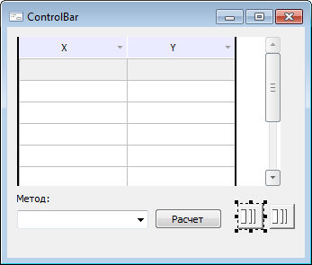
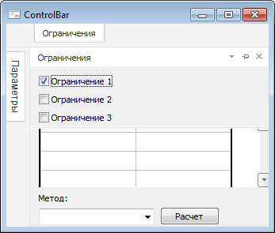
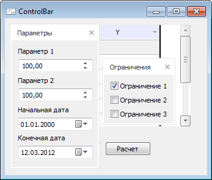

# ControlBar: Компонент

ControlBar: Компонент
-

# ControlBar

## Иерархия наследования

           [IComponent](modforms.chm::/Interface/IComponent/IComponent.htm)

           [IControlBar](ModForms.chm::/Interface/IControlBar/IControlBar.htm)

           [ControlBar](ModForms.chm::/Class/ControlBar/ControlBar.htm)

## Описание

Компонент ControlBar является
 невизуальным и предназначен для создания всплывающих панелей на форме.

## Работа с компонентом

В качестве панели отображается форма, указанная в свойстве [MetabaseObject](ModForms.chm::/Interface/IControlBar/IControlBar.MetabaseObject.htm)
 компонента ControlBar.

Всплывающая панель может находиться в одном из трех состояний. Припаркованная
 – панель все время отображается на форме, при этом отображается меню панели,
 все компоненты главной формы смещаются. Плавающая – панель отображается
 в виде отдельного окна. Манипуляции с плавающей панелью осуществляется
 так же, как и с аналогичными плавающими окнами в различных инструментах
 платформы. Скрытая – на форме отображается вкладка, при наведении на которую
 панель разворачивается поверх всех компонентов формы. Панель остается
 развернутой в следующих случаях: пока фокус находится на каком-либо компоненте
 панели. Компоненты панели не имеют фокуса, но курсор мыши находится в
 области панели. Направление разворачивания панели зависит от ее места
 расположения.

Если для формы, используемой в качестве всплывающей панели, изменено
 базовое свойство [Icon](ModForms.chm::/Interface/IFormControl/IFormControl.Icon.htm),
 то при отображении панели в скрытом состоянии данная пиктограмма будет
 отображаться на вкладке рядом с наименованием панели.

## Пример

В режиме дизайнера формы:

После запуска формы:

 

## Свойства компонента ControlBar

		 Имя свойства
		 Краткое описание

		 
		 [AllowDocking](ModForms.chm::/Interface/IControlBar/IControlBar.AllowDocking.htm)
		 Свойство AllowDocking
		 определяет, может ли всплывающая панель находиться в припаркованном
		 состоянии.

		 
		 [AllowFloat](ModForms.chm::/Interface/IControlBar/IControlBar.AllowFloat.htm)
		 Свойство AllowFloat
		 определяет, может ли всплывающая панель находиться в плавающем
		 состоянии.

		 
		 [AutoHide](ModForms.chm::/Interface/IControlBar/IControlBar.AutoHide.htm)
		 Свойство AutoHide определяет,
		 может ли всплывающая панель находиться в скрытом состоянии.

		 
		 [ComponentCount](ModForms.chm::/Interface/IComponent/IComponent.ComponentCount.htm)
		 Свойство ComponentCount
		 возвращает количество дочерних компонентов.

		 
		 [Components](ModForms.chm::/Interface/IComponent/IComponent.Components.htm)
		 Свойство Components
		 возвращает дочерний компонент.

		 
		 [Data](ModForms.chm::/Interface/IComponent/IComponent.Data.htm)
		 Свойство Data предназначено
		 для хранения любых пользовательских данных.

		 
		 [DockEdge](ModForms.chm::/Interface/IControlBar/IControlBar.DockEdge.htm)
		 Свойство DockEdge возвращает
		 настройки, определяющие стороны родительского окна, к которым
		 будет возможность прикрепить всплывающую панель во время выполнения
		 формы.

		 
		 [DockPosition](ModForms.chm::/Interface/IControlBar/IControlBar.DockPosition.htm)
		 Свойство DockPosition
		 определяет край родительского окна, к которому будет прикреплена
		 всплывающая панель.

		 
		 [Floating](ModForms.chm::/Interface/IControlBar/IControlBar.Floating.htm)
		 Свойство Floating возвращает
		 True, если панель находится
		 в плавающем состоянии.

		 
		 [Form](ModForms.chm::/Interface/IControlBar/IControlBar.Form.htm)
		 Свойство Form возвращает
		 родительскую форму для данной всплывающей панели.

		 
		 [Height](ModForms.chm::/Interface/IControlBar/IControlBar.Height.htm)
		 Свойство Height определяет
		 вертикальный размер всплывающей панели в пикселях.

		 
		 [Hidden](modforms.chm::/Interface/IControlBar/IControlBar.Hidden.htm)
		 Свойство Hidden определяет
		 состояние, в котором находится панель.

		 
		 [Id](ModForms.chm::/Interface/IControlBar/IControlBar.Id.htm)
		 Свойство Id определяет
		 уникальный идентификатор всплывающей панели.

		 
		 [Left](ModForms.chm::/Interface/IControlBar/IControlBar.Left.htm)
		 Свойство Left определяет
		 координату левой границы всплывающей панели.

		 
		 [MetabaseObject](ModForms.chm::/Interface/IControlBar/IControlBar.MetabaseObject.htm)
		 Свойство MetabaseObject
		 определяет идентификатор формы, которая будет отображаться во
		 всплывающей панели.

		 
		 [Name](ModForms.chm::/Interface/IComponent/IComponent.Name.htm)
		 Свойство Name определяет
		 наименование компонента.

		 
		 [Tag](ModForms.chm::/Interface/IComponent/IComponent.Tag.htm)
		 Свойство Tag не используется
		 компилятором. Пользователь может изменить значение свойства Tag и использовать его по своему
		 усмотрению.

		 
		 [Text](ModForms.chm::/Interface/IControlBar/IControlBar.Text.htm)
		 Свойство Text определяет
		 текст заголовка всплывающей панели либо текст, отображаемый на
		 вкладке, если панель скрыта.

		 
		 [Top](ModForms.chm::/Interface/IControlBar/IControlBar.Top.htm)
		 Свойство Top определяет
		 координату верхней границы всплывающей панели.

		 
		 [Visible](ModForms.chm::/Interface/IControlBar/IControlBar.Visible.htm)
		 Свойство Visible определяет
		 видимость компонента во время выполнения формы.

		 
		 [Width](ModForms.chm::/Interface/IControlBar/IControlBar.Width.htm)
		 Свойство Width определяет
		 горизонтальный размер всплывающей панели в пикселях.

## Методы компонента ControlBar

		 Имя метода
		 Краткое описание

		 
		 [DockIn](ModForms.chm::/Interface/IControlBar/IControlBar.DockIn.htm)
		 Метод DockIn осуществляет
		 группировку всплывающих панелей.

		 
		 [DockOf](ModForms.chm::/Interface/IControlBar/IControlBar.DockOf.htm)
		 Метод DockOf осуществляет
		 "парковку" данной панели к панели, передаваемой посредством
		 входного параметра.

		 
		 [Float](ModForms.chm::/Interface/IControlBar/IControlBar.Float.htm)
		 Метод Float переводит
		 панель в плавающее состояние.

		 
		 [IsDocked](ModForms.chm::/Interface/IControlBar/IControlBar.IsDocked.htm)
		 Метод IsDocked осуществляет
		 проверку, находится ли данная всплывающая панель в одной группе
		 с панелью, передаваемой посредством входного параметра.

		 
		 [PutParentForm](ModForms.chm::/Interface/IControlBar/IControlBar.PutParentForm.htm)
		 Метод PutParentForm
		 устанавливает родительскую форму для всплывающей панели.

См. также:

[Дополнительные компоненты](Additional_components.htm)

		Справочная
		 система на версию 10.9
		 от 18/08/2025,
		 © ООО «ФОРСАЙТ»,
