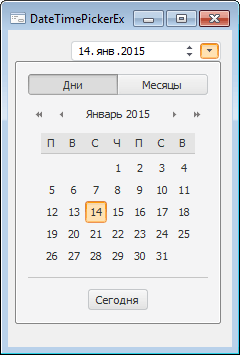

# DateTimePickerEx: Компонент

DateTimePickerEx: Компонент
-

# DateTimePickerEx

## Иерархия наследования

           [IComponent](modforms.chm::/Interface/IComponent/IComponent.htm)

           [IControl](ModForms.chm::/Interface/IControl/IControl.htm)

           [IDateTimePickerEx](ModForms.chm::/Interface/IDateTimePickerEx/IDateTimePickerEx.htm)

           [DateTimePickerEx](ModForms.chm::/Class/DateTimePickerEx/DateTimePickerEx.htm)

## Описание

Компонент DateTimePickerEx реализует
 комбинированный календарь, позволяющий редактировать значение даты и времени
 и имеющий дополнительные настройки для изменения внешнего вида календаря.
 В календаре поддерживаются даты в диапазоне 01.01.1601-31.12.9999.

## Работа с компонентом

Различные свойства Show* позволяют
 настроить внешний вид компонента. Данные свойства позволяют задать следующие
 настройки:

	- Отображать ли флаг, управляющий доступом к редактору ([ShowCheckbox](ModForms.chm::/Interface/IDateTimePickerEx/IDateTimePickerEx.ShowCheckbox.htm));

	- Отображать ли поля для редактирования компоненты времени ([ShowTime](ModForms.chm::/Interface/IDateTimePickerEx/IDateTimePickerEx.ShowTime.htm));

	- Отображать ли кнопки, отвечающие за выбор режима установки даты
	 в календаре (различные свойства ShowMode*);

Режим установки даты также можно задать, используя свойство [Mode](ModForms.chm::/Interface/IDateTimePickerEx/IDateTimePickerEx.Mode.htm).
 Установка даты осуществляется путем выбора одного из периодов, соответствующих
 режиму. Значение свойства [CurrentDate](ModForms.chm::/Interface/IDateTimePickerEx/IDateTimePickerEx.CurrentDate.htm)
 будет соответствовать началу выбранного периода.

Используя свойства [MinDate](ModForms.chm::/Interface/IDateTimePickerEx/IDateTimePickerEx.MinDate.htm) и [MaxDate](ModForms.chm::/Interface/IDateTimePickerEx/IDateTimePickerEx.MaxDate.htm) можно
 ограничить диапазон дат, в котором будет возможность выбора значения.

## Особенности использования

Язык, используемый для отображения текста различных элементов компонента,
 зависит от [языка
 интерфейса](GetStarted.chm::/Interface/Intro_Language.htm),
 с которым запущено приложение.

## Пример

## Свойства компонента DateTimePickerEx

		 Имя свойства
		 Краткое описание

		 
		 [Align](ModForms.chm::/Interface/IControl/IControl.Align.htm)

		 Свойство Align определяет,
		 как поведет себя компонент при изменении размеров содержащего
		 его родительского компонента.

		 
		 [Alignment](ModForms.chm::/Interface/IDateTimePickerEx/IDateTimePickerEx.Alignment.htm)

		 Свойство Alignment
		 определяет способ выравнивания раскрывающегося календаря относительно
		 границ компонента.

		 
		 [AllowDrag](ModForms.chm::/Interface/IControl/IControl.AllowDrag.htm)

		 Свойство AllowDrag
		 определяет возможность взять у компонента перетаскиваемый объект.

		 
		 [AllowDrop](ModForms.chm::/Interface/IControl/IControl.AllowDrop.htm)

		 Свойство AllowDrop
		 определяет, будет ли возможность у компонента принять перетаскиваемый
		 объект.

		 
		 [Anchors](ModForms.chm::/Interface/IControl/IControl.Anchors.htm)

		 Свойство Anchors возвращает
		 настройки, определяющие в процентном соотношении изменение размеров
		 текущего компонента при изменении размеров родительского компонента.

		 
		 [AutoResize](ModForms.chm::/Interface/IDateTimePickerEx/IDateTimePickerEx.AutoResize.htm)

		 Свойство AutoResize
		 определяет признак автоматического подгона размеров компонента.

		 
		 [Brush](ModForms.chm::/Interface/IControl/IControl.Brush.htm)

		 Свойство Brush определяет
		 кисть, используемую для заливки области компонента.

		 
		 [Checked](ModForms.chm::/Interface/IDateTimePickerEx/IDateTimePickerEx.Checked.htm)

		 Свойство Checked определяет
		 состояние флага компонента.

		 
		 [ClientHeight](ModForms.chm::/Interface/IControl/IControl.ClientHeight.htm)

		 Свойство ClientHeight
		 используется для получения или задания высоты клиентской области
		 компонента.

		 
		 [ClientWidth](ModForms.chm::/Interface/IControl/IControl.ClientWidth.htm)

		 Свойство ClientWidth
		 используется для получения или задания ширины клиентской области
		 компонента.

		 
		 [Color](ModForms.chm::/Interface/IControl/IControl.Color.htm)

		 Свойство Color определяет
		 цвет фона компонента.

		 
		 [ColorBackground](ModForms.chm::/Interface/IDateTimePickerEx/IDateTimePickerEx.ColorBackground.htm)

		 Свойство ColorBackground
		 определяет цвет фона поля редактирования компонента.

		 
		 [ColorText](ModForms.chm::/Interface/IDateTimePickerEx/IDateTimePickerEx.ColorText.htm)

		 Свойство ColorText
		 определяет цвет текста в поле редактирования компонента.

		 
		 [ComponentCount](ModForms.chm::/Interface/IComponent/IComponent.ComponentCount.htm)

		 Свойство ComponentCount
		 возвращает количество дочерних компонентов.

		 
		 [Components](ModForms.chm::/Interface/IComponent/IComponent.Components.htm)

		 Свойство Components
		 возвращает дочерний компонент.

		 
		 [CurrentDate](ModForms.chm::/Interface/IDateTimePickerEx/IDateTimePickerEx.CurrentDate.htm)

		 Свойство CurrentDate
		 определяет дату и время, которые будут отображаться в компоненте
		 при запуске формы.

		 
		 [Cursor](ModForms.chm::/Interface/IControl/IControl.Cursor.htm)

		 Свойство Cursor определяет
		 вид курсора над компонентом.

		 
		 [Data](ModForms.chm::/Interface/IComponent/IComponent.Data.htm)

		 Свойство Data предназначено
		 для хранения любых пользовательских данных.

		 
		 [DropCalendar](ModForms.chm::/Interface/IDateTimePickerEx/IDateTimePickerEx.DropCalendar.htm)

		 Свойство DropCalendar
		 определяет возможность вызова в компоненте раскрывающегося календаря.

		 
		 [DroppedDown](ModForms.chm::/Interface/IDateTimePickerEx/IDateTimePickerEx.DroppedDown.htm)

		 Свойство DroppedDown
		 возвращает признак отображения раскрывающегося календаря компонента.

		 
		 [Enabled](ModForms.chm::/Interface/IControl/IControl.Enabled.htm)

		 Свойство Enabled определяет
		 доступность компонента для пользователя.

		 
		 [EnableTodayButton](ModForms.chm::/Interface/IDateTimePickerEx/IDateTimePickerEx.EnableTodayButton.htm)

		 Свойство EnableTodayButton
		 определяет признак отображения в раскрывающемся календаре кнопки
		 для установки текущей даты и времени.

		 
		 [EnableWeekNumbers](ModForms.chm::/Interface/IDateTimePickerEx/IDateTimePickerEx.EnableWeekNumbers.htm)

		 Свойство EnableWeekNumbers
		 определяет признак отображения в раскрывающемся календаре номеров
		 недель.

		 
		 [FirstDayOfWeek](ModForms.chm::/Interface/IDateTimePickerEx/IDateTimePickerEx.FirstDayOfWeek.htm)

		 Свойство FirstDayOfWeek
		 определяет день, с которого будет начинаться неделя при отображении
		 раскрывающегося календаря компонента.

		 
		 [Focused](ModForms.chm::/Interface/IControl/IControl.Focused.htm)

		 Свойство Focused возвращает
		 True, если фокус установлен
		 на данном компоненте.

		 
		 [Font](ModForms.chm::/Interface/IControl/IControl.Font.htm)

		 Свойство Font определяет
		 множество характеристик, описывающих шрифт, используемый при отображении
		 текста.

		 
		 [Height](ModForms.chm::/Interface/IControl/IControl.Height.htm)

		 Свойство Height определяет
		 высоту компонента.

		 
		 [HelpContext](ModForms.chm::/Interface/IControl/IControl.HelpContext.htm)

		 Свойство HelpContext
		 определяет уникальный индекс раздела контекстно-зависимой справки
		 для данного компонента.

		 
		 [Hint](ModForms.chm::/Interface/IControl/IControl.Hint.htm)

		 Свойство Hint определяет
		 текст подсказки для компонента.

		 
		 [IsValidDate](ModForms.chm::/Interface/IDateTimePickerEx/IDateTimePickerEx.IsValidDate.htm)

		 Свойство IsValidDate
		 возвращает признак возможности установить указанное значение в
		 качестве значения для компонента.

		 
		 [Left](ModForms.chm::/Interface/IControl/IControl.Left.htm)

		 Свойство Left определяет
		 координату левого края компонента.

		 
		 [MaxDate](ModForms.chm::/Interface/IDateTimePickerEx/IDateTimePickerEx.MaxDate.htm)

		 Свойство MaxDate определяет
		 максимальное значение даты, которое можно выбрать в календаре.

		 
		 [MinDate](ModForms.chm::/Interface/IDateTimePickerEx/IDateTimePickerEx.MinDate.htm)

		 Свойство MinDate определяет
		 минимальное значение даты, которое можно выбрать в календаре.

		 
		 [Mode](ModForms.chm::/Interface/IDateTimePickerEx/IDateTimePickerEx.Mode.htm)

		 Свойство Mode определяет
		 режим установки даты в календаре.

		 
		 [MonthFormat](ModForms.chm::/Interface/IDateTimePickerEx/IDateTimePickerEx.MonthFormat.htm)

		 Свойство MonthFormat
		 определяет стиль отображения наименования месяца поле редактирования
		 компонента.

		 
		 [Name](ModForms.chm::/Interface/IComponent/IComponent.Name.htm)

		 Свойство Name определяет
		 наименование компонента.

		 
		 [Parent](ModForms.chm::/Interface/IControl/IControl.Parent.htm)

		 Свойство Parent определяет
		 родительский компонент.

		 
		 [ParentColor](ModForms.chm::/Interface/IControl/IControl.ParentColor.htm)

		 Свойство ParentColor
		 определяет, будет ли для компонента заимствован цвет родительского
		 компонента.

		 
		 [ParentFont](ModForms.chm::/Interface/IControl/IControl.ParentFont.htm)

		 Свойство ParentFont
		 определяет, будет ли для компонента использоваться шрифт родительского
		 компонента.

		 
		 [ParentShowHint](ModForms.chm::/Interface/IControl/IControl.ParentShowHint.htm)

		 Свойство ParentShowHint
		 определяет условие отображения всплывающей подсказки.

		 
		 [PopupMenu](ModForms.chm::/Interface/IControl/IControl.PopupMenu.htm)

		 Свойство PopupMenu
		 определяет контекстное меню, которое будет появляться по щелчку
		 дополнительной кнопки мыши на компоненте.

		 
		 [Scrolls](ModForms.chm::/Interface/IControl/IControl.Scrolls.htm)

		 Свойство Scrolls возвращает
		 параметры полос прокрутки компонента.

		 
		 [ShowCheckbox](ModForms.chm::/Interface/IDateTimePickerEx/IDateTimePickerEx.ShowCheckbox.htm)

		 Свойство ShowCheckbox
		 определяет признак наличия флага, определяющего доступ к компоненту.

		 
		 [ShowDate](ModForms.chm::/Interface/IDateTimePickerEx/IDateTimePickerEx.ShowDate.htm)

		 Свойство ShowDate определяет
		 признак отображения даты в компоненте.

		 
		 [ShowHint](ModForms.chm::/Interface/IControl/IControl.ShowHint.htm)

		 Свойство ShowHint включает
		 и выключает показ всплывающего окна подсказки для компонента.

		 
		 [ShowModeDays](ModForms.chm::/Interface/IDateTimePickerEx/IDateTimePickerEx.ShowModeDays.htm)

		 Свойство ShowModeDays
		 определяет, будет ли в области компонента отображаться кнопка
		 для включения режима установки даты путем выбора дня в месяце.

		 
		 [ShowModeHalfYears](ModForms.chm::/Interface/IDateTimePickerEx/IDateTimePickerEx.ShowModeHalfYears.htm)

		 Свойство ShowModeHalfYears
		 определяет, будет ли в области компонента отображаться кнопка
		 для включения режима установки даты путем выбора полугодия.

		 
		 [ShowModeMonths](ModForms.chm::/Interface/IDateTimePickerEx/IDateTimePickerEx.ShowModeMonths.htm)

		 Свойство ShowModeMonths
		 определяет, будет ли в области компонента отображаться кнопка
		 для включения режима установки даты путем выбора месяца в году.

		 
		 [ShowModeQuarters](ModForms.chm::/Interface/IDateTimePickerEx/IDateTimePickerEx.ShowModeQuarters.htm)

		 Свойство ShowModeQuarters
		 определяет, будет ли в области компонента отображаться кнопка
		 для включения режима установки даты путем выбора квартала в году.

		 
		 [ShowModeWeeks](ModForms.chm::/Interface/IDateTimePickerEx/IDateTimePickerEx.ShowModeWeeks.htm)

		 Свойство ShowModeWeeks
		 определяет, будет ли в области компонента отображаться кнопка
		 для включения режима установки даты путем выбора недели в полугодии.

		 
		 [ShowSpinButton](ModForms.chm::/Interface/IDateTimePickerEx/IDateTimePickerEx.ShowSpinButton.htm)

		 Свойство ShowSpinButton
		 определяет признак отображения кнопок SpinUp
		 и SpinDown, используемых
		 для изменения значений даты и времени.

		 
		 [ShowTime](ModForms.chm::/Interface/IDateTimePickerEx/IDateTimePickerEx.ShowTime.htm)

		 Свойство ShowTime определяет
		 признак отображения времени в компоненте.

		 
		 [SingleMonthMode](ModForms.chm::/Interface/IDateTimePickerEx/IDateTimePickerEx.SingleMonthMode.htm)

		 Свойство SingleMonthMode
		 определяет признак отделения чисел месяца от номеров недель.

		 
		 [TabOrder](ModForms.chm::/Interface/IControl/IControl.TabOrder.htm)

		 Свойство TabOrder определяет
		 позицию компонента в последовательности табуляции.

		 
		 [TabStop](ModForms.chm::/Interface/IControl/IControl.TabStop.htm)

		 Свойство TabStop определяет
		 признак необходимости компоненту получать фокус при нажатии кнопки
		 «TAB».

		 
		 [Tag](ModForms.chm::/Interface/IComponent/IComponent.Tag.htm)

		 Свойство Tag не используется
		 компилятором. Пользователь может изменить значение свойства Tag и использовать его по своему
		 усмотрению.

		 
		 [Text](ModForms.chm::/Interface/IControl/IControl.Text.htm)

		 Свойство Text определяет
		 строку, идентифицирующую компонент для пользователя.

		 
		 [Top](ModForms.chm::/Interface/IControl/IControl.Top.htm)

		 Свойство Top определяет
		 координату верхнего края компонента.

		 
		 [Visible](ModForms.chm::/Interface/IControl/IControl.Visible.htm)

		 Свойство Visible определяет
		 видимость компонента во время выполнения.

		 
		 [Width](ModForms.chm::/Interface/IControl/IControl.Width.htm)

		 Свойство Width определяет
		 ширину компонента.

## Методы компонента DateTimePickerEx

		 Имя метода
		 Краткое описание

		 
		 [BringToFront](ModForms.chm::/Interface/IControl/IControl.BringToFront.htm)

		 Метод BringToFront
		 располагает компонент на передний план.

		 
		 [ClientToScreen](ModForms.chm::/Interface/IControl/IControl.ClientToScreen.htm)

		 Метод ClientToScreen
		 преобразовывает координаты точки, указанные относительно системы
		 координат компонента, в экранные координаты.

		 
		 [DoDragDrop](ModForms.chm::/Interface/IControl/IControl.DoDragDrop.htm)

		 Метод DoDragDrop позволяет
		 начать операцию перетаскивания.

		 
		 [GetImage](ModForms.chm::/Interface/IControl/IControl.GetImage.htm)

		 Метод GetImage возвращает
		 изображение компонента со всеми дочерними компонентами.

		 
		 [ScreenToClient](ModForms.chm::/Interface/IControl/IControl.ScreenToClient.htm)

		 Метод ScreenToClient
		 преобразовывает экранные координаты точки в координаты, указываемые
		 относительно системы координат компонента.

		 
		 [SendToBack](ModForms.chm::/Interface/IControl/IControl.SendToBack.htm)

		 Метод SendToBack располагает
		 компонент на задний план.

		 
		 [SetFocus](ModForms.chm::/Interface/IControl/IControl.SetFocus.htm)

		 Метод SetFocus устанавливает
		 фокус на данный компонент.

## События компонента DateTimePickerEx

		 Имя события
		 Краткое описание

		 
		 [OnBeginDrag](ModForms.chm::/Interface/IControl/IControl.OnBeginDrag.htm)

		 Событие OnBeginDrag
		 для компонента наступает, когда пользователь начинает перетаскивать
		 объект от компонента.

		 
		 [OnChange](ModForms.chm::/Class/DateTimePickerEx/DateTimePickerEx.OnChange.htm)

		 Событие OnChange возникает
		 при изменении даты/времени в компоненте.

		 
		 [OnClick](ModForms.chm::/Interface/IControl/IControl.OnClick.htm)

		 Событие OnClick наступает,
		 если пользователь щёлкнул в области компонента.

		 
		 [OnCloseUp](ModForms.chm::/Class/DateTimePickerEx/DateTimePickerEx.OnCloseUp.htm)

		 Событие OnCloseUp наступает
		 после сворачивания раскрывающегося календаря.

		 
		 [OnDblClick](ModForms.chm::/Interface/IControl/IControl.OnDblClick.htm)

		 Событие OnDblClick
		 наступает, если пользователь дважды щёлкнул в области компонента.

		 
		 [OnDragDrop](ModForms.chm::/Interface/IControl/IControl.OnDragDrop.htm)

		 Событие OnDragDrop
		 для компонента наступает, когда пользователь отпускает над ним
		 перетаскиваемый объект.

		 
		 [OnDragEnter](ModForms.chm::/Interface/IControl/IControl.OnDragEnter.htm)

		 Событие OnDragEnter
		 наступает, когда перетаскиваемый объект входит в границы данного
		 компонента.

		 
		 [OnDragLeave](ModForms.chm::/Interface/IControl/IControl.OnDragLeave.htm)

		 Событие OnDragLeave
		 наступает, когда перетаскиваемый объект выходит за границы данного
		 компонента.

		 
		 [OnDragOver](ModForms.chm::/Interface/IControl/IControl.OnDragOver.htm)

		 Событие OnDragOver
		 для компонента наступает, когда пользователь протаскивает над
		 ним перетаскиваемый объект.

		 
		 [OnDropDown](ModForms.chm::/Class/DateTimePicker/DateTimePicker.OnDropDown.htm)

		 Событие OnDropDown
		 наступает непосредственно после развертывания раскрывающегося
		 календаря.

		 
		 [OnEnter](ModForms.chm::/Interface/IControl/IControl.OnEnter.htm)

		 Событие OnEnter наступает
		 в момент получения фокуса компонентом.

		 
		 [OnExit](ModForms.chm::/Interface/IControl/IControl.OnExit.htm)

		 Событие OnExit наступает
		 в момент потери фокуса компонентом.

		 
		 [OnHScroll](ModForms.chm::/Interface/IControl/IControl.OnHScroll.htm)

		 Событие OnHScroll наступает
		 при изменении положения ползунка горизонтальной полосы прокрутки.

		 
		 [OnKeyDown](ModForms.chm::/Interface/IControl/IControl.OnKeyDown.htm)

		 Событие OnKeyDown наступает,
		 если компонент находится в фокусе и производится нажатие на клавиатуру.

		 
		 [OnKeyPress](ModForms.chm::/Interface/IControl/IControl.OnKeyPress.htm)

		 Событие OnKeyPress
		 наступает, если компонент находится в фокусе, при нажатии пользователем
		 символьной клавиши.

		 
		 [OnKeyPreview](ModForms.chm::/Interface/IControl/IControl.OnKeyPreview.htm)

		 Событие OnKeyPreview
		 наступает перед каждым событием, связанным с нажатием клавиш.

		 
		 [OnKeyUp](ModForms.chm::/Interface/IControl/IControl.OnKeyUp.htm)

		 Событие OnKeyUp наступает,
		 если компонент находится в фокусе, при отпускании пользователем
		 любой, ранее нажатой клавиши.

		 
		 [OnMouseDown](ModForms.chm::/Interface/IControl/IControl.OnMouseDown.htm)

		 Событие OnMouseDown
		 наступает, если указатель находится в области компонента и была
		 нажата любая кнопка мыши.

		 
		 [OnMouseEnter](ModForms.chm::/Interface/IControl/IControl.OnMouseEnter.htm)

		 Событие OnMouseEnter
		 наступает в момент входа курсора мыши в область компонента.

		 
		 [OnMouseHover](ModForms.chm::/Interface/IControl/IControl.OnMouseHover.htm)

		 Событие OnMouseHover
		 наступает при задержке курсора мыши в области компонента.

		 
		 [OnMouseLeave](ModForms.chm::/Interface/IControl/IControl.OnMouseLeave.htm)

		 Событие OnMouseLeave
		 наступает в момент выхода курсора мыши за пределы области компонента.

		 
		 [OnMouseMove](ModForms.chm::/Interface/IControl/IControl.OnMouseMove.htm)

		 Событие OnMouseMove
		 наступает при перемещении курсора мыши над компонентом.

		 
		 [OnMouseUp](ModForms.chm::/Interface/IControl/IControl.OnMouseUp.htm)

		 Событие OnMouseUp наступает
		 при отпускании кнопки мыши, когда указатель находится в области
		 компонента.

		 
		 [OnMouseWheel](ModForms.chm::/Interface/IControl/IControl.OnMouseWheel.htm)

		 Событие OnMouseWheel
		 наступает, если компонент находится в фокусе при вращении колеса
		 мыши.

		 
		 [OnVScroll](ModForms.chm::/Interface/IControl/IControl.OnVScroll.htm)

		 Событие OnVScroll наступает
		 при изменении положения ползунка вертикальной полосы прокрутки.

См. также:

[Дополнительные компоненты](Additional_components.htm)

		Справочная
		 система на версию 10.9
		 от 18/08/2025,
		 © ООО «ФОРСАЙТ»,
