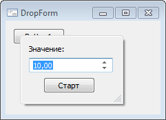

# DropForm: Компонент

DropForm: Компонент
-

# DropForm

## Иерархия наследования

                      [IComponent](modforms.chm::/Interface/IComponent/IComponent.htm)

                      [IDropForm](ModForms.chm::/Interface/IDropForm/IDropForm.htm)

                      [DropForm](ModForms.chm::/Class/DropForm/DropForm.htm)

## Описание

Компонент DropForm предназначен
 для создания раскрывающихся форм.

## Работа с компонентом

Для работы компонента необходимо в свойстве [MetabaseObject](ModForms.chm::/Interface/IDropForm/IDropForm.MetabaseObject.htm) указать идентификатор формы репозитория, которая
 будет использоваться как раскрывающаяся форма. При вставке компонента
 на форму автоматически будет выведен диалог для выбора формы.

Для разворачивания формы из прикладного кода используется метод [DropDown](ModForms.chm::/Interface/IDropForm/IDropForm.DropDown.htm).
 Вид окна, в котором отображается развернутая форма, зависит от значения
 свойства [BorderStyle](ModForms.chm::/Interface/IFormControl/IFormControl.BorderStyle.htm)
 формы, подключенной в компоненте. Если свойству установлено значение FormBorderStyle.None,
 то форма отображается в окне без рамки. При всех других значениях форма
 будет отображаться в окне с рамкой. Если свойству [BorderStyle](ModForms.chm::/Interface/IFormControl/IFormControl.BorderStyle.htm)
 установлено значение FormBorderStyle.Sizeable, то также будет возможность
 изменить размер окна.

Примечание.
 Изменение значения свойства [BorderStyle](ModForms.chm::/Interface/IFormControl/IFormControl.BorderStyle.htm)
 для формы, используемой в компоненте, доступно только на стадии проектирования
 формы.

Свойства развернутой раскрывающейся формы доступны в свойстве [Form](ModForms.chm::/Interface/IDropForm/IDropForm.Form.htm).
 Для сворачивания развернутой формы используется метод [RollUp](ModForms.chm::/Interface/IDropForm/IDropForm.RollUp.htm).
 При потере фокуса также происходит сворачивание раскрывающейся формы.

## Пример

## Свойства компонента DropForm

		 Имя свойства
		 Краткое описание

		 
		 [AnimationType](ModForms.chm::/Interface/IDropForm/IDropForm.AnimationType.htm)
		 Свойство AnimationType
		 определяет тип анимации, применяемый при разворачивании формы.

		 
		 [ComponentCount](ModForms.chm::/Interface/IComponent/IComponent.ComponentCount.htm)
		 Свойство ComponentCount
		 возвращает количество дочерних компонентов.

		 
		 [Components](ModForms.chm::/Interface/IComponent/IComponent.Components.htm)
		 Свойство Components
		 возвращает дочерний компонент.

		 
		 [Data](ModForms.chm::/Interface/IComponent/IComponent.Data.htm)
		 Свойство Data предназначено
		 для хранения любых пользовательских данных.

		 
		 [DropHeight](ModForms.chm::/Interface/IDropForm/IDropForm.DropHeight.htm)
		 Свойство DropHeight
		 определяет высоту области, в которой будет отображаться раскрывающаяся
		 форма.

		 
		 [DropWidth](ModForms.chm::/Interface/IDropForm/IDropForm.DropWidth.htm)
		 Свойство DropWidth
		 определяет ширину области, в которой будет отображаться раскрывающаяся
		 форма.

		 
		 [Form](ModForms.chm::/Interface/IDropForm/IDropForm.Form.htm)
		 Свойство Form возвращает
		 параметры раскрывающейся формы.

		 
		 [MetabaseObject](ModForms.chm::/Interface/IDropForm/IDropForm.MetabaseObject.htm)
		 Свойство MetabaseObject
		 определяет идентификатор формы репозитория, которая будет использоваться
		 в качестве раскрывающейся формы.

		 
		 [Name](ModForms.chm::/Interface/IComponent/IComponent.Name.htm)
		 Свойство Name определяет
		 наименование компонента.

		 
		 [Parent](ModForms.chm::/Interface/IDropForm/IDropForm.Parent.htm)
		 Свойство Parent определяет
		 родительскую форму для компонента.

		 
		 [SizeGrip](ModForms.chm::/Interface/IDropForm/IDropForm.SizeGrip.htm)
		 Свойство SizeGrip
		 определяет, будет ли в компоненте отображаться кнопка изменения
		 размеров окна.

		 
		 [Tag](ModForms.chm::/Interface/IComponent/IComponent.Tag.htm)
		 Свойство Tag не используется
		 компилятором. Пользователь может изменить значение свойства Tag и использовать его по своему
		 усмотрению.

## Методы компонента DropForm

		 Имя метода
		 Краткое описание

		 
		 [DropDown](ModForms.chm::/Interface/IDropForm/IDropForm.DropDown.htm)
		 Метод DropDown осуществляет
		 разворачивание формы.

		 
		 [RollUp](ModForms.chm::/Interface/IDropForm/IDropForm.RollUp.htm)
		 Метод RollUp осуществляет
		 сворачивание раскрывающейся формы.

## События компонента DropForm

		 Имя события
		 Краткое описание

		 
		 [OnDropDown](ModForms.chm::/Class/DropForm/DropForm.OnDropDown.htm)
		 Событие OnDropDown
		 наступает при разворачивании раскрывающейся формы.

		 
		 [OnRollUp](ModForms.chm::/Class/DropForm/DropForm.OnRollUp.htm)
		 Событие OnRollUp наступает
		 при сворачивании раскрывающейся формы.

См. также:

[Дополнительные компоненты](Additional_components.htm)

		Справочная
		 система на версию 10.9
		 от 18/08/2025,
		 © ООО «ФОРСАЙТ»,
