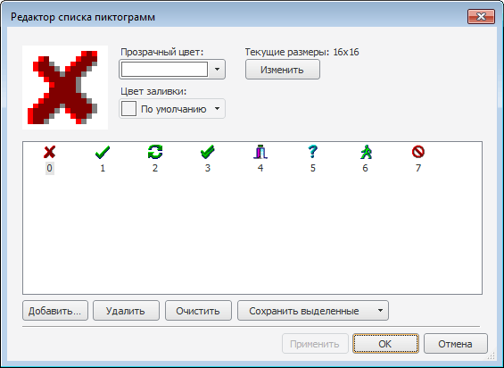

# ImageList: Компонент

ImageList: Компонент
-

# ImageList

## Иерархия наследования

           [IComponent](modforms.chm::/Interface/IComponent/IComponent.htm)

           [IImageList](ModForms.chm::/Interface/IImageList/IImageList.htm)

           [ImageList](ModForms.chm::/Class/ImageList/ImageList.htm)

## Описание

Компонент ImageList предназначен
 для хранения коллекции изображений.

## Работа с компонентом

Все изображения имеют одинаковый размер. Размер определяется с помощью
 свойств Height и Width
 либо в редакторе компонента.

Каждое изображение, загруженное в компонент, имеет свой индекс, с помощью
 которого происходит обращение к нему.

Загрузка изображений производится в окне «Редактор
 списка пиктограмм». Для открытия данного окна необходимо дважды
 щелкнуть по компоненту на форме либо выполнить соответствующую команду
 контекстного меню, вызываемого для компонента:

Загрузка производится посредством стандартного окна открытия
 файла, открываемого с помощью кнопки «Добавить...».
 Если загружаемое изображение имеет высоту большую, чем установлена
 в компоненте, то будет выдан запрос на изменение текущих настроек компонента.
 При утвердительном ответе размеры в компоненте будут изменены, иначе разбивка
 будет производиться с исходными размерами. Изображения, которые имели
 меньшие размеры, будут увеличены. Добавленная область будет закрашена
 установленным цветом заливки. Если в списке уже присутствуют ранее загруженные
 изображения, то новые будут добавлены в конец списка.

Изображения в списке можно перемещать, используя Drag&Drop. При
 перемещении будут изменены индексы всех смещенных изображений.

Удаление выделенного изображения производится с помощью кнопки «Удалить». Кнопка «Очистить»
 удаляет все загруженные изображения.

Используя кнопку «Сохранить выделенные»,
 выделенные пиктограммы можно сохранить на диск в виде одного файла либо
 в виде отдельных изображений. При сохранении в отдельные изображения наименования
 файлов формируются в следующем формате: <наименование компонента ImageList>_<индекс
 изображения>.bmp.

Для изображений можно задать цвет заливки
 и прозрачный цвет. Для этого необходимо
 воспользоваться одноименными раскрывающимися списками выбора цвета. Данные
 цвета будут использованы при формировании конечных изображений, которые
 будут отображены в компонентах.

Компонент ImageList может загружать
 изображения в следующих форматах: bmp, jpg, gif, tiff, jpeg, png, ico.
 Также поддерживаются изображения с альфа-каналом: в формате gif с простой
 бинарной прозрачностью и в формате png с частичной прозрачностью.

Примечание.
 Все загружаемые в компонент bmp-файлы должны быть в формате TrueColor.

Кнопка «Изменить» позволяет
 изменить размеры изображений и переразбить все загруженные изображения.

## Свойства компонента ImageList

		 Имя свойства
		 Краткое описание

		 
		 [ComponentCount](ModForms.chm::/Interface/IComponent/IComponent.ComponentCount.htm)
		 Свойство ComponentCount
		 возвращает количество дочерних компонентов.

		 
		 [Components](ModForms.chm::/Interface/IComponent/IComponent.Components.htm)
		 Свойство Components
		 возвращает дочерний компонент.

		 
		 [Count](ModForms.chm::/Interface/IImageList/IImageList.Count.htm)
		 Свойство Count возвращает
		 количество изображений, загруженных в коллекцию компонента.

		 
		 [Data](ModForms.chm::/Interface/IComponent/IComponent.Data.htm)
		 Свойство Data предназначено
		 для хранения любых пользовательских данных.

		 
		 [Height](ModForms.chm::/Interface/IImageList/IImageList.Height.htm)
		 Свойство Height определяет
		 высоту изображений, хранящихся в коллекции компонента.

		 
		 [Icon](ModForms.chm::/Interface/IImageList/IImageList.Icon.htm)
		 Свойство Icon возвращает
		 указанное графическое изображение в виде пиктограммы.

		 
		 [Item](ModForms.chm::/Interface/IImageList/IImageList.Item.htm)
		 Свойство Item возвращает
		 указанное графическое изображение.

		 
		 [Name](ModForms.chm::/Interface/IComponent/IComponent.Name.htm)
		 Свойство Name определяет
		 наименование компонента.

		 
		 [Tag](ModForms.chm::/Interface/IComponent/IComponent.Tag.htm)
		 Свойство Tag не используется
		 компилятором. Пользователь может изменить значение свойства Tag и использовать его по своему
		 усмотрению.

		 
		 [Width](ModForms.chm::/Interface/IImageList/IImageList.Width.htm)
		 Свойство Width определяет
		 ширину изображений, хранящихся в коллекции компонента.

## Методы компонента ImageList

		 Имя метода
		 Краткое описание

		 
		 [Add](ModForms.chm::/Interface/IImageList/IImageList.Add.htm)
		 Метод Add добавляет
		 изображение в коллекцию компонента.

		 
		 [AddIcon](ModForms.chm::/Interface/IImageList/IImageList.AddIcon.htm)
		 Метод AddIcon добавляет
		 пиктограмму в коллекцию компонента.

		 
		 [Clear](ModForms.chm::/Interface/IImageList/IImageList.Clear.htm)
		 Метод Clear осуществляет
		 очистку коллекции изображений компонента.

		 
		 [LoadFromFile](ModForms.chm::/Interface/IImageList/IImageList.LoadFromFile.htm)
		 Метод LoadFromFile
		 осуществляет загрузку изображения в компонент из файла.

		 
		 [LoadFromStream](ModForms.chm::/Interface/IImageList/IImageList.LoadFromStream.htm)
		 Метод LoadFromStream
		 осуществляет загрузку изображения в компонент из потока.

		 
		 [LoadFromStream2](ModForms.chm::/Interface/IImageList/IImageList.LoadFromStream2.htm)
		 Метод LoadFromStream2
		 осуществляет загрузку изображений из потока с восстановлением
		 информации о полупрозрачности.

		 
		 [Remove](ModForms.chm::/Interface/IImageList/IImageList.Remove.htm)
		 Метод Remove удаляет
		 изображение из коллекции.

		 
		 [SaveToDoc](ModForms.chm::/Interface/IImageList/IImageList.SaveToDoc.htm)
		 Метод SaveToDoc сохраняет
		 все изображения из компонента в файл.

		 
		 [SaveToStream](ModForms.chm::/Interface/IImageList/IImageList.SaveToStream.htm)
		 Метод SaveToStream
		 сохраняет все изображения из компонента в поток.

		 
		 [SaveToStream2](ModForms.chm::/Interface/IImageList/IImageList.SaveToStream2.htm)
		 Метод SaveToStream2
		 сохраняет изображения в поток с сохранением информации о полупрозрачности.

		 
		 [SetOverlay](modforms.chm::/Interface/IImageList/IImageList.SetOverlay.htm)
		 Метод SetOverlay идентифицирует
		 изображение в списке как изображение, которое может быть использовано
		 как покрывающая маска.

См. также:

[Дополнительные компоненты](Additional_components.htm)

		Справочная
		 система на версию 10.9
		 от 18/08/2025,
		 © ООО «ФОРСАЙТ»,
