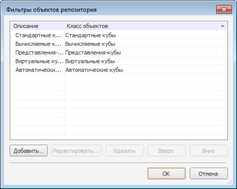
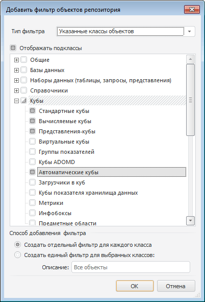
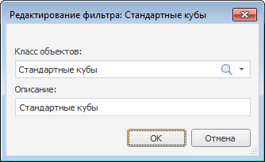
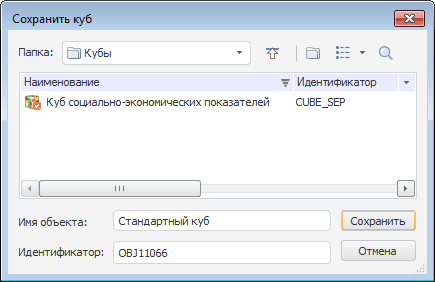

# MetabaseSaveDialog: Компонент

MetabaseSaveDialog: Компонент
-

# MetabaseSaveDialog

## Иерархия наследования

           [IComponent](ModForms.chm::/Interface/IComponent/IComponent.htm)

           [IMetabaseDialog](KeExtCtrls.chm::/Interface/IMetabaseDialog/IMetabaseDialog.htm)

           [IMetabaseSaveDialog](KeExtCtrls.chm::/Interface/IMetabaseSaveDialog/IMetabaseSaveDialog.htm)

           [MetabaseSaveDialog](KeExtCtrls.chm::/Class/MetabaseSaveDialog/MetabaseSaveDialog.htm)

## Описание

Компонент MetabaseSaveDialog
 представляет собой диалог сохранения объекта репозитория.

## Работа с компонентом

В диалоге присутствует возможность фильтрации пустых папок, для этого
 необходимо выбрать соответствующий пункт контекстного меню. По умолчанию
 фильтрация включена. Для инициализации диалога необходимо вызвать метод
 [Execute](KeExtCtrls.chm::/Interface/IMetabaseDialog/IMetabaseDialog.Execute.htm).

## Фильтры компонента

Для настройки фильтрации объектов, отображаемых в дереве компонента,
 необходимо выполнить одно из следующих действий:

	- для компонента выполнить команду контекстного меню
	 «Фильтр».

	- в [инспекторе
	 объектов](../../01_Development_Environment/03_Windows_of_Development_Environment/Object_Inspector.htm) дважды щелкнуть по свойству [Filters](keextctrls.chm::/Interface/IMetabaseDialog/IMetabaseDialog.Filters.htm).

В данном окне содержится список фильтров, используемых в компоненте.

Весь список оформлен в виде таблицы, содержащей два столбца:

	- Описание -
	 в данном столбце представлено краткое описание фильтра.

	- Класс объектов
	 - список всех классов (подклассов), включенных в данный фильтр.

В окне можно создавать новые, а также редактировать или удалять уже
 имеющиеся фильтры. В таблице доступна множественная отметка, при этом
 выделенные фильтры можно только удалить.

Описание фильтра можно отредактировать. Для этого необходимо выделить
 фильтр и осуществить одиночный щелчок мыши в области описания. По истечению
 нескольких секунд будет открыто окно редактирования описания. Также можно
 воспользоваться клавишей F2.

### Создание фильтра объектов

Для создания нового фильтра объектов необходимо выполнить одно из следующих
 действий:

	- нажать кнопку «Добавить»;

	- нажать клавишу INSERT;

	- дважды щелкнуть на свободном месте диалога.

В открывшемся диалоге в дереве классов необходимо отметить флаги у тех
 классов объектов, которые будут доступны при использовании данного фильтра.
 Для всех отмеченных классов (подклассов) всегда будут создаваться отдельные
 фильтры. Описание создаваемых фильтров будет соответствовать наименованиям
 классов (подклассов).

После нажатия кнопки «ОК» будет
 создан новый фильтр (фильтры) для выбранных классов объектов.

### Редактирование фильтра объектов

Для редактирования какого-либо фильтра необходимо выполнить одно из
 следующих действий:

	- дважды щелкнуть по необходимому фильтру;

	- выделить фильтр в таблице и нажать кнопку «Редактировать»;

	- выделить фильтр в таблице и нажать клавишу F4;

	- для требуемого фильтра выполнить команду контекстного
	 меню «Редактировать».

После этого будет выведен диалог редактирования фильтра:

В диалоге можно изменить класс (подкласс) объекта, для которого создан
 фильтр, а также описание фильтра. После нажатия кнопки «ОК»
 изменения будут сохранены.

### Удаление фильтра

Для удаления фильтра (фильтров) необходимо выделить его в таблице и
 выполнить одно из следующих действий:

	- нажать кнопку «Удалить»;

	- нажать клавишу DELETE;

	- выполнить для фильтра (фильтров) команду контекстного
	 меню «Удалить».

После этого фильтр будет удален.

## Пример

## Свойства компонента MetabaseSaveDialog

		 Имя свойства
		 Краткое описание

		 
		 [ComponentCount](ModForms.chm::/Interface/IComponent/IComponent.ComponentCount.htm)
		 Свойство ComponentCount
		 возвращает количество дочерних компонентов.

		 
		 [Components](ModForms.chm::/Interface/IComponent/IComponent.Components.htm)
		 Свойство Components
		 возвращает дочерний компонент.

		 
		 [Data](ModForms.chm::/Interface/IComponent/IComponent.Data.htm)
		 Свойство Data предназначено
		 для хранения любых пользовательских данных.

		 
		 [FilterIndex](KeExtCtrls.chm::/Interface/IMetabaseDialog/IMetabaseDialog.FilterIndex.htm)
		 Свойство FilterIndex
		 определяет индекс выбранного фильтра компонента.

		 
		 [Filters](KeExtCtrls.chm::/Interface/IMetabaseDialog/IMetabaseDialog.Filters.htm)
		 Свойство Filters возвращает
		 коллекцию фильтров компонента.

		 
		 [FolderFilters](KeExtCtrls.chm::/Interface/IMetabaseDialog/IMetabaseDialog.FolderFilters.htm)
		 Свойство FolderFilters
		 возвращает коллекцию фильтров, используемых для определения объектов-папок
		 в диалоге.

		 
		 [InitialFolder](KeExtCtrls.chm::/Interface/IMetabaseDialog/IMetabaseDialog.InitialFolder.htm)
		 Свойство InitialFolder
		 определяет исходный каталог.

		 
		 [Name](ModForms.chm::/Interface/IComponent/IComponent.Name.htm)
		 Свойство Name определяет
		 наименование компонента.

		 
		 [Object](KeExtCtrls.chm::/Interface/IMetabaseDialog/IMetabaseDialog.Object.htm)
		 Свойство Object возвращает
		 описание выбранного объекта репозитория.

		 
		 [Objects](KeExtCtrls.chm::/Interface/IMetabaseDialog/IMetabaseDialog.Objects.htm)
		 Свойство Objects возвращает
		 коллекцию выбранных объектов репозитория.

		 
		 [Root](KeExtCtrls.chm::/Interface/IMetabaseDialog/IMetabaseDialog.Root.htm)
		 Свойство Root определяет
		 корневой каталог.

		 
		 [SaveObject](KeExtCtrls.chm::/Interface/IMetabaseSaveDialog/IMetabaseSaveDialog.SaveObject.htm)
		 Свойство SaveObject
		 определяет описание сохраняемого объекта репозитория.

		 
		 [Tag](ModForms.chm::/Interface/IComponent/IComponent.Tag.htm)
		 Свойство Tag не используется
		 компилятором. Пользователь может изменить значение свойства Tag и использовать его по своему
		 усмотрению.

		 
		 [Title](KeExtCtrls.chm::/Interface/IMetabaseDialog/IMetabaseDialog.Title.htm)
		 Свойство Title определяет
		 заголовок диалога.

## Методы компонента MetabaseSaveDialog

		 Имя метода
		 Краткое описание

		 
		 [Execute](KeExtCtrls.chm::/Interface/IMetabaseDialog/IMetabaseDialog.Execute.htm)
		 Метод Execute инициализирует
		 диалог открытия объекта репозитория.

См. также:

[Дополнительные компоненты](Additional_components.htm)

		Справочная
		 система на версию 10.9
		 от 18/08/2025,
		 © ООО «ФОРСАЙТ»,
