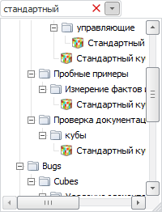
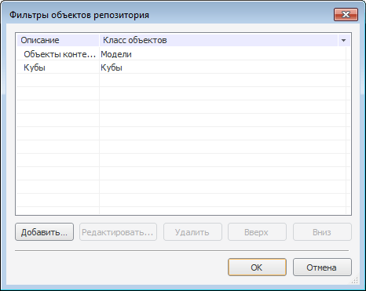
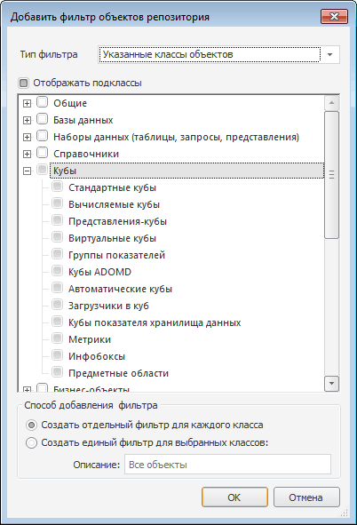
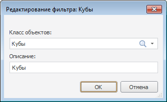
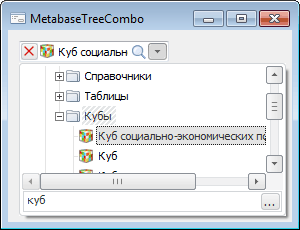

# MetabaseTreeCombo: Компонент

MetabaseTreeCombo: Компонент
-

# MetabaseTreeCombo

## Иерархия наследования

           [IComponent](modforms.chm::/Interface/IComponent/IComponent.htm)

           [IControl](ModForms.chm::/Interface/IControl/IControl.htm)

           [ITreeControl](ModForms.chm::/Interface/ITreeControl/ITreeControl.htm)

           [ITreeCombo](ModForms.chm::/Interface/ITreeCombo/ITreeCombo.htm)

           [IMetabaseTreeCombo](KeExtCtrls.chm::/Interface/IMetabaseTreeCombo/IMetabaseTreeCombo.htm)

           [MetabaseTreeCombo](KeExtCtrls.chm::/Class/MetabaseTreeCombo/MetabaseTreeCombo.htm)

## Описание

Компонент MetabaseTreeCombo
 предназначен для отображения дерева объектов репозитория в виде раскрывающегося
 списка.

## Работа с компонентом

По умолчанию в компоненте ничего не отображается. Для установки каталога,
 содержимое которого будет отображено в компоненте, используется свойство
 [Root](KeExtCtrls.chm::/Interface/IMetabaseTreeCombo/IMetabaseTreeCombo.Root.htm).
 Список отображаемых объектов можно изменить, настроив фильтрацию в свойстве
 [Filters](KeExtCtrls.chm::/Interface/IMetabaseTreeCombo/IMetabaseTreeCombo.Filters.htm).
 Каждый элемент дерева является ссылкой на соответствующий объект репозитория.
 Для получения информации о соответствующем объекте необходимо вершину
 дерева привести к интерфейсу [IMetabaseTreeListNode](KeExtCtrls.chm::/Interface/IMetabaseTreeListNode/IMetabaseTreeListNode.htm)
 (преобразование осуществляется с использованием ключевого слова As) и получить свойство [ObjectDescriptor](KeExtCtrls.chm::/Interface/IMetabaseTreeListNode/IMetabaseTreeListNode.ObjectDescriptor.htm).

Основной список свойств и методов данного компонента унаследован от
 [TreeCombo](TreeCombo.htm), поэтому и работа с данным компонентом
 аналогична работе с деревом компонента [TreeCombo](TreeCombo.htm).
 Методы, используемые для изменения иерархии элементов, в данном компоненте
 не поддерживаются.

Кнопка  используется для сброса установленной
 отметки элементов дерева.

Примечание.
 Размеры раскрывающегося списка элементов можно изменять, перетаскивая
 его правую, левую или нижнюю границу при помощи мыши. Минимальная ширина
 раскрывающегося списка равна ширине компонента.

## Поиск элементов

При развернутом раскрывающемся списке компонента предусмотрены следующие
 виды поиска:

	- При наборе первых символов в наименовании элементов
	 курсор будет переходить к первому найденному элементу. Данный поиск
	 осуществляется циклически и только по элементам, присутствующим в
	 развернутой части иерархии дерева элементов.

	- При помощи строки поиска, которая вызывается при нажатии
	 клавиши F3 либо либо сочетания клавиш CTRL+F. После ввода искомой
	 части слова и нажатии клавиши ENTER либо кнопки 
	 будет осуществляться поиск. Поиск осуществляется циклически по всей
	 иерархии элементов.

При удачном поиске курсор будет фокусироваться на найденном элементе.
 Состояние отметки зависит от значения свойства [FindMode](ModForms.chm::/Interface/ITreeControl/ITreeControl.FindMode.htm).
 В зависимости от [выбранного
 режима множественной отметки](ModForms.chm::/Interface/ITreeControl/ITreeControl.SelectionMode.htm) добавление элемента в
 отметку осуществляется выделением с использованием клавиши ПРОБЕЛ либо
 выделением с помощью мыши при зажатой клавише CTRL.

Также существует возможность поиска при свернутом раскрывающемся списке
 компонента. Когда компонент находится в фокусе, при наборе сочетания символов
 будет формироваться список, отфильтрованный по элементам, содержащим в
 своем наименовании данное сочетание:

Отметка элементов осуществляется так же, как было описано выше, в зависимости
 от установленного значения свойства [SelectionMode](ModForms.chm::/Interface/ITreeControl/ITreeControl.SelectionMode.htm).
 После закрытия данного окна, отметка будет применена в компоненте.

В строке поиска существует возможность поиска по частям не только одного,
 но и нескольких слов. Для этого искомые сочетания символов разделяются
 пробелом. Порядок слов в наименовании элементов при поиске не учитывается.

## Сортировка данных

Необходимым условием для сортировки данных является установка свойствам
 [ShowColumnHeaders](ModForms.chm::/Interface/ITreeControl/ITreeControl.ShowColumnHeaders.htm),
 [Sorted](ModForms.chm::/Interface/ITreeControl/ITreeControl.Sorted.htm)
 и [ColumnClick](ModForms.chm::/Interface/ITreeControl/ITreeControl.ColumnClick.htm)
 значения True, а свойству [SortType](ModForms.chm::/Interface/ITreeControl/ITreeControl.SortType.htm)
 значения, отличного от None.

В режиме выполнения формы для сортировки данных по какому-либо столбцу
 необходимо щелкнуть по заголовку данного столбца. При этом все данные
 будут отсортированы по возрастанию значений. Повторные щелчки будут вызывать
 смену направления сортировки. Для мультисортировки необходимо зажать клавишу
 CTRL и щелкнуть по заголовкам необходимых столбцов. Порядок сортировки
 будет определяться следующим образом: столбец, по заголовку которого был
 осуществлен последний щелчок, будет отсортирован в последнюю очередь.

Также осуществить настройку сортировки можно в специализированном окне
 «Сортировка»:

Данное окно появляется при выборе соответствующего пункта контекстного
 меню, вызываемого в области заголовков колонок.

Примечание.
 Пункт контекстного меню будет доступен, если свойствам [ShowColumnHeaders](ModForms.chm::/Interface/ITreeControl/ITreeControl.ShowColumnHeaders.htm)
 и [Sorted](ModForms.chm::/Interface/ITreeControl/ITreeControl.Sorted.htm)
 установлено значения True, а свойству
 [SortType](ModForms.chm::/Interface/ITreeControl/ITreeControl.SortType.htm)
 значение, отличное от None.

Колонки, по которым будет осуществляться сортировка, необходимо переместить
 в список выбранных. Кнопки  и
  используются для изменения направления
 сортировки по выбранному столбцу. Кнопки  и 
 используются для изменения порядка сортировки. Колонки, расположенные
 вверху списка, будут сортироваться в первую очередь.

В языке Fore для применения
 сортировки необходимо установить свойству [Sorted](ModForms.chm::/Interface/ITreeControl/ITreeControl.Sorted.htm)
 значение True и свойству [SortType](ModForms.chm::/Interface/ITreeControl/ITreeControl.SortType.htm)
 значение, отличное от None. Колонка, по данным которой осуществляется
 сортировка, указывается в свойстве [SortColumn](ModForms.chm::/Interface/ITreeControl/ITreeControl.SortColumn.htm).
 Направление сортировки определяется в свойстве [SortAscending](ModForms.chm::/Interface/ITreeListColumn/ITreeListColumn.SortAscending.htm)
 соответствующего столбца.

Также для управления сортировкой могут применяться методы [Sort](ModForms.chm::/Interface/ITreeControl/ITreeControl.Sort.htm)
 и [SortDefault](ModForms.chm::/Interface/ITreeControl/ITreeControl.SortDefault.htm).

## Фильтры компонента

Для настройки фильтрации объектов, отображаемых в дереве компонента,
 необходимо выполнить одно из следующих действий:

	- для компонента выполнить команду контекстного меню
	 «Фильтр».

	- в [инспекторе
	 объектов](../../01_Development_Environment/03_Windows_of_Development_Environment/Object_Inspector.htm) дважды щелкнуть по свойству [Filters](KeExtCtrls.chm::/Interface/IMetabaseTreeCombo/IMetabaseTreeCombo.Filters.htm).

В данном окне содержится список фильтров, используемых в компоненте.

Весь список оформлен в виде таблицы, содержащей два столбца:

	- Описание -
	 в данном столбце представлено краткое описание фильтра.

	- Класс объектов
	 - список всех классов (подклассов), включенных в данный фильтр.

В окне можно создавать новые, а также редактировать или удалять существующие
 фильтры. В таблице доступна множественная отметка, при этом выделенные
 фильтры можно только удалить.

Описание фильтра можно отредактировать. Для этого необходимо выделить
 фильтр и осуществить одиночный щелчок мыши в области описания. По истечению
 нескольких секунд будет открыто окно редактирования описания. Также можно
 воспользоваться горячей клавишей F2.

### Создание фильтра объектов

Для создания нового фильтра объектов необходимо выполнить одно из следующих
 действий:

	- нажать кнопку «Добавить»;

	- нажать клавишу INSERT;

	- дважды щелкнуть на свободном месте диалога.

В открывшемся диалоге необходимо выбрать тип создаваемого фильтра. Доступны
 следующие типы:

	- Все объекты.
	 При использовании данного фильтра будут доступны все объекты репозитория.

	- Указанные классы
	 объектов. При использовании данного фильтра будут доступны
	 только выбранные объекты.

В дереве классов необходимо отметить флажки у тех классов объектов,
 которые будут доступны при использовании данного фильтра. Флажок «Отображать подклассы» позволяет
 исключить из дерева отображение дополнительных классов объектов.

В области «Способ добавления фильтра»
 необходимо указать в каком виде будет сохранен фильтр:

	- Создать отдельный
	 фильтр для каждого класса. Для каждого отмеченного класса (подкласса)
	 будет создан отдельный фильтр. Описание создаваемых фильтров будет
	 соответствовать наименованиям классов (подклассов).

	- Создать единый фильтр
	 для выбранных классов. Для всех отмеченных классов будет создан
	 один составной фильтр. В поле «Описание»
	 необходимо указать краткое описание создаваемого фильтра.

После нажатия кнопки «ОК» будет
 создан новый фильтр (фильтры) для выбранных классов объектов.

### Редактирование фильтра объектов

Для редактирования какого-либо фильтра необходимо выполнить одно из
 следующих действий:

	- дважды щелкнуть по необходимому фильтру.

	- выделить фильтр в таблице и нажать кнопку «Редактировать».

	- выделить фильтр в таблице и нажать клавишу F4.

	- для выбранного фильтра выполнить команду контекстного
	 меню «Редактировать».

В зависимости от типа созданного фильтра (отдельный для класса (подкласса)
 либо составной фильтр) будет выведен диалог редактирования фильтра.

	Отдельный фильтр для класса (подкласса) Составной фильтр

		

		

В диалоге можно изменить класс (подкласс, либо их комбинацию для составного
 фильтра) объекта(ов), для которого создан фильтр, а также описание фильтра.
 После нажатия кнопки «ОК» изменения
 будут сохранены.

### Удаление фильтра

Для удаления фильтра (фильтров) необходимо выделить его в таблице и
 выполнить одно из следующих действий:

	- нажать кнопку «Удалить».

	- нажать клавишу DELETE.

	- выполнить для фильтра (фильтров) команду контекстного
	 меню «Удалить».

После этого фильтр будет удален.

## Пример

## Свойства компонента MetabaseTreeCombo

		 Имя свойства
		 Краткое описание

		 
		 [Align](ModForms.chm::/Interface/IControl/IControl.Align.htm)

		 Свойство Align определяет,
		 как поведет себя компонент при изменении размеров содержащего
		 его родительского компонента.

		 
		 [AllowDrag](ModForms.chm::/Interface/IControl/IControl.AllowDrag.htm)

		 Свойство AllowDrag
		 определяет возможность взять у компонента перетаскиваемый объект.

		 
		 [AllowDrop](ModForms.chm::/Interface/IControl/IControl.AllowDrop.htm)

		 Свойство AllowDrop
		 определяет, будет ли возможность у компонента принять перетаскиваемый
		 объект.

		 
		 [Anchors](ModForms.chm::/Interface/IControl/IControl.Anchors.htm)

		 Свойство Anchors возвращает
		 настройки, определяющие в процентном соотношении изменение размеров
		 текущего компонента при изменении размеров родительского компонента.

		 
		 [AnimationType](ModForms.chm::/Interface/ITreeCombo/ITreeCombo.AnimationType.htm)

		 Свойство AnimationType
		 определяет тип анимации, применяемый при разворачивании списка
		 компонента.

		 
		 [AutoCheckParent](ModForms.chm::/Interface/ITreeControl/ITreeControl.AutoCheckParent.htm)

		 Свойство AutoCheckParent
		 определяет, будет ли у родительских вершин компонента автоматически
		 устанавливаться неопределенное состояние, если отмечены не все
		 дочерние элементы.

		 
		 [AutoUpdateInfo](ModForms.chm::/Interface/ITreeCombo/ITreeCombo.AutoUpdateInfo.htm)

		 Свойство AutoUpdateInfo
		 определяет признак автоматического обновления информации об отметке
		 в редакторе компонента.

		 
		 [BorderStyle](ModForms.chm::/Interface/ITreeControl/ITreeControl.BorderStyle.htm)

		 Свойство BorderStyle
		 определяет стиль рамки, обрамляющей компонент.

		 
		 [Brush](ModForms.chm::/Interface/IControl/IControl.Brush.htm)

		 Свойство Brush определяет
		 кисть, используемую для заливки области компонента.

		 
		 [CancelOnEscape](ModForms.chm::/Interface/ITreeCombo/ITreeCombo.CancelOnEscape.htm)

		 Свойство CancelOnEscape
		 определяет, будет ли производиться отмена установленной отметки
		 и закрытие списка при нажатии клавиши ESC.

		 
		 [Checkboxes](ModForms.chm::/Interface/ITreeControl/ITreeControl.Checkboxes.htm)

		 Свойство Checkboxes
		 определяет наличие флажков у элементов.

		 
		 [CheckedObjects](KeExtCtrls.chm::/Interface/IMetabaseTreeCombo/IMetabaseTreeCombo.CheckedObjects.htm)

		 Свойство CheckedObjects
		 возвращает коллекцию описаний объектов, флажки которых отмечены
		 в компоненте.

		 
		 [ClientHeight](ModForms.chm::/Interface/IControl/IControl.ClientHeight.htm)

		 Свойство ClientHeight
		 используется для получения или задания высоты клиентской области
		 компонента.

		 
		 [ClientWidth](ModForms.chm::/Interface/IControl/IControl.ClientWidth.htm)

		 Свойство ClientWidth
		 используется для получения или задания ширины клиентской области
		 компонента.

		 
		 [CloseOnClick](ModForms.chm::/Interface/ITreeCombo/ITreeCombo.CloseOnClick.htm)

		 Свойство CloseOnClick
		 определяет, будет ли производиться автоматическое закрытие списка
		 при выборе щелчком кнопки мыши одного элемента из этого списка.

		 
		 [CloseOnEnter](ModForms.chm::/Interface/ITreeCombo/ITreeCombo.CloseOnEnter.htm)

		 Свойство CloseOnEnter
		 определяет, будет ли производиться закрытие списка и сохранение
		 отметки при нажатии клавиши ENTER.

		 
		 [Color](ModForms.chm::/Interface/IControl/IControl.Color.htm)

		 Свойство Color определяет
		 цвет фона компонента.

		 
		 [ColumnClick](ModForms.chm::/Interface/ITreeControl/ITreeControl.ColumnClick.htm)

		 Свойство ColumnClick
		 определяет возможность отображения заголовков столбцов в виде
		 кнопок.

		 
		 [Columns](ModForms.chm::/Interface/ITreeControl/ITreeControl.Columns.htm)

		 Свойство Соlumns возвращает
		 коллекцию столбцов компонента.

		 
		 [ComponentCount](ModForms.chm::/Interface/IComponent/IComponent.ComponentCount.htm)

		 Свойство ComponentCount
		 возвращает количество дочерних компонентов.

		 
		 [Components](ModForms.chm::/Interface/IComponent/IComponent.Components.htm)

		 Свойство Components
		 возвращает дочерний компонент.

		 
		 [Cursor](ModForms.chm::/Interface/IControl/IControl.Cursor.htm)

		 Свойство Cursor определяет
		 вид курсора над компонентом.

		 
		 [Data](ModForms.chm::/Interface/IComponent/IComponent.Data.htm)

		 Свойство Data предназначено
		 для хранения любых пользовательских данных.

		 
		 [DelayedFill](KeExtCtrls.chm::/Interface/IMetabaseTreeCombo/IMetabaseTreeCombo.DelayedFill.htm)

		 Свойство DelayedFill
		 определяет режим построения дерева объектов в компоненте.

		 
		 [DisplayMode](KeExtCtrls.chm::/Interface/IMetabaseTreeCombo/IMetabaseTreeCombo.DisplayMode.htm)

		 Свойство DisplayMode
		 определяет режим отображения объектов в дереве компонента.

		 
		 [Dropped](ModForms.chm::/Interface/ITreeCombo/ITreeCombo.Dropped.htm)

		 Свойство Dropped возвращает
		 видимость раскрывающегося списка.

		 
		 [DroppedListHeight](ModForms.chm::/Interface/ITreeCombo/ITreeCombo.DroppedListHeight.htm)

		 Свойство DroppedListHeight
		 определяет высоту раскрывающегося списка компонента.

		 
		 [DroppedListWidth](ModForms.chm::/Interface/ITreeCombo/ITreeCombo.DroppedListWidth.htm)

		 Свойство DroppedListWidth
		 определяет ширину раскрывающегося списка компонента.

		 
		 [DroppedPopupMenu](ModForms.chm::/Interface/ITreeCombo/ITreeCombo.DroppedPopupMenu.htm)

		 Свойство DroppedPopupMenu
		 определяет контекстное меню, вызываемое в области раскрывающегося
		 списка компонента.

		 
		 [DropTargetNode](ModForms.chm::/Interface/ITreeControl/ITreeControl.DropTargetNode.htm)

		 Свойство DropTargetNode
		 определяет вершину компонента, над которой в данный момент пользователь
		 перетаскивает другую вершину.

		 
		 [Enabled](ModForms.chm::/Interface/IControl/IControl.Enabled.htm)

		 Свойство Enabled определяет
		 доступность компонента для пользователя.

		 
		 [EnableFindDialog](ModForms.chm::/Interface/ITreeControl/ITreeControl.EnableFindDialog.htm)

		 Свойство EnableFindDialog
		 определяет, будет ли вызываться стандартный диалог поиска элементов
		 при нажатии сочетания клавиш CTRL+F или F3.

		 
		 [FindEditVisible](ModForms.chm::/Interface/ITreeCombo/ITreeCombo.FindEditVisible.htm)

		 Свойство FindEditVisible
		 определяет признак отображения строки поиска при развернутом раскрывающемся
		 списке компонента.

		 
		 [FindMode](ModForms.chm::/Interface/ITreeControl/ITreeControl.FindMode.htm)

		 Свойство FindMode определяет
		 режим отметки найденных элементов.

		 
		 [Filters](KeExtCtrls.chm::/Interface/IMetabaseTreeCombo/IMetabaseTreeCombo.Filters.htm)

		 Свойство Filters возвращает
		 коллекцию фильтров, используемых для фильтрации объектов, отображаемых
		 в компоненте.

		 
		 [FilterStyle](ModForms.chm::/Interface/ITreeCombo/ITreeCombo.FilterStyle.htm)

		 Свойство FilterStyle
		 определяет режим построения дерева отфильтрованных элементов.

		 
		 [Focused](ModForms.chm::/Interface/IControl/IControl.Focused.htm)

		 Свойство Focused возвращает
		 True, если фокус установлен
		 на данном компоненте.

		 
		 [FocusedNode](ModForms.chm::/Interface/ITreeControl/ITreeControl.FocusedNode.htm)

		 Свойство FocusedNode
		 определяет вершину, имеющую фокус в данный момент.

		 
		 [Font](ModForms.chm::/Interface/IControl/IControl.Font.htm)

		 Свойство Font определяет
		 множество характеристик, описывающих шрифт, используемый при отображении
		 текста.

		 
		 [GridLines](ModForms.chm::/Interface/ITreeControl/ITreeControl.GridLines.htm)

		 Свойство GridLines
		 определяет, будет ли отображаться сетка.

		 
		 [HeaderMenu](ModForms.chm::/Interface/ITreeControl/ITreeControl.HeaderMenu.htm)

		 Свойство HeaderMenu
		 определяет контекстное меню, вызываемое по щелчку дополнительной
		 кнопки мыши на заголовке колонки компонента.

		 
		 [Height](ModForms.chm::/Interface/IControl/IControl.Height.htm)

		 Свойство Height определяет
		 высоту компонента.

		 
		 [HelpContext](ModForms.chm::/Interface/IControl/IControl.HelpContext.htm)

		 Свойство HelpContext
		 определяет уникальный индекс раздела контекстно-зависимой справки
		 для данного компонента.

		 
		 [HideSelection](ModForms.chm::/Interface/ITreeControl/ITreeControl.HideSelection.htm)

		 Свойство HideSelection
		 определяет признак отображения отметки в компоненте при передаче
		 фокуса другому компоненту.

		 
		 [HighlightTrack](ModForms.chm::/Interface/ITreeControl/ITreeControl.HighlightTrack.htm)

		 Свойство HighlightTrack
		 определяет, подсвечивать ли элемент при наведении указателя мыши.

		 
		 [Hint](ModForms.chm::/Interface/IControl/IControl.Hint.htm)

		 Свойство Hint определяет
		 текст подсказки для компонента.

		 
		 [HotTrack](ModForms.chm::/Interface/ITreeControl/ITreeControl.HotTrack.htm)

		 Свойство HotTrack определяет
		 признак выделения подчеркиванием элемента, над которым проходит
		 указатель мыши.

		 
		 [HotTrackAutoExpand](ModForms.chm::/Interface/ITreeControl/ITreeControl.HotTrackAutoExpand.htm)

		 Свойство HotTrackAutoExpand
		 определяет признак изменения состояния дерева дочерних элементов
		 при щелчке по выделенному элементу.

		 
		 [Images](ModForms.chm::/Interface/ITreeControl/ITreeControl.Images.htm)

		 Свойство Images содержит
		 список изображений, используемых для прорисовки узлов.

		 
		 [InnerRoot](ModForms.chm::/Interface/ITreeControl/ITreeControl.InnerRoot.htm)

		 Свойство InnerRoot
		 возвращает параметры внутренней корневой вершины дерева.

		 
		 [Left](ModForms.chm::/Interface/IControl/IControl.Left.htm)

		 Свойство Left определяет
		 координату левого края компонента.

		 
		 [Locked](ModForms.chm::/Interface/ITreeControl/ITreeControl.Locked.htm)

		 Свойство Locked определяет
		 возможность изменения отметки и редактирования элементов в компоненте.

		 
		 [Metabase](KeExtCtrls.chm::/Interface/IMetabaseTreeCombo/IMetabaseTreeCombo.Metabase.htm)

		 Свойство Metabase определяет
		 репозиторий, с которым связан компонент.

		 
		 [Name](ModForms.chm::/Interface/IComponent/IComponent.Name.htm)

		 Свойство Name определяет
		 наименование компонента.

		 
		 [Nodes](ModForms.chm::/Interface/ITreeControl/ITreeControl.Nodes.htm)

		 Свойство Nodes возвращает
		 коллекцию элементов.

		 
		 [Parent](ModForms.chm::/Interface/IControl/IControl.Parent.htm)

		 Свойство Parent определяет
		 родительский компонент.

		 
		 [ParentColor](ModForms.chm::/Interface/IControl/IControl.ParentColor.htm)

		 Свойство ParentColor
		 определяет, будет ли для компонента заимствован цвет родительского
		 компонента.

		 
		 [ParentFont](ModForms.chm::/Interface/IControl/IControl.ParentFont.htm)

		 Свойство ParentFont
		 определяет, будет ли для компонента использоваться шрифт родительского
		 компонента.

		 
		 [ParentShowHint](ModForms.chm::/Interface/IControl/IControl.ParentShowHint.htm)

		 Свойство ParentShowHint
		 определяет условие отображения всплывающей подсказки.

		 
		 [PopupMenu](ModForms.chm::/Interface/IControl/IControl.PopupMenu.htm)

		 Свойство PopupMenu
		 определяет контекстное меню, которое будет появляться по щелчку
		 дополнительной кнопки мыши на компоненте.

		 
		 [ReadOnly](ModForms.chm::/Interface/ITreeControl/ITreeControl.ReadOnly.htm)

		 Свойство ReadOnly определяет
		 признак возможности редактирования элементов.

		 
		 [Root](KeExtCtrls.chm::/Interface/IMetabaseTreeCombo/IMetabaseTreeCombo.Root.htm)

		 Свойство Root определяет
		 корневой каталог, содержимое которого будет отображаться в компоненте.

		 
		 [RowSelect](ModForms.chm::/Interface/ITreeControl/ITreeControl.RowSelect.htm)

		 Свойство RowSelect
		 определяет необходимость выделения выбранного элемента подсветкой
		 всей строки.

		 
		 [Scrolls](ModForms.chm::/Interface/IControl/IControl.Scrolls.htm)

		 Свойство Scrolls возвращает
		 параметры полос прокрутки компонента.

		 
		 [Selected](ModForms.chm::/Interface/ITreeControl/ITreeControl.Selected.htm)

		 Свойство Selected возвращает
		 последний отмеченный элемент дерева.

		 
		 [SelectedObjects](KeExtCtrls.chm::/Interface/IMetabaseTreeCombo/IMetabaseTreeCombo.SelectedObjects.htm)

		 Свойство SelectedObjects
		 возвращает коллекцию описаний объектов, выделенных в компоненте.

		 
		 [Selection](ModForms.chm::/Interface/ITreeControl/ITreeControl.Selection.htm)

		 Свойство Selection
		 возвращает отметку дерева элементов.

		 
		 [SelectionMode](ModForms.chm::/Interface/ITreeControl/ITreeControl.SelectionMode.htm)

		 Свойство SelectionMode
		 определяет режим отметки элементов в компоненте.

		 
		 [ShowButtons](ModForms.chm::/Interface/ITreeControl/ITreeControl.ShowButtons.htm)

		 Свойство ShowButtons
		 определяет, будут ли отображаться кнопки разворачивания и сворачивания
		 дерева потомков вершин.

		 
		 [ShowColumnHeaders](ModForms.chm::/Interface/ITreeControl/ITreeControl.ShowColumnHeaders.htm)

		 Свойство ShowColumnHeaders
		 определяет, будут ли отображаться заголовки столбцов.

		 
		 [ShowEditImage](ModForms.chm::/Interface/ITreeCombo/ITreeCombo.ShowEditImage.htm)

		 Свойство ShowEditImage
		 определяет признак отображения пиктограммы элемента в редакторе
		 компонента.

		 
		 [ShowEmptyFolders](KeExtCtrls.chm::/Interface/IMetabaseTreeCombo/IMetabaseTreeCombo.ShowEmptyFolders.htm)

		 Свойство ShowEmptyFolders
		 определяет признак отображения пустых папок.

		 
		 [ShowHint](ModForms.chm::/Interface/IControl/IControl.ShowHint.htm)

		 Свойство ShowHint включает
		 и выключает показ всплывающего окна подсказки для компонента.

		 
		 [ShowHints](ModForms.chm::/Interface/ITreeControl/ITreeControl.ShowHints.htm)

		 Свойство ShowHints
		 определяет, будут ли отображаться всплывающие подсказки при задержке
		 мыши над элементами.

		 
		 [ShowInternalObjects](KeExtCtrls.chm::/Interface/IMetabaseTreeCombo/IMetabaseTreeCombo.ShowInternalObjects.htm)

		 Свойство ShowInternalObjects
		 определяет признак отображения внутренних объектов в дереве объектов
		 репозитория.

		 
		 [ShowLines](ModForms.chm::/Interface/ITreeControl/ITreeControl.ShowLines.htm)

		 Свойство ShowLines
		 определяет, будет ли отображаться линия, соединяющая вершину с
		 ее потомками.

		 
		 [ShowShortCuts](KeExtCtrls.chm::/Interface/IMetabaseTreeCombo/IMetabaseTreeCombo.ShowShortCuts.htm)

		 Свойство ShowShortCuts
		 определяет признак отображения ярлыков в дереве элементов компонента.

		 
		 [SortColumn](ModForms.chm::/Interface/ITreeControl/ITreeControl.SortColumn.htm)

		 Свойство SortColumn
		 определяет индекс столбца, по которому будет осуществляться сортировка.

		 
		 [Sorted](ModForms.chm::/Interface/ITreeControl/ITreeControl.Sorted.htm)

		 Свойство Sorted определяет
		 возможность сортировки по столбцу, указанному в свойстве [SortColumn](ModForms.chm::/Interface/ITreeControl/ITreeControl.SortColumn.htm).

		 
		 [SortType](ModForms.chm::/Interface/ITreeControl/ITreeControl.SortType.htm)

		 Свойство SortType определяет
		 тип сортировки для компонента.

		 
		 [StateImages](ModForms.chm::/Interface/ITreeControl/ITreeControl.StateImages.htm)

		 Свойство StateImages
		 определяет источник пиктограмм для выбранных элементов.

		 
		 [TabOrder](ModForms.chm::/Interface/IControl/IControl.TabOrder.htm)

		 Свойство TabOrder определяет
		 позицию компонента в последовательности табуляции.

		 
		 [TabStop](ModForms.chm::/Interface/IControl/IControl.TabStop.htm)

		 Свойство TabStop определяет
		 признак необходимости компоненту получать фокус при нажатии кнопки
		 «TAB».

		 
		 [Tag](ModForms.chm::/Interface/IComponent/IComponent.Tag.htm)

		 Свойство Tag не используется
		 компилятором. Пользователь может изменить значение свойства Tag и использовать его по своему
		 усмотрению.

		 
		 [Text](ModForms.chm::/Interface/IControl/IControl.Text.htm)

		 Свойство Text определяет
		 строку, идентифицирующую компонент для пользователя.

		 
		 [Top](ModForms.chm::/Interface/IControl/IControl.Top.htm)

		 Свойство Top определяет
		 координату верхнего края компонента.

		 
		 [Visible](ModForms.chm::/Interface/IControl/IControl.Visible.htm)

		 Свойство Visible определяет
		 видимость компонента во время выполнения.

		 
		 [Width](ModForms.chm::/Interface/IControl/IControl.Width.htm)

		 Свойство Width определяет
		 ширину компонента.

## Методы компонента MetabaseTreeCombo

		 Имя метода
		 Краткое описание

		 
		 [AdjustDroppedListWidth](ModForms.chm::/Interface/ITreeCombo/ITreeCombo.AdjustDroppedListWidth.htm)

		 Метод AdjustDroppedListWidth
		 осуществляет подгонку ширины раскрывающегося списка компонента.

		 
		 [AdjustWidth](ModForms.chm::/Interface/ITreeControl/ITreeControl.AdjustWidth.htm)

		 Метод AdjustWidth осуществляет
		 автоматический подгон ширины колонки с учетом её содержимого.

		 
		 [BringToFront](ModForms.chm::/Interface/IControl/IControl.BringToFront.htm)

		 Метод BringToFront
		 располагает компонент на передний план.

		 
		 [ClientToScreen](ModForms.chm::/Interface/IControl/IControl.ClientToScreen.htm)

		 Метод ClientToScreen
		 преобразовывает координаты точки, указанные относительно системы
		 координат компонента, в экранные координаты.

		 
		 [DoDragDrop](ModForms.chm::/Interface/IControl/IControl.DoDragDrop.htm)

		 Метод DoDragDrop позволяет
		 начать операцию перетаскивания.

		 
		 [DropDown](ModForms.chm::/Interface/ITreeCombo/ITreeCombo.DropDown.htm)

		 Метод DropDown осуществляет
		 разворачивание комбинированного списка.

		 
		 [FindByDescriptor](KeExtCtrls.chm::/Interface/IMetabaseTreeCombo/IMetabaseTreeCombo.FindByDescriptor.htm)

		 Метод FindByDescriptor
		 осуществляет поиск вершины в дереве компонента, соответствующей
		 указанному объекту репозитория.

		 
		 [FindItemByKey](KeExtCtrls.chm::/Interface/IMetabaseTreeCombo/IMetabaseTreeCombo.FindItemByKey.htm)

		 Метод FindItemByKey
		 осуществляет поиск вершины в дереве компонента по ключу объекта
		 репозитория.

		 
		 [GetImage](ModForms.chm::/Interface/IControl/IControl.GetImage.htm)

		 Метод GetImage возвращает
		 графическое изображение компонента со всеми дочерними компонентами.

		 
		 [GetItemAt](ModForms.chm::/Interface/ITreeControl/ITreeControl.GetItemAt.htm)

		 Метод GetItemAt позволяет
		 получить элемент компонента в заданной точке.

		 
		 [GetItemObject](KeExtCtrls.chm::/Interface/IMetabaseTreeCombo/IMetabaseTreeCombo.GetItemObject.htm)

		 Метод GetItemObject
		 возвращает описание объекта репозитория, которому соответствует
		 указанная вершина дерева.

		 
		 [HitTest](ModForms.chm::/Interface/ITreeControl/ITreeControl.HitTest.htm)

		 Метод HitTest является
		 расширением метода [GetItemAt](ModForms.chm::/Interface/ITreeControl/ITreeControl.GetItemAt.htm)
		 .

		 
		 [RollUp](ModForms.chm::/Interface/ITreeCombo/ITreeCombo.RollUp.htm)

		 Метод RollUp осуществляет
		 свертывание комбинированного списка.

		 
		 [ScreenToClient](ModForms.chm::/Interface/IControl/IControl.ScreenToClient.htm)

		 Метод ScreenToClient
		 преобразовывает экранные координаты точки в координаты, указываемые
		 относительно системы координат компонента.

		 
		 [SelectElem](KeExtCtrls.chm::/Interface/IMetabaseTreeCombo/IMetabaseTreeCombo.SelectElem.htm)

		 Метод SelectElem осуществляет
		 отметку вершины дерева, соответствующей указанному объекту репозитория.

		 
		 [SelectElemKey](KeExtCtrls.chm::/Interface/IMetabaseTreeCombo/IMetabaseTreeCombo.SelectElemKey.htm)

		 Метод SelectElemKey
		 осуществляет отметку вершины дерева, соответствующей объекту репозитория
		 с указанным ключом.

		 
		 [SendToBack](ModForms.chm::/Interface/IControl/IControl.SendToBack.htm)

		 Метод SendToBack располагает
		 компонент на задний план.

		 
		 [SetFocus](ModForms.chm::/Interface/IControl/IControl.SetFocus.htm)

		 Метод SetFocus устанавливает
		 фокус на данный компонент.

		 
		 [Sort](ModForms.chm::/Interface/ITreeControl/ITreeControl.Sort.htm)

		 Метод Sort выполняет
		 сортировку по значениям указанного столбца.

		 
		 [SortDefault](ModForms.chm::/Interface/ITreeControl/ITreeControl.SortDefault.htm)

		 Метод SortDefault выполняет
		 сортировку по значениям столбца, индекс которого указан в свойстве
		 SortColumn.

		 
		 [UpdateInfo](ModForms.chm::/Interface/ITreeCombo/ITreeCombo.UpdateInfo.htm)

		 Метод UpdateInfo осуществляет
		 обновление информации об отметке элементов, отображаемой в редакторе
		 компонента.

## События компонента MetabaseTreeCombo

		 Имя события
		 Краткое описание

		 
		 [OnAdded](ModForms.chm::/Interface/ITreeControl/ITreeControl.OnAdded.htm)

		 Событие OnAdded наступает
		 при добавлении нового элемента.

		 
		 [OnBeginDrag](ModForms.chm::/Interface/IControl/IControl.OnBeginDrag.htm)

		 Событие OnBeginDrag
		 для компонента наступает, когда пользователь начинает перетаскивать
		 объект от компонента.

		 
		 [OnBeginFilter](ModForms.chm::/Class/TreeCombo/TreeCombo.OnBeginFilter.htm)

		 Событие OnBeginFilter
		 наступает в момент начала фильтрации списка элементов компонента.

		 
		 [OnBeginSearch](ModForms.chm::/Interface/ITreeControl/ITreeControl.OnBeginSearch.htm)

		 Событие OnBeginSearch
		 наступает в момент начала поиска элементов в компоненте.

		 
		 [OnCheckToAddElem](KeExtCtrls.chm::/Class/MetabaseTreeCombo/MetabaseTreeCombo.OnCheckToAddElem.htm)

		 Событие OnCheckToAddElem
		 наступает при добавлении элементов в дерево.

		 
		 [OnChecked](ModForms.chm::/Interface/ITreeControl/ITreeControl.OnChecked.htm)

		 Событие OnChecked наступает
		 после установки флажка у элемента.

		 
		 [OnChecking](ModForms.chm::/Interface/ITreeControl/ITreeControl.OnChecking.htm)

		 Событие OnChecking
		 наступает при установке флажка у элемента.

		 
		 [OnClick](ModForms.chm::/Interface/IControl/IControl.OnClick.htm)

		 Событие OnClick наступает,
		 если пользователь щёлкнул в области компонента.

		 
		 [OnCollapsed](ModForms.chm::/Interface/ITreeControl/ITreeControl.OnCollapsed.htm)

		 Событие OnCollapsed
		 наступает после свертывания иерархии потомков вершины дерева.

		 
		 [OnCollapsing](ModForms.chm::/Interface/ITreeControl/ITreeControl.OnCollapsing.htm)

		 Событие OnCollapsing
		 наступает перед свертыванием иерархии потомков вершины дерева.

		 
		 [OnColumnClick](ModForms.chm::/Interface/ITreeControl/ITreeControl.OnColumnClick.htm)

		 Событие OnColumnClick
		 наступает при щелчке кнопкой мыши по заголовку столбца компонента.

		 
		 [OnCompareItems](ModForms.chm::/Interface/ITreeControl/ITreeControl.OnCompareItems.htm)

		 Событие OnCompareItems
		 наступает при сравнении двух элементов во время пользовательской
		 сортировки элементов.

		 
		 [OnDblClick](ModForms.chm::/Interface/IControl/IControl.OnDblClick.htm)

		 Событие OnDblClick
		 наступает, если пользователь дважды щёлкнул в области компонента.

		 
		 [OnDeleting](ModForms.chm::/Interface/ITreeControl/ITreeControl.OnDeleting.htm)

		 Событие OnDeleting
		 наступает при удалении элемента.

		 
		 [OnDragDrop](ModForms.chm::/Interface/IControl/IControl.OnDragDrop.htm)

		 Событие OnDragDrop
		 для компонента наступает, когда пользователь отпускает над ним
		 перетаскиваемый объект.

		 
		 [OnDragEnter](ModForms.chm::/Interface/IControl/IControl.OnDragEnter.htm)

		 Событие OnDragEnter
		 наступает, когда перетаскиваемый объект входит в область данного
		 компонента.

		 
		 [OnDragLeave](ModForms.chm::/Interface/IControl/IControl.OnDragLeave.htm)

		 Событие OnDragLeave
		 наступает, когда перетаскиваемый объект выходит за границы данного
		 компонента.

		 
		 [OnDragOver](ModForms.chm::/Interface/IControl/IControl.OnDragOver.htm)

		 Событие OnDragOver
		 для компонента наступает, когда пользователь протаскивает над
		 ним перетаскиваемый объект.

		 
		 [OnDropDown](ModForms.chm::/Class/TreeCombo/TreeCombo.OnDropDown.htm)

		 Событие OnDropDown
		 наступает при разворачивании списка компонента.

		 
		 [OnEdited](ModForms.chm::/Interface/ITreeControl/ITreeControl.OnEdited.htm)

		 Событие OnEdited наступает
		 при выходе из режима редактирования содержимого поля текущей записи
		 компонента.

		 
		 [OnEditing](ModForms.chm::/Interface/ITreeControl/ITreeControl.OnEditing.htm)

		 Событие OnEditing наступает
		 при переходе в режим редактирования содержимого поля текущей записи
		 компонента.

		 
		 [OnEnter](ModForms.chm::/Interface/IControl/IControl.OnEnter.htm)

		 Событие OnEnter наступает
		 в момент получения фокуса компонентом.

		 
		 [OnExit](ModForms.chm::/Interface/IControl/IControl.OnExit.htm)

		 Событие OnExit наступает
		 в момент потери фокуса компонентом.

		 
		 [OnExpanded](ModForms.chm::/Interface/ITreeControl/ITreeControl.OnExpanded.htm)

		 Событие OnExpanded
		 наступает после развертывания иерархии потомков вершины дерева.

		 
		 [OnExpanding](ModForms.chm::/Interface/ITreeControl/ITreeControl.OnExpanding.htm)

		 Событие OnExpanding
		 наступает непосредственно перед развертыванием иерархии потомков
		 вершины дерева.

		 
		 [OnFilter](ModForms.chm::/Class/TreeCombo/TreeCombo.OnFilter.htm)

		 Событие OnFilter наступает
		 после окончания фильтрации списка элементов.

		 
		 [OnFocusedChanged](ModForms.chm::/Interface/ITreeControl/ITreeControl.OnFocusedChanged.htm)

		 Событие OnFocusedChanged
		 наступает при передаче фокуса другому элементу компонента.

		 
		 [OnFocusedChanging](ModForms.chm::/Interface/ITreeControl/ITreeControl.OnFocusedChanging.htm)

		 Событие OnFocusedChanging
		 наступает перед передачей фокуса другой вершине компонента.

		 
		 [OnGetElementPopup](KeExtCtrls.chm::/Class/MetabaseTreeCombo/MetabaseTreeCombo.OnGetElementPopup.htm)

		 Событие OnGetElementPopup
		 наступает при вызове контекстного меню для какого-либо элемента
		 дерева.

		 
		 [OnGetHint](ModForms.chm::/Interface/ITreeControl/ITreeControl.OnGetHint.htm)

		 Событие OnGetHint наступает
		 при появлении всплывающей подсказки над элементом, над которым
		 остановился курсор мыши.

		 
		 [OnGetNodeImage](ModForms.chm::/Interface/ITreeControl/ITreeControl.OnGetNodeImage.htm)

		 Событие OnGetNodeImage
		 используется при определении изображения возле элемента дерева.

		 
		 [OnGetNodeStateImage](ModForms.chm::/Interface/ITreeControl/ITreeControl.OnGetNodeStateImage.htm)

		 Событие OnGetNodeStateImage
		 используется при определении изображения состояния возле элемента
		 дерева.

		 
		 [OnHover](ModForms.chm::/Interface/ITreeControl/ITreeControl.OnHover.htm)

		 Событие OnHover наступает
		 в момент прохождения курсора мыши над элементом и отметки подчеркиванием
		 этого элемента компонента.

		 
		 [OnHScroll](ModForms.chm::/Interface/IControl/IControl.OnHScroll.htm)

		 Событие OnHScroll наступает
		 при изменении положения ползунка горизонтальной полосы прокрутки.

		 
		 [OnIsBrowseableElem](KeExtCtrls.chm::/Class/MetabaseTreeCombo/MetabaseTreeCombo.OnIsBrowseableElem.htm)

		 Событие OnIsBrowseableElem
		 предназначено для установки признака отображения элемента в дереве.

		 
		 [OnIsDynamicElem](KeExtCtrls.chm::/Class/MetabaseTreeCombo/MetabaseTreeCombo.OnIsDynamicElem.htm)

		 Событие OnIsDynamicElem
		 предназначено для установки признака динамического построения
		 дерева дочерних элементов папок.

		 
		 [OnIsEmptyFolder](KeExtCtrls.chm::/Class/MetabaseTreeCombo/MetabaseTreeCombo.OnIsEmptyFolder.htm)

		 Событие OnIsEmptyFolder
		 предназначено для установки признака пустой папки.

		 
		 [OnIsFolderElem](KeExtCtrls.chm::/Class/MetabaseTreeCombo/MetabaseTreeCombo.OnIsFolderElem.htm)

		 Событие OnIsFolderElem
		 предназначено для установки признака папки у элементов, отображаемых
		 в дереве компонента.

		 
		 [OnKeyDown](ModForms.chm::/Interface/IControl/IControl.OnKeyDown.htm)

		 Событие OnKeyDown наступает,
		 если компонент находится в фокусе и производится нажатие на клавиатуру.

		 
		 [OnKeyPress](ModForms.chm::/Interface/IControl/IControl.OnKeyPress.htm)

		 Событие OnKeyPress
		 наступает, если компонент находится в фокусе, при нажатии пользователем
		 символьной клавиши.

		 
		 [OnKeyPreview](ModForms.chm::/Interface/IControl/IControl.OnKeyPreview.htm)

		 Событие OnKeyPreview
		 наступает перед каждым событием, связанным с нажатием клавиш.

		 
		 [OnKeyUp](ModForms.chm::/Interface/IControl/IControl.OnKeyUp.htm)

		 Событие OnKeyUp наступает,
		 если компонент находится в фокусе, при отпускании пользователем
		 любой, ранее нажатой клавиши.

		 
		 [OnMouseDown](ModForms.chm::/Interface/IControl/IControl.OnMouseDown.htm)

		 Событие OnMouseDown
		 наступает, если указатель находится в области компонента и была
		 нажата любая кнопка мыши.

		 
		 [OnMouseEnter](ModForms.chm::/Interface/IControl/IControl.OnMouseEnter.htm)

		 Событие OnMouseEnter
		 наступает в момент входа курсора мыши в область компонента.

		 
		 [OnMouseHover](ModForms.chm::/Interface/IControl/IControl.OnMouseHover.htm)

		 Событие OnMouseHover
		 наступает при задержке курсора мыши в области компонента.

		 
		 [OnMouseLeave](ModForms.chm::/Interface/IControl/IControl.OnMouseLeave.htm)

		 Событие OnMouseLeave
		 наступает в момент выхода курсора мыши за пределы области компонента.

		 
		 [OnMouseMove](ModForms.chm::/Interface/IControl/IControl.OnMouseMove.htm)

		 Событие OnMouseMove
		 наступает при перемещении курсора мыши над компонентом.

		 
		 [OnMouseUp](ModForms.chm::/Interface/IControl/IControl.OnMouseUp.htm)

		 Событие OnMouseUp наступает
		 при отпускании кнопки мыши, когда указатель находится в области
		 компонента.

		 
		 [OnMouseWheel](ModForms.chm::/Interface/IControl/IControl.OnMouseWheel.htm)

		 Событие OnMouseWheel
		 наступает, если компонент находится в фокусе при вращении колеса
		 мыши.

		 
		 [OnRollUp](ModForms.chm::/Class/TreeCombo/TreeCombo.OnRollUp.htm)

		 Событие OnRollUp наступает
		 при сворачивании списка компонента.

		 
		 [OnSearch](ModForms.chm::/Interface/ITreeControl/ITreeControl.OnSearch.htm)

		 Событие OnSearch наступает
		 после окончания поиска элементов в компоненте.

		 
		 [OnSelected](ModForms.chm::/Interface/ITreeControl/ITreeControl.OnSelected.htm)

		 Событие OnSelected
		 наступает после установки отметки у вершины.

		 
		 [OnSelecting](ModForms.chm::/Interface/ITreeControl/ITreeControl.OnSelecting.htm)

		 Событие OnSelecting
		 наступает перед попыткой установить отметку у вершины.

		 
		 [OnSelectionChanged](ModForms.chm::/Interface/ITreeControl/ITreeControl.OnSelectionChanged.htm)

		 Событие OnSelectionChanged
		 наступает при изменении отметки элементов компонента.

		 
		 [OnUnselected](ModForms.chm::/Interface/ITreeControl/ITreeControl.OnUnselected.htm)

		 Событие OnUnselected
		 наступает после снятия отметки у вершины.

		 
		 [OnUnselecting](ModForms.chm::/Interface/ITreeControl/ITreeControl.OnUnselecting.htm)

		 Событие OnUnselecting
		 наступает перед попыткой снять отметку у элемента.

		 
		 [OnVScroll](ModForms.chm::/Interface/IControl/IControl.OnVScroll.htm)

		 Событие OnVScroll наступает
		 при изменении положения ползунка вертикальной полосы прокрутки.

См. также:

[Дополнительные компоненты](Additional_components.htm)

		Справочная
		 система на версию 10.9
		 от 18/08/2025,
		 © ООО «ФОРСАЙТ»,
